# Team Format and Dataset

## 1. Team formation and dataset

### 1.1 Contributions

- Oswald Lackner
    - Initial python script setup
    - Plot activation
    - Column data managment
    - Import of raw data from CSV-files
    - Dataset overview
    - Data processing pipline (cleaning, outlier)
        - Hexbin raw data visualisation
            - Hours of day
            - Days a week
            - days a year
        - Outlier removal
- Stocker Christoph
    - Basic statistical analysis
    - Original data quality analysis with visualization
        - Checking Dataset Time Ranges
        - Generating Combined Missingness diagramm
        - Generating Combined Timestamp Gap Analysis
        - Generating Combined Outlier Analysis
        - Generating Logical Consistency Check

Source of Data: [Kaggle: Hourly Power Generation of Europe](https://www.kaggle.com/datasets/mehmetnuryildirim/hourly-power-generation-of-europe) (date: 2026-01-16)

# 2. Task Categories and Points

## 2.1 A. Data Preprocessing and Data Quality (70 points)

1. Dataset overview (dimensions, columns, types, time range, sampling rate, missingness
summary) (10 points)
2. Basic statistical analysis using pandas (descriptives, grouped stats, quantiles) (10 points)
3. Original data quality analysis with visualization (missingness patterns, outliers, dupli-
cates, timestamp gaps, inconsistent units) (20 points)
4. Data preprocessing pipeline (cleaning steps, handling missing data, outliers strategy, re-
sampling or alignment if needed, feature engineering basics) (20 points)
5. Preprocessed vs original comparison (before/after visuals plus commentary on what changed
and why) (10 points)


### 2.1.1 Dataset overview (dimensions, columns, types, time range, sampling rate, missingness summary) (10 points)

This section is about data impoert and preprocessing

1. Initial python script setup
2. Class for activated plots
3. Class for Columns of Data
4. Import of CSV-files

### 2.1.1.1 Initial python script setup

Import of main librarys an basic settings


```python
# Initial setup
import pandas as pd
import numpy as np
import matplotlib.pyplot as plt
import seaborn as sns
import os
from pathlib import Path
from enum import Enum, auto
import calendar
from typing import Iterable, Tuple, Dict, Union
import matplotlib.colors as mcolors
import pprint


# Configure plotting
plt.rcParams.update({
    'figure.figsize': [12, 8],
    'figure.dpi': 150,
    'figure.autolayout': True,
    'axes.labelsize': 12,
    'axes.titlesize': 14,
    'font.size': 12
})

sns.set_style("whitegrid")
sns.set_context("notebook", font_scale=1.2)

```

### 2.1.1.2 Class for activated plots

This class shall provide a basic mechanism to activate/deactivate plots and calculation for analyze parts in shorter time.


```python
class PlotOptions(Enum):
    DATAFRAME_NAN_REPORT = auto()
    TIME_PLOT_RAW_POWER = auto()
    TIME_PLOT_RAW_POWER_OVERLAY = auto()
    POWER_SHARE_BY_SOURCE = auto()
    POWER_SHARE_BY_SOURCE_OVER_YEARS = auto()
    SCATTER_TOTAL_POWER_OVER_YEAR = auto()
    YEARLY_SEASONAL_OVER_YEARS = auto()
    HOURLY_PLOT_OVER_SEASONS = auto()
    HEXBIN_TOTAL_POWER_HOURLY_DAYTIME_PLOT = auto()
    HEXBIN_TOTAL_POWER_DAILY_YEAR_PLOT = auto()
    HOURLY_TOTAL_POWER_REGRESSION = auto()
    TREND_TOTAL_POWER_OVER_YEARS = auto()
    TREND_TOTAL_POWER_OVER_MONTHS = auto()

class StatesOptions(Enum):
    ITALY = auto()
    FRANCE = auto()
    GERMANY = auto()
    SPAIN = auto()    

class ActvnMatrix:
    PLOT_OPTIONS_DICT = {
        "DATAFRAME_NAN_REPORT": True,
        "TIME_PLOT_RAW_POWER": True,
        "TIME_PLOT_RAW_POWER_OVERLAY": False,
        "POWER_SHARE_BY_SOURCE": True,
        "POWER_SHARE_BY_SOURCE_OVER_YEARS": True,
        "SCATTER_TOTAL_POWER_OVER_YEAR": True,
        "YEARLY_SEASONAL_OVER_YEARS": True,
        "HOURLY_PLOT_OVER_SEASONS": False,
        "HEXBIN_TOTAL_POWER_HOURLY_DAYTIME_PLOT": True,
        # "HEXBIN_TOTAL_POWER_HOURLY_DAYTIME_PLOT": False,
        "HEXBIN_TOTAL_POWER_DAILY_YEAR_PLOT": False,
        # "HEXBIN_TOTAL_POWER_DAILY_YEAR_PLOT": True
        "HOURLY_TOTAL_POWER_REGRESSION" : True,
        "TREND_TOTAL_POWER_OVER_YEARS": True,
        "TREND_TOTAL_POWER_OVER_MONTHS": True
    }

    STATE = {
        "Italy": True,
        "France": True,
        "Germany": True,
        "Spain": True,
    } 


    @classmethod
    def is_active(cls, country: str, plot_option: PlotOptions) -> bool:
        """
        Return True if the given country and plot_option are active.
        country can be:
            - string (case-insensitive)
            - StatesOptions enum
        plot_option can be:
            - string (case-insensitive)
            - PlotOptions enum
        Prints messages if country or plot is inactive.
        """
        country_str = country
        plot_str = plot_option.name
        # --- Check country ---
        if country_str not in cls.STATE:
            print(f"\n{'!'*10} WARNING {'!'*10}")
            print(f"Country '{country_str}' not found in STATE dictionary!")
            return False

        country_active = cls.STATE[country_str]

        # --- Check plot ---
        plot_active = cls.PLOT_OPTIONS_DICT.get(plot_str, False)
        if not plot_active:
            print(f"\n{'-'*5} NOTE {'-'*5}")
            print(f"Plot '{plot_str}' is deactivated in PLOT_OPTIONS_DICT. Skipping execution for {country_str}.")
            return False

        return country_active and plot_active
```

### 2.1.1.3 Class for Columns of Data

This class shall provide all columns of data in an effective way to use environments variable fullfillment and additional it shall prevent typos for column names.


```python
class Columns:
    AREA = 'Area'
    MTU = 'MTU'
    DATETIME = 'DATETIME'
    YEAR = 'YEAR'

    META = [
        AREA,
        MTU,
        DATETIME,
        YEAR
    ]

    class Power:
        # Standard main types
        BIOMASS = 'Biomass - Actual Aggregated [MW]'
        FOSSIL_BROWN = 'Fossil Brown coal/Lignite - Actual Aggregated [MW]'
        FOSSIL_COAL_DERIVED_GAS = 'Fossil Coal-derived gas - Actual Aggregated [MW]'
        FOSSIL_GAS = 'Fossil Gas - Actual Aggregated [MW]'
        FOSSIL_HARD_COAL = 'Fossil Hard coal - Actual Aggregated [MW]'
        FOSSIL_OIL = 'Fossil Oil - Actual Aggregated [MW]'
        FOSSIL_OIL_SHALE = 'Fossil Oil shale - Actual Aggregated [MW]'
        FOSSIL_PEAT = 'Fossil Peat - Actual Aggregated [MW]'
        GEOTHERMAL = 'Geothermal - Actual Aggregated [MW]'
        HYDRO_PUMPED = 'Hydro Pumped Storage - Actual Aggregated [MW]'
        HYDRO_CONSUMPTION = 'Hydro Pumped Storage - Actual Consumption [MW]'
        HYDRO_RUNOF = 'Hydro Run-of-river and poundage - Actual Aggregated [MW]'
        HYDRO_RESERVOIR = 'Hydro Water Reservoir - Actual Aggregated [MW]'
        MARINE = 'Marine - Actual Aggregated [MW]'
        NUCLEAR = 'Nuclear - Actual Aggregated [MW]'
        OTHER = 'Other - Actual Aggregated [MW]'
        OTHER_RENEWABLE = 'Other renewable - Actual Aggregated [MW]'
        SOLAR = 'Solar - Actual Aggregated [MW]'
        WASTE = 'Waste - Actual Aggregated [MW]'
        WIND_OFFSHORE = 'Wind Offshore - Actual Aggregated [MW]'
        WIND_ONSHORE = 'Wind Onshore - Actual Aggregated [MW]'

        # Helper: list of all known power columns
        ALL = [
            BIOMASS, FOSSIL_BROWN, FOSSIL_COAL_DERIVED_GAS, FOSSIL_GAS,
            FOSSIL_HARD_COAL, FOSSIL_OIL, FOSSIL_OIL_SHALE, FOSSIL_PEAT,
            GEOTHERMAL, HYDRO_PUMPED, HYDRO_CONSUMPTION, HYDRO_RUNOF, HYDRO_RESERVOIR,
            MARINE, NUCLEAR, OTHER, OTHER_RENEWABLE, SOLAR, WASTE,
            WIND_OFFSHORE, WIND_ONSHORE
        ]

        ALL_FILT = [
            BIOMASS, FOSSIL_BROWN, FOSSIL_COAL_DERIVED_GAS, FOSSIL_GAS,
            FOSSIL_HARD_COAL, FOSSIL_OIL,
            GEOTHERMAL, HYDRO_PUMPED, HYDRO_CONSUMPTION, HYDRO_RUNOF, HYDRO_RESERVOIR,
            NUCLEAR, OTHER, SOLAR, WASTE,
            WIND_ONSHORE
        ] # Removed: FOSSIL_OIL_SHALE,  FOSSIL_PEAT, MARINE, WIND_OFFSHORE, OTHER_RENEWABLE, 

    

        HYDRO = [
            HYDRO_PUMPED, HYDRO_CONSUMPTION, HYDRO_RUNOF, HYDRO_RESERVOIR
        ]

        WIND = [
            WIND_ONSHORE
        ] # WIND_OFFSHORE,

        FOSSIL = [
            FOSSIL_BROWN, FOSSIL_COAL_DERIVED_GAS, FOSSIL_GAS,
            FOSSIL_HARD_COAL, FOSSIL_OIL,
        ] # FOSSIL_OIL_SHALE,  FOSSIL_PEAT

        RENEWAABLE = [
            BIOMASS, GEOTHERMAL, HYDRO_PUMPED, HYDRO_CONSUMPTION, HYDRO_RUNOF,
            HYDRO_RESERVOIR, SOLAR, WIND_ONSHORE
        ] # Removed:  OTHER_RENEWABLE, WIND_OFFSHORE, MARINE,

    # Additional calculated columns
    class CALC:
        # Axis columns
        TOTAL_POWER = 'total_power'
        TOTAL_FOSSIL_POWER = 'total_fossil_power'
        TOTAL_RENEWABLE_POWER = 'total_renewable_power'

    # Additional columns as Axis representations
    class AXIS:
        DAY_OF_WEEK = 'day_of_week'
        DAY_OF_YEAR = 'day_in_year'
        SEASON = 'season'
        YEAR  = 'year'
        MONTH = 'month'
        MONTH_STR = 'month_str'
        DAY_OF_WEEK_STR = 'day_of_week_str'
        HOURS_OF_DAY = 'hours_a_day'


colors = {
    "Italy": "tab:blue",
    "France": "tab:orange",
    "Germany": "tab:green",
    "Spain": "tab:red",
}        


WEEK_ORDER = ["Monday", "Tuesday", "Wednesday", "Thursday", "Friday", "Saturday", "Sunday"]
MONTH_ORDER = ["January", "February", "March", "April", "May", "June", "July", "August", "September", "October", "November", "December"]
```

### 2.1.1.4 Import of raw data from CSV-files

Dataset is provided by 4 individual csv-files containing same columns. These datasets are imported by reusing the function:
```python
def load_power_generation_data(...) -> pd.DataFrame:
```

Dataset is available in 4 seperate files:

- File for Italy: `Italy_Power_Generation.csv`
- File for France: `France_Power_Generation.csv`
- File for Germany: `Germany_Power_Generation.csv`
- File for Spain: `Spain_Power_Generation.csv`


```python

def load_power_generation_data(file_path: str, dataset_name: str, col_datetime: str = 'DATETIME') -> pd.DataFrame:
    """
    Load and process power generation data from a CSV file.

    Parameters
    ----------
    file_path : str
        Path to the CSV data file
    col_datetime : str
        Column name to use as datetime index (default 'DATETIME')

    Returns
    -------
    pd.DataFrame
        Processed DataFrame with:
        - DatetimeIndex from MTU column
        - Numeric power columns
        - Columns normalized to match Columns class
    """

    filepath = Path(file_path)
    print("\n\n" + "=" * 100)
    print(f"Loading data from:")
    print(f"    - Path: {filepath.parent}")
    print(f"    - File: {filepath.name}\n")
    
    # Read CSV
    df = pd.read_csv(filepath)

    print(f"\nColumn of {dataset_name}" + 45*" "+ "Number of NaNs")
    print(80*"-")
    print(df.isna().sum().sort_values(ascending=False))

    # Normalize column names (make number of spaces consistent)
    df.columns = df.columns.str.strip().str.replace(r'\s+', ' ', regex=True)

    # Fix Germany-specific DATETIME
    if col_datetime not in df.columns:
        if 'Unnamed: 2' in df.columns:
            df.rename(columns={'Unnamed: 2': col_datetime}, inplace=True)
        else:
            raise KeyError(f"{col_datetime} column not found in {filepath.name}")

    # Extract first datetime from MTU
    if 'MTU' in df.columns:
        df[col_datetime] = df['MTU'].str.split(' - ').str[0]
    else:
        raise KeyError("MTU column not found for datetime extraction")

    # Convert to datetime
    df[col_datetime] = pd.to_datetime(df[col_datetime], format='%d.%m.%Y %H:%M', errors='coerce')

    # Safety check
    if df[col_datetime].isna().any():
        print(f"Warning: Some rows could not be converted to datetime in {filepath.name}")

    # Set index
    df.set_index(col_datetime, inplace=True)

    # Identify power columns present in the CSV (intersection with Columns.Power.ALL)
    power_cols = [c for c in Columns.Power.ALL if c in df.columns]

    # Convert all power columns to numeric
    df[power_cols] = df[power_cols].apply(pd.to_numeric, errors='coerce')

    # Calculate total power generation
    df[Columns.CALC.TOTAL_POWER] = df[Columns.Power.ALL].sum(axis=1)
    df[Columns.CALC.TOTAL_FOSSIL_POWER] = df[Columns.Power.FOSSIL].sum(axis=1)
    df[Columns.CALC.TOTAL_RENEWABLE_POWER] = df[Columns.Power.RENEWAABLE].sum(axis=1)


    # Create additional time-based columns
    df[Columns.AXIS.YEAR] = df.index.year

    # Month + fractional day
    df[Columns.AXIS.MONTH] = df.index.month + (df.index.day - 1) / df.index.days_in_month
    # df[Columns.AXIS.MONTH] = df.index.month

    # Day of year + fractional day
    df[Columns.AXIS.DAY_OF_YEAR] = df.index.dayofyear + (df.index.hour + df.index.minute / 60) / 24
    # df[Columns.AXIS.DAY_OF_YEAR] = df.index.dayofyear

    # Day of week + fractional day
    df[Columns.AXIS.DAY_OF_WEEK] = df.index.dayofweek + (df.index.hour + df.index.minute / 60) / 24
    #df[Columns.AXIS.DAY_OF_WEEK] = df.index.dayofweek

    season_map = {
        12: "Winter", 1: "Winter", 2: "Winter",
        3: "Spring", 4: "Spring", 5: "Spring",
        6: "Summer", 7: "Summer", 8: "Summer",
        9: "Autumn", 10: "Autumn", 11: "Autumn"
    }

    # df[Columns.AXIS.SEASON] = df[Columns.AXIS.MONTH].map(season_map) -> doesn't work with fractional months
    df[Columns.AXIS.SEASON] = df.index.month.map(season_map)

    #df[Columns.AXIS.MONTH_STR] = df[Columns.AXIS.MONTH].apply(lambda x: calendar.month_name[x])
    df[Columns.AXIS.MONTH_STR] = df[Columns.AXIS.MONTH].apply(lambda x: calendar.month_name[int(np.floor(x))])

    df[Columns.AXIS.DAY_OF_WEEK_STR] = df[Columns.AXIS.DAY_OF_WEEK].apply(lambda x: calendar.day_name[int(np.floor(x))])
    df[Columns.AXIS.HOURS_OF_DAY] = df.index.hour + df.index.minute / 60


    print("\nShape:")
    print(f"  Rows: {df.shape[0]:,}")
    print(f"  Columns: {df.shape[1]}\n")

    #print(f"\nTime range: {df.index.min()} to {df.index.max()}")
    #print(f"Number of samples: {len(df):,}")

    # print("\nColumns:")
    # for col in df.columns:
    #     print(f"  - {col}")

    #print("\nFirst few rows:")
    #print(df.head())

    print("Data Overview:")
    print(df.describe())    

    # print("\nMissing values per column:")
    # print(df.isna().sum().sort_values(ascending=False))

    return df

```

### 2.1.1.5 Load function overview


These files are read in by using function:
```python
def load_power_generation_data(file_path: str, col_datetime: str = 'DATETIME') -> pd.DataFrame:
```

Funtions of `load_power_generation_data`:

- List Read in file with path.
- normalize the number of spaces to be usable over all dataset parts
- count number of NaNs
- especially Germany has a datetime column that is not named. -> 2.1.4 Data preprocessing pipeline
- extraction of datetime from MTU column which is state. -> 2.1.4 Data preprocessing pipeline
- convert MTU daytime extracted to python datatype datetime -> 2.1.4 Data preprocessing pipeline
- check for correct convertion by counting possible NaNs -> 2.1.4 Data preprocessing pipeline
- set extracted datetime to index.  -> 2.1.4 Data preprocessing pipeline
- catch  power cols for dataset
- convert power columns to numeric -> 2.1.4 Data preprocessing pipeline
- calculate total power -> 2.1.4 Data preprocessing pipeline
- create addional timely indexes for year, month, day of the year, day of the week, hours of the day
- Add seasonal information
- Add Monthly/weekly time information as string

Print information of data
- Print number of rows, columns
- Dataframe describe


```python
base_path = Path.cwd()
subfolder = Path(r"OneDrive - FH JOANNEUM\Courses\STM_WS2025_DA_Data Analysis\Assignment_2")
#subfolder = Path(r"C:\Users\chris\FH JOANNEUM\Lackner Oswald - Assignment_2")
#subfolder = Path(r"data")  # <-- For venv testing in github repository

COUNTRIES = ["Italy", "France", "Germany", "Spain"]

dataframes = []

for country in COUNTRIES:
    df = load_power_generation_data(
        file_path=base_path / subfolder / f"{country}_Power_Generation.csv",
        dataset_name=country
    )
    dataframes.append((country, df))


```

    
    
    ====================================================================================================
    Loading data from:
        - Path: C:\Users\reosa\OneDrive - FH JOANNEUM\Courses\STM_WS2025_DA_Data Analysis\Assignment_2
        - File: Italy_Power_Generation.csv
    
    
    Column of Italy                                             Number of NaNs
    --------------------------------------------------------------------------------
    Hydro Pumped Storage  - Actual Consumption [MW]              17314
    Hydro Pumped Storage  - Actual Aggregated [MW]                1507
    Fossil Coal-derived gas  - Actual Aggregated [MW]              575
    Other  - Actual Aggregated [MW]                                311
    Fossil Hard coal  - Actual Aggregated [MW]                     119
    Hydro Water Reservoir  - Actual Aggregated [MW]                 47
    Wind Offshore  - Actual Aggregated [MW]                         38
    Fossil Gas  - Actual Aggregated [MW]                            23
    Biomass  - Actual Aggregated [MW]                               23
    Wind Onshore  - Actual Aggregated [MW]                          23
    Waste  - Actual Aggregated [MW]                                 23
    Solar  - Actual Aggregated [MW]                                 23
    Fossil Oil  - Actual Aggregated [MW]                            23
    Geothermal  - Actual Aggregated [MW]                            23
    Hydro Run-of-river and poundage  - Actual Aggregated [MW]       23
    Fossil Brown coal/Lignite  - Actual Aggregated [MW]              7
    Fossil Peat  - Actual Aggregated [MW]                            7
    Fossil Oil shale  - Actual Aggregated [MW]                       7
    Other renewable  - Actual Aggregated [MW]                        7
    Marine  - Actual Aggregated [MW]                                 7
    Nuclear  - Actual Aggregated [MW]                                7
    DATETIME                                                         0
    MTU                                                              0
    YEAR                                                             0
    Area                                                             0
    dtype: int64
    
    Shape:
      Rows: 59,070
      Columns: 35
    
    Data Overview:
                   YEAR  Biomass - Actual Aggregated [MW]  Fossil Brown coal/Lignite - Actual Aggregated [MW]  Fossil Coal-derived gas - Actual Aggregated [MW]  Fossil Gas - Actual Aggregated [MW]  Fossil Hard coal - Actual Aggregated [MW]  Fossil Oil - Actual Aggregated [MW]  Fossil Oil shale - Actual Aggregated [MW]  Fossil Peat - Actual Aggregated [MW]  Geothermal - Actual Aggregated [MW]  Hydro Pumped Storage - Actual Aggregated [MW]  Hydro Pumped Storage - Actual Consumption [MW]  Hydro Run-of-river and poundage - Actual Aggregated [MW]  Hydro Water Reservoir - Actual Aggregated [MW]  Marine - Actual Aggregated [MW]  Nuclear - Actual Aggregated [MW]  Other - Actual Aggregated [MW]  Other renewable - Actual Aggregated [MW]  Solar - Actual Aggregated [MW]  Waste - Actual Aggregated [MW]  Wind Offshore - Actual Aggregated [MW]  Wind Onshore - Actual Aggregated [MW]   total_power  total_fossil_power  total_renewable_power          year         month   day_in_year   day_of_week   hours_a_day
    count  59070.000000                      59047.000000                                                0.0                                       58495.000000                         59047.000000                               58951.000000                         59047.000000                                        0.0                                   0.0                         59047.000000                                   57563.000000                                    41756.000000                                       59047.000000                                           59023.000000                              0.0                               0.0                    58759.000000                                       0.0                    59047.000000                    59047.000000                             2945.000000                           59047.000000  59070.000000        59070.000000           59070.000000  59070.000000  59070.000000  59070.000000  59070.000000  59070.000000
    mean    2018.882123                        503.847901                                                NaN                                         439.063971                         10759.009670                                1926.035725                           144.205717                                        NaN                                   NaN                           647.465612                                     387.120425                                      363.123838                                        3699.176995                                             746.988056                              NaN                               NaN                     5202.974795                                       NaN                     2270.121496                       37.158873                                3.131749                            2137.368876  29103.500288        13255.915659           10634.702641   2018.882123      6.834354    178.393770      3.480650     11.499035
    std        1.947274                        161.482369                                                NaN                                         246.285346                          4876.335472                                 948.998914                           126.988867                                        NaN                                   NaN                            23.957432                                     528.681021                                      484.751554                                        1581.773082                                             488.467826                              NaN                               NaN                     3814.591969                                       NaN                     3139.213214                        8.672031                                5.566327                            1546.521569   6956.705377         5300.486392            4009.550939      1.947274      3.409561    103.886302      2.021478      6.922556
    min     2016.000000                        167.000000                                                NaN                                           0.000000                          1590.000000                                 204.000000                             0.000000                                        NaN                                   NaN                           485.000000                                       0.000000                                        1.000000                                         774.000000                                               4.000000                              NaN                               NaN                      623.000000                                       NaN                        0.000000                        5.000000                                0.000000                              20.000000      0.000000            0.000000               0.000000   2016.000000      1.000000      1.000000      0.000000      0.000000
    25%     2017.000000                        354.000000                                                NaN                                         235.000000                          6872.000000                                1206.000000                            37.000000                                        NaN                                   NaN                           633.000000                                       4.000000                                       24.000000                                        2413.000000                                             356.000000                              NaN                               NaN                     2077.000000                                       NaN                        0.000000                       32.000000                                0.000000                             873.000000  23331.000000         9148.000000            7454.250000   2017.000000      3.903226     88.875000      1.750000      5.000000
    50%     2019.000000                        534.000000                                                NaN                                         396.000000                         10022.000000                                1655.000000                            97.000000                                        NaN                                   NaN                           650.000000                                     171.000000                                      156.000000                                        3545.000000                                             660.000000                              NaN                               NaN                     3199.000000                                       NaN                       69.000000                       38.000000                                1.000000                            1764.000000  28424.500000        12591.000000           10183.000000   2019.000000      6.800000    176.791667      3.500000     11.000000
    75%     2021.000000                        651.000000                                                NaN                                         620.000000                         13964.500000                                2554.000000                           217.000000                                        NaN                                   NaN                           665.000000                                     553.000000                                      510.000000                                        4842.500000                                            1068.000000                              NaN                               NaN                     8061.000000                                       NaN                     4356.000000                       43.000000                                3.000000                            3105.000000  34754.750000        16828.000000           13446.000000   2021.000000      9.666667    264.666667      5.250000     17.000000
    max     2022.000000                        845.000000                                                NaN                                        1135.000000                         28140.000000                                6198.000000                           868.000000                                        NaN                                   NaN                           707.000000                                    4786.000000                                     3974.000000                                        8534.000000                                            2872.000000                              NaN                               NaN                    19489.000000                                       NaN                    13155.000000                       62.000000                               30.000000                            7692.000000  49695.000000        31842.000000           23314.000000   2022.000000     12.967742    366.958333      6.958333     23.000000
    
    
    ====================================================================================================
    Loading data from:
        - Path: C:\Users\reosa\OneDrive - FH JOANNEUM\Courses\STM_WS2025_DA_Data Analysis\Assignment_2
        - File: France_Power_Generation.csv
    
    
    Column of France                                             Number of NaNs
    --------------------------------------------------------------------------------
    Hydro Pumped Storage  - Actual Consumption [MW]              37960
    Hydro Pumped Storage  - Actual Aggregated [MW]               29957
    Fossil Hard coal  - Actual Aggregated [MW]                    3995
    Hydro Water Reservoir  - Actual Aggregated [MW]                217
    Hydro Run-of-river and poundage  - Actual Aggregated [MW]       83
    Wind Onshore  - Actual Aggregated [MW]                          82
    Fossil Oil  - Actual Aggregated [MW]                            82
    Fossil Gas  - Actual Aggregated [MW]                            81
    Nuclear  - Actual Aggregated [MW]                               81
    Biomass  - Actual Aggregated [MW]                               80
    Waste  - Actual Aggregated [MW]                                 79
    Solar  - Actual Aggregated [MW]                                 68
    Fossil Peat  - Actual Aggregated [MW]                            8
    Fossil Coal-derived gas  - Actual Aggregated [MW]                8
    Fossil Brown coal/Lignite  - Actual Aggregated [MW]              8
    Geothermal  - Actual Aggregated [MW]                             8
    Fossil Oil shale  - Actual Aggregated [MW]                       8
    Other renewable  - Actual Aggregated [MW]                        8
    Other  - Actual Aggregated [MW]                                  8
    Marine  - Actual Aggregated [MW]                                 8
    Wind Offshore  - Actual Aggregated [MW]                          8
    DATETIME                                                         0
    MTU                                                              0
    YEAR                                                             0
    Area                                                             0
    dtype: int64
    
    Shape:
      Rows: 67,831
      Columns: 35
    
    Data Overview:
                   YEAR  Biomass - Actual Aggregated [MW]  Fossil Brown coal/Lignite - Actual Aggregated [MW]  Fossil Coal-derived gas - Actual Aggregated [MW]  Fossil Gas - Actual Aggregated [MW]  Fossil Hard coal - Actual Aggregated [MW]  Fossil Oil - Actual Aggregated [MW]  Fossil Oil shale - Actual Aggregated [MW]  Fossil Peat - Actual Aggregated [MW]  Geothermal - Actual Aggregated [MW]  Hydro Pumped Storage - Actual Aggregated [MW]  Hydro Pumped Storage - Actual Consumption [MW]  Hydro Run-of-river and poundage - Actual Aggregated [MW]  Hydro Water Reservoir - Actual Aggregated [MW]  Marine - Actual Aggregated [MW]  Nuclear - Actual Aggregated [MW]  Other - Actual Aggregated [MW]  Other renewable - Actual Aggregated [MW]  Solar - Actual Aggregated [MW]  Waste - Actual Aggregated [MW]  Wind Offshore - Actual Aggregated [MW]  Wind Onshore - Actual Aggregated [MW]    total_power  total_fossil_power  total_renewable_power          year         month   day_in_year   day_of_week   hours_a_day
    count  67831.000000                      67751.000000                                                0.0                                                0.0                         67750.000000                               63836.000000                         67749.000000                                        0.0                                   0.0                                  0.0                                   37874.000000                                    29871.000000                                       67748.000000                                           67614.000000                              0.0                      67750.000000                             0.0                                       0.0                    67763.000000                    67752.000000                                     0.0                           67749.000000   67831.000000        67831.000000           67831.000000  67831.000000  67831.000000  67831.000000  67831.000000  67831.000000
    mean    2018.380711                        335.920311                                                NaN                                                NaN                          3895.820738                                 630.728131                           224.243915                                        NaN                                   NaN                                  NaN                                    1005.951867                                     1453.772354                                        4515.060002                                            1704.756973                              NaN                      41962.107941                             NaN                                       NaN                     1272.970987                      204.993314                                     NaN                            3229.824883   59069.338370         4708.721927           12243.862747   2018.380711      6.857043    179.052286      3.480497     11.499020
    std        2.235456                         93.658593                                                NaN                                                NaN                          2431.711101                                 739.395393                           206.261629                                        NaN                                   NaN                                  NaN                                     699.611502                                      916.538610                                        1500.630454                                            1109.958128                              NaN                       7738.209410                             NaN                                       NaN                     1864.246193                       52.092954                                     NaN                            2493.167190   10803.993206         2961.845409            3838.617030      2.235456      3.416634    104.092849      2.021036      6.922553
    min     2015.000000                        104.000000                                                NaN                                                NaN                           300.000000                                   0.000000                            42.000000                                        NaN                                   NaN                                  NaN                                       0.000000                                        1.000000                                         745.000000                                               0.000000                              NaN                      19179.000000                             NaN                                       NaN                        0.000000                       27.000000                                     NaN                             262.000000       0.000000            0.000000               0.000000   2015.000000      1.000000      1.000000      0.000000      0.000000
    25%     2016.000000                        286.000000                                                NaN                                                NaN                          1889.000000                                  18.000000                           139.000000                                        NaN                                   NaN                                  NaN                                     469.000000                                      648.000000                                        3250.000000                                             875.000000                              NaN                      37663.000000                             NaN                                       NaN                        0.000000                      175.000000                                     NaN                            1423.000000   51527.500000         2407.000000            9385.000000   2016.000000      3.935484     89.291667      1.750000      5.000000
    50%     2018.000000                        322.000000                                                NaN                                                NaN                          3570.000000                                 373.000000                           174.000000                                        NaN                                   NaN                                  NaN                                     886.000000                                     1436.000000                                        4525.000000                                            1482.000000                              NaN                      41764.500000                             NaN                                       NaN                      178.000000                      212.000000                                     NaN                            2413.000000   57776.000000         4171.000000           11867.000000   2018.000000      6.833333    177.625000      3.500000     11.000000
    75%     2020.000000                        353.000000                                                NaN                                                NaN                          5699.000000                                1064.000000                           234.000000                                        NaN                                   NaN                                  NaN                                    1400.000000                                     2169.500000                                        5759.000000                                            2285.000000                              NaN                      46973.750000                             NaN                                       NaN                     2165.000000                      243.000000                                     NaN                            4286.000000   66918.500000         6925.000000           14637.000000   2020.000000      9.700000    265.958333      5.250000     17.000000
    max     2022.000000                       1149.000000                                                NaN                                                NaN                         25289.000000                                4472.000000                          4278.000000                                        NaN                                   NaN                                  NaN                                    4368.000000                                     7663.000000                                       18293.000000                                            8406.000000                              NaN                     152050.000000                             NaN                                       NaN                    10701.000000                      754.000000                                     NaN                           21538.000000  222585.000000        30447.000000           41356.000000   2022.000000     12.967742    366.958333      6.958333     23.000000
    
    
    ====================================================================================================
    Loading data from:
        - Path: C:\Users\reosa\OneDrive - FH JOANNEUM\Courses\STM_WS2025_DA_Data Analysis\Assignment_2
        - File: Germany_Power_Generation.csv
    


    C:\Users\reosa\AppData\Local\Temp\ipykernel_5340\3831355117.py:28: DtypeWarning: Columns (6) have mixed types. Specify dtype option on import or set low_memory=False.
      df = pd.read_csv(filepath)


    
    Column of Germany                                             Number of NaNs
    --------------------------------------------------------------------------------
    Geothermal  - Actual Aggregated [MW]                         33
    Fossil Hard coal  - Actual Aggregated [MW]                   32
    Fossil Gas  - Actual Aggregated [MW]                         32
    Fossil Coal-derived gas  - Actual Aggregated [MW]            32
    Fossil Brown coal/Lignite  - Actual Aggregated [MW]          32
    Fossil Peat  - Actual Aggregated [MW]                        32
    Fossil Oil shale  - Actual Aggregated [MW]                   32
    Fossil Oil  - Actual Aggregated [MW]                         32
    Biomass  - Actual Aggregated [MW]                            32
    Marine  - Actual Aggregated [MW]                             32
    Nuclear  - Actual Aggregated [MW]                            32
    Other  - Actual Aggregated [MW]                              32
    Other renewable  - Actual Aggregated [MW]                    32
    Hydro Pumped Storage  - Actual Aggregated [MW]               32
    Hydro Pumped Storage  - Actual Consumption [MW]              32
    Hydro Run-of-river and poundage  - Actual Aggregated [MW]    32
    Hydro Water Reservoir  - Actual Aggregated [MW]              32
    Solar  - Actual Aggregated [MW]                              32
    Waste  - Actual Aggregated [MW]                              32
    Wind Offshore  - Actual Aggregated [MW]                      32
    Wind Onshore  - Actual Aggregated [MW]                       32
    Unnamed: 2                                                    0
    MTU                                                           0
    YEAR                                                          0
    Area                                                          0
    dtype: int64
    
    Shape:
      Rows: 271,324
      Columns: 35
    
    Data Overview:
                    YEAR  Biomass - Actual Aggregated [MW]  Fossil Brown coal/Lignite - Actual Aggregated [MW]  Fossil Coal-derived gas - Actual Aggregated [MW]  Fossil Gas - Actual Aggregated [MW]  Fossil Hard coal - Actual Aggregated [MW]  Fossil Oil - Actual Aggregated [MW]  Fossil Oil shale - Actual Aggregated [MW]  Fossil Peat - Actual Aggregated [MW]  Geothermal - Actual Aggregated [MW]  Hydro Pumped Storage - Actual Aggregated [MW]  Hydro Pumped Storage - Actual Consumption [MW]  Hydro Run-of-river and poundage - Actual Aggregated [MW]  Hydro Water Reservoir - Actual Aggregated [MW]  Marine - Actual Aggregated [MW]  Nuclear - Actual Aggregated [MW]  Other - Actual Aggregated [MW]  Other renewable - Actual Aggregated [MW]  Solar - Actual Aggregated [MW]  Waste - Actual Aggregated [MW]  Wind Offshore - Actual Aggregated [MW]  Wind Onshore - Actual Aggregated [MW]    total_power  total_fossil_power  total_renewable_power           year          month    day_in_year    day_of_week    hours_a_day
    count  271324.000000                     271292.000000                                      271292.000000                                      161180.000000                        271292.000000                              271292.000000                        271292.000000                                        0.0                                   0.0                        271291.000000                                  271292.000000                                   271292.000000                                      271292.000000                                          271292.000000                              0.0                     271292.000000                   271292.000000                             271292.000000                   271292.000000                   271292.000000                           271292.000000                          271292.000000  271324.000000       271324.000000          271324.000000  271324.000000  271324.000000  271324.000000  271324.000000  271324.000000
    mean     2018.380711                       4424.540702                                       12998.443419                                         354.316181                          4570.626373                                7061.014523                           295.524055                                        NaN                                   NaN                            19.848240                                    1118.701425                                     1132.386377                                        1624.776683                                             110.640314                              NaN                       7818.208322                     2090.242038                                144.553743                     4864.312424                      631.015872                             2191.950968                            9941.931111   61241.999097        25133.150138           23234.396611    2018.380711       6.857043     179.067911       3.496122      11.874020
    std         2.235444                        355.105745                                        3493.252888                                         172.325799                          2850.303636                                4312.138519                           146.381936                                        NaN                                   NaN                             5.471195                                    1256.254156                                     1332.760954                                         384.207556                                              89.428509                              NaN                       1931.504153                     2585.045226                                 38.171862                     7521.369040                      152.431534                             1726.068489                            8294.243058   10550.319608         8106.140661           10253.096545       2.235444       3.416615     104.092274       2.021059       6.928155
    min      2015.000000                       3294.000000                                        2851.000000                                           0.000000                           399.000000                                 661.000000                             0.000000                                        NaN                                   NaN                             0.000000                                       0.000000                                        0.000000                                         682.000000                                               0.000000                              NaN                       1984.000000                       21.000000                                 41.000000                        0.000000                       32.000000                                0.000000                              73.000000       0.000000            0.000000               0.000000    2015.000000       1.000000       1.000000       0.000000       0.000000
    25%      2016.000000                       4154.000000                                       11200.000000                                         294.000000                          2275.000000                                3221.000000                           195.000000                                        NaN                                   NaN                            16.000000                                     209.000000                                       86.000000                                        1338.000000                                              46.000000                              NaN                       6586.000000                      269.000000                                118.000000                        0.000000                      540.000000                              661.000000                            3676.000000   53682.000000        19423.000000           14995.000000    2016.000000       3.935484      89.312500       1.750000       5.750000
    50%      2018.000000                       4485.000000                                       13751.000000                                         392.000000                          3871.500000                                6358.000000                           277.000000                                        NaN                                   NaN                            20.000000                                     619.000000                                      550.000000                                        1592.000000                                              83.000000                              NaN                       7889.000000                      413.000000                                142.000000                      106.000000                      629.000000                             1841.000000                            7358.000000   61586.500000        25187.000000           20995.000000    2018.000000       6.833333     177.635417       3.500000      11.750000
    75%      2020.000000                       4713.000000                                       15589.000000                                         480.000000                          6477.000000                               10369.000000                           436.000000                                        NaN                                   NaN                            24.000000                                    1616.000000                                     1855.000000                                        1890.000000                                             147.000000                              NaN                       9229.000000                     3867.000000                                173.000000                     7742.000000                      750.000000                             3453.000000                           13881.250000   69269.000000        30702.000000           29775.000000    2020.000000       9.700000     265.958333       5.250000      17.750000
    max      2022.000000                       5137.000000                                       19827.000000                                         758.000000                         15088.000000                               19267.000000                          1197.000000                                        NaN                                   NaN                            34.000000                                    8640.000000                                     7968.000000                                        2883.000000                                             638.000000                              NaN                      11474.000000                    32099.000000                                236.000000                    38153.000000                     1009.000000                             7262.000000                           44180.000000   98943.000000        48599.000000           68113.000000    2022.000000      12.967742     366.989583       6.989583      23.750000
    
    
    ====================================================================================================
    Loading data from:
        - Path: C:\Users\reosa\OneDrive - FH JOANNEUM\Courses\STM_WS2025_DA_Data Analysis\Assignment_2
        - File: Spain_Power_Generation.csv
    
    
    Column of Spain                                             Number of NaNs
    --------------------------------------------------------------------------------
    Hydro Pumped Storage  - Actual Aggregated [MW]               76969
    Fossil Oil  - Actual Aggregated [MW]                            65
    Hydro Run-of-river and poundage  - Actual Aggregated [MW]       65
    Marine  - Actual Aggregated [MW]                                64
    Solar  - Actual Aggregated [MW]                                 64
    Fossil Brown coal/Lignite  - Actual Aggregated [MW]             64
    Fossil Coal-derived gas  - Actual Aggregated [MW]               63
    Fossil Hard coal  - Actual Aggregated [MW]                      63
    Biomass  - Actual Aggregated [MW]                               63
    Wind Offshore  - Actual Aggregated [MW]                         63
    Hydro Water Reservoir  - Actual Aggregated [MW]                 63
    Waste  - Actual Aggregated [MW]                                 63
    Other  - Actual Aggregated [MW]                                 63
    Wind Onshore  - Actual Aggregated [MW]                          63
    Geothermal  - Actual Aggregated [MW]                            63
    Hydro Pumped Storage  - Actual Consumption [MW]                 63
    Fossil Peat  - Actual Aggregated [MW]                           63
    Fossil Gas  - Actual Aggregated [MW]                            62
    Fossil Oil shale  - Actual Aggregated [MW]                      62
    Other renewable  - Actual Aggregated [MW]                       62
    Nuclear  - Actual Aggregated [MW]                               62
    DATETIME                                                         0
    MTU                                                              0
    YEAR                                                             0
    Area                                                             0
    dtype: int64
    
    Shape:
      Rows: 76,969
      Columns: 35
    
    Data Overview:
                   YEAR  Biomass - Actual Aggregated [MW]  Fossil Brown coal/Lignite - Actual Aggregated [MW]  Fossil Coal-derived gas - Actual Aggregated [MW]  Fossil Gas - Actual Aggregated [MW]  Fossil Hard coal - Actual Aggregated [MW]  Fossil Oil - Actual Aggregated [MW]  Fossil Oil shale - Actual Aggregated [MW]  Fossil Peat - Actual Aggregated [MW]  Geothermal - Actual Aggregated [MW]  Hydro Pumped Storage - Actual Aggregated [MW]  Hydro Pumped Storage - Actual Consumption [MW]  Hydro Run-of-river and poundage - Actual Aggregated [MW]  Hydro Water Reservoir - Actual Aggregated [MW]  Marine - Actual Aggregated [MW]  Nuclear - Actual Aggregated [MW]  Other - Actual Aggregated [MW]  Other renewable - Actual Aggregated [MW]  Solar - Actual Aggregated [MW]  Waste - Actual Aggregated [MW]  Wind Offshore - Actual Aggregated [MW]  Wind Onshore - Actual Aggregated [MW]   total_power  total_fossil_power  total_renewable_power          year         month   day_in_year   day_of_week   hours_a_day
    count  76969.000000                      76906.000000                                       76905.000000                                            76906.0                         76907.000000                               76906.000000                         76904.000000                                    76907.0                               76906.0                              76906.0                                            0.0                                    76906.000000                                       76904.000000                                           76906.000000                          76905.0                      76907.000000                    76906.000000                              76907.000000                    76905.000000                    76906.000000                                 76906.0                           76906.000000  76969.000000        76969.000000           76969.000000  76969.000000  76969.000000  76969.000000  76969.000000  76969.000000
    mean    2018.810404                        412.978051                                         210.971471                                                0.0                          7203.489799                                2418.356994                           227.548866                                        0.0                                   0.0                                  0.0                                            NaN                                      513.593400                                         935.899303                                            2346.402959                              0.0                       6340.859766                       51.414415                                 92.558064                     2363.840570                      267.880061                                     0.0                            5788.126232  29150.154257        10052.217542           12350.667996   2018.810404      6.965678    182.315911      3.480276     11.559355
    std        2.403026                         86.916096                                         328.973514                                                0.0                          3305.133191                                2194.077272                            91.432171                                        0.0                                   0.0                                  0.0                                            NaN                                      795.961583                                         384.606695                                            1717.669362                              0.0                        834.183573                       21.097831                                 13.161869                     3222.985762                       43.612603                                     0.0                            3344.187269   4671.972910         3847.121051            4704.106474      2.403026      3.247221     98.930949      2.021989      6.924405
    min     2015.000000                          0.000000                                           0.000000                                                0.0                             0.000000                                   0.000000                             0.000000                                        0.0                                   0.0                                  0.0                                            NaN                                        0.000000                                           0.000000                                               0.000000                              0.0                          0.000000                        0.000000                                  0.000000                        0.000000                        0.000000                                     0.0                               0.000000      0.000000            0.000000               0.000000   2015.000000      1.000000      1.000000      0.000000      0.000000
    25%     2017.000000                        351.000000                                           0.000000                                                0.0                          4594.000000                                 704.000000                           156.000000                                        0.0                                   0.0                                  0.0                                            NaN                                        0.000000                                         612.000000                                             968.000000                              0.0                       5957.000000                       44.000000                                 85.000000                       86.000000                      240.000000                                     0.0                            3190.000000  25682.000000         6900.000000            8823.000000   2017.000000      4.300000    101.208333      1.718750      5.750000
    50%     2019.000000                        400.000000                                           0.000000                                                0.0                          6189.000000                                1292.000000                           240.000000                                        0.0                                   0.0                                  0.0                                            NaN                                      109.000000                                         858.000000                                            1867.000000                              0.0                       6859.000000                       55.000000                                 95.000000                      667.000000                      274.000000                                     0.0                            5160.000000  28960.000000         9712.000000           11746.000000   2019.000000      7.096774    185.500000      3.489583     11.750000
    75%     2021.000000                        487.000000                                         454.000000                                                0.0                          9224.500000                                4212.000000                           299.000000                                        0.0                                   0.0                                  0.0                                            NaN                                      729.000000                                        1200.000000                                            3313.000000                              0.0                       6991.000000                       60.000000                                102.000000                     3775.000000                      303.000000                                     0.0                            7794.000000  32334.000000        12764.000000           15472.000000   2021.000000      9.466667    258.395833      5.250000     17.750000
    max     2022.000000                        609.000000                                         999.000000                                                0.0                         20454.000000                                8359.000000                           449.000000                                        0.0                                   0.0                                  0.0                                            NaN                                     4558.000000                                        2000.000000                                            9975.000000                              0.0                       7136.000000                      106.000000                                131.000000                    14314.000000                      357.000000                                     0.0                           19899.000000  44988.000000        28085.000000           31853.000000   2022.000000     12.967742    366.958333      6.989583     23.750000


### 2.1.1.6 Dataset overview

Dataset overview (dimensions, columns, types, time range, sampling rate, missingness
summary) (10 points)


```python
def report_multiple_dataframe_overview(
    dataframes: list[tuple[str, pd.DataFrame]],
    datetime_col: str | None = None
):
    """
    Print a Markdown-style overview and comparison of multiple DataFrames.

    Includes:
    - Dimensions
    - Column data types
    - Time range
    - Sampling rate
    - Missingness summary

    Parameters
    ----------
    dataframes : list of (name, DataFrame)
    datetime_col : str or None
        Column name for datetime, or None if DatetimeIndex is used.
    """

    print("\n# Dataset Comparison Overview\n")

    # ----------------------------
    # DATASET-LEVEL OVERVIEW TABLE
    # ----------------------------
    header = (
        "| Dataset | Rows | Columns | Time Start | Time End | Sampling Rate | Missing Cells | Missing % |"
    )
    separator = (
        "|---------|------|---------|------------|----------|---------------|---------------|-----------|"
    )

    print(header)
    print(separator)

    for name, df in dataframes:
        rows, cols = df.shape

        # ---- datetime handling ----
        dt = None
        if datetime_col and datetime_col in df.columns:
            dt = pd.to_datetime(df[datetime_col], errors="coerce")
        elif isinstance(df.index, pd.DatetimeIndex):
            dt = df.index

        if dt is not None and not dt.dropna().empty:
            t_start = dt.min()
            t_end = dt.max()

            diffs = dt.sort_values().diff().dropna()
            sampling = diffs.median() if len(diffs) else "N/A"

        else:
            t_start = t_end = sampling = "N/A"

        # ---- missingness ----
        missing_cells = df.isna().sum().sum()
        missing_pct = (missing_cells / (rows * cols)) * 100 if rows * cols else 0

        print(
            f"| {name} | "
            f"{rows:,} | "
            f"{cols} | "
            f"{t_start} | "
            f"{t_end} | "
            f"{sampling} | "
            f"{missing_cells:,} | "
            f"{missing_pct:.2f}% |"
        )

    print("\n---\n")

    # ----------------------------
    # COLUMN-LEVEL DETAILS
    # ----------------------------
    for name, df in dataframes:
        print(f"## Column Details – {name}\n")

        col_header = "| Column | dtype | Missing | Missing % |"
        col_sep = "|--------|-------|---------|-----------|"

        print(col_header)
        print(col_sep)

        total_rows = len(df)

        for col in df.columns:
            missing = df[col].isna().sum()
            missing_pct = (missing / total_rows) * 100 if total_rows else 0

            print(
                f"| {col} | "
                f"{df[col].dtype} | "
                f"{missing:,} | "
                f"{missing_pct:.2f}% |"
            )

        print("\n---\n")


report_multiple_dataframe_overview(dataframes)

```

    
    # Dataset Comparison Overview
    
    | Dataset | Rows | Columns | Time Start | Time End | Sampling Rate | Missing Cells | Missing % |
    |---------|------|---------|------------|----------|---------------|---------------|-----------|
    | Italy | 59,070 | 35 | 2016-01-01 00:00:00 | 2022-09-26 23:00:00 | 0 days 01:00:00 | 430,602 | 20.83% |
    | France | 67,831 | 35 | 2015-01-01 00:00:00 | 2022-09-26 23:00:00 | 0 days 01:00:00 | 683,244 | 28.78% |
    | Germany | 271,324 | 35 | 2015-01-01 00:00:00 | 2022-09-26 23:45:00 | 0 days 00:15:00 | 924,661 | 9.74% |
    | Spain | 76,969 | 35 | 2015-01-01 00:00:00 | 2022-09-26 23:45:00 | 0 days 01:00:00 | 78,232 | 2.90% |
    
    ---
    
    ## Column Details – Italy
    
    | Column | dtype | Missing | Missing % |
    |--------|-------|---------|-----------|
    | Area | object | 0 | 0.00% |
    | MTU | object | 0 | 0.00% |
    | YEAR | int64 | 0 | 0.00% |
    | Biomass - Actual Aggregated [MW] | float64 | 23 | 0.04% |
    | Fossil Brown coal/Lignite - Actual Aggregated [MW] | float64 | 59,070 | 100.00% |
    | Fossil Coal-derived gas - Actual Aggregated [MW] | float64 | 575 | 0.97% |
    | Fossil Gas - Actual Aggregated [MW] | float64 | 23 | 0.04% |
    | Fossil Hard coal - Actual Aggregated [MW] | float64 | 119 | 0.20% |
    | Fossil Oil - Actual Aggregated [MW] | float64 | 23 | 0.04% |
    | Fossil Oil shale - Actual Aggregated [MW] | float64 | 59,070 | 100.00% |
    | Fossil Peat - Actual Aggregated [MW] | float64 | 59,070 | 100.00% |
    | Geothermal - Actual Aggregated [MW] | float64 | 23 | 0.04% |
    | Hydro Pumped Storage - Actual Aggregated [MW] | float64 | 1,507 | 2.55% |
    | Hydro Pumped Storage - Actual Consumption [MW] | float64 | 17,314 | 29.31% |
    | Hydro Run-of-river and poundage - Actual Aggregated [MW] | float64 | 23 | 0.04% |
    | Hydro Water Reservoir - Actual Aggregated [MW] | float64 | 47 | 0.08% |
    | Marine - Actual Aggregated [MW] | float64 | 59,070 | 100.00% |
    | Nuclear - Actual Aggregated [MW] | float64 | 59,070 | 100.00% |
    | Other - Actual Aggregated [MW] | float64 | 311 | 0.53% |
    | Other renewable - Actual Aggregated [MW] | float64 | 59,070 | 100.00% |
    | Solar - Actual Aggregated [MW] | float64 | 23 | 0.04% |
    | Waste - Actual Aggregated [MW] | float64 | 23 | 0.04% |
    | Wind Offshore - Actual Aggregated [MW] | float64 | 56,125 | 95.01% |
    | Wind Onshore - Actual Aggregated [MW] | float64 | 23 | 0.04% |
    | total_power | float64 | 0 | 0.00% |
    | total_fossil_power | float64 | 0 | 0.00% |
    | total_renewable_power | float64 | 0 | 0.00% |
    | year | int32 | 0 | 0.00% |
    | month | float64 | 0 | 0.00% |
    | day_in_year | float64 | 0 | 0.00% |
    | day_of_week | float64 | 0 | 0.00% |
    | season | object | 0 | 0.00% |
    | month_str | object | 0 | 0.00% |
    | day_of_week_str | object | 0 | 0.00% |
    | hours_a_day | float64 | 0 | 0.00% |
    
    ---
    
    ## Column Details – France
    
    | Column | dtype | Missing | Missing % |
    |--------|-------|---------|-----------|
    | Area | object | 0 | 0.00% |
    | MTU | object | 0 | 0.00% |
    | YEAR | int64 | 0 | 0.00% |
    | Biomass - Actual Aggregated [MW] | float64 | 80 | 0.12% |
    | Fossil Brown coal/Lignite - Actual Aggregated [MW] | float64 | 67,831 | 100.00% |
    | Fossil Coal-derived gas - Actual Aggregated [MW] | float64 | 67,831 | 100.00% |
    | Fossil Gas - Actual Aggregated [MW] | float64 | 81 | 0.12% |
    | Fossil Hard coal - Actual Aggregated [MW] | float64 | 3,995 | 5.89% |
    | Fossil Oil - Actual Aggregated [MW] | float64 | 82 | 0.12% |
    | Fossil Oil shale - Actual Aggregated [MW] | float64 | 67,831 | 100.00% |
    | Fossil Peat - Actual Aggregated [MW] | float64 | 67,831 | 100.00% |
    | Geothermal - Actual Aggregated [MW] | float64 | 67,831 | 100.00% |
    | Hydro Pumped Storage - Actual Aggregated [MW] | float64 | 29,957 | 44.16% |
    | Hydro Pumped Storage - Actual Consumption [MW] | float64 | 37,960 | 55.96% |
    | Hydro Run-of-river and poundage - Actual Aggregated [MW] | float64 | 83 | 0.12% |
    | Hydro Water Reservoir - Actual Aggregated [MW] | float64 | 217 | 0.32% |
    | Marine - Actual Aggregated [MW] | float64 | 67,831 | 100.00% |
    | Nuclear - Actual Aggregated [MW] | float64 | 81 | 0.12% |
    | Other - Actual Aggregated [MW] | float64 | 67,831 | 100.00% |
    | Other renewable - Actual Aggregated [MW] | float64 | 67,831 | 100.00% |
    | Solar - Actual Aggregated [MW] | float64 | 68 | 0.10% |
    | Waste - Actual Aggregated [MW] | float64 | 79 | 0.12% |
    | Wind Offshore - Actual Aggregated [MW] | float64 | 67,831 | 100.00% |
    | Wind Onshore - Actual Aggregated [MW] | float64 | 82 | 0.12% |
    | total_power | float64 | 0 | 0.00% |
    | total_fossil_power | float64 | 0 | 0.00% |
    | total_renewable_power | float64 | 0 | 0.00% |
    | year | int32 | 0 | 0.00% |
    | month | float64 | 0 | 0.00% |
    | day_in_year | float64 | 0 | 0.00% |
    | day_of_week | float64 | 0 | 0.00% |
    | season | object | 0 | 0.00% |
    | month_str | object | 0 | 0.00% |
    | day_of_week_str | object | 0 | 0.00% |
    | hours_a_day | float64 | 0 | 0.00% |
    
    ---
    
    ## Column Details – Germany
    
    | Column | dtype | Missing | Missing % |
    |--------|-------|---------|-----------|
    | Area | object | 0 | 0.00% |
    | MTU | object | 0 | 0.00% |
    | YEAR | int64 | 0 | 0.00% |
    | Biomass - Actual Aggregated [MW] | float64 | 32 | 0.01% |
    | Fossil Brown coal/Lignite - Actual Aggregated [MW] | float64 | 32 | 0.01% |
    | Fossil Coal-derived gas - Actual Aggregated [MW] | float64 | 110,144 | 40.60% |
    | Fossil Gas - Actual Aggregated [MW] | float64 | 32 | 0.01% |
    | Fossil Hard coal - Actual Aggregated [MW] | float64 | 32 | 0.01% |
    | Fossil Oil - Actual Aggregated [MW] | float64 | 32 | 0.01% |
    | Fossil Oil shale - Actual Aggregated [MW] | float64 | 271,324 | 100.00% |
    | Fossil Peat - Actual Aggregated [MW] | float64 | 271,324 | 100.00% |
    | Geothermal - Actual Aggregated [MW] | float64 | 33 | 0.01% |
    | Hydro Pumped Storage - Actual Aggregated [MW] | float64 | 32 | 0.01% |
    | Hydro Pumped Storage - Actual Consumption [MW] | float64 | 32 | 0.01% |
    | Hydro Run-of-river and poundage - Actual Aggregated [MW] | float64 | 32 | 0.01% |
    | Hydro Water Reservoir - Actual Aggregated [MW] | float64 | 32 | 0.01% |
    | Marine - Actual Aggregated [MW] | float64 | 271,324 | 100.00% |
    | Nuclear - Actual Aggregated [MW] | float64 | 32 | 0.01% |
    | Other - Actual Aggregated [MW] | float64 | 32 | 0.01% |
    | Other renewable - Actual Aggregated [MW] | float64 | 32 | 0.01% |
    | Solar - Actual Aggregated [MW] | float64 | 32 | 0.01% |
    | Waste - Actual Aggregated [MW] | float64 | 32 | 0.01% |
    | Wind Offshore - Actual Aggregated [MW] | float64 | 32 | 0.01% |
    | Wind Onshore - Actual Aggregated [MW] | float64 | 32 | 0.01% |
    | total_power | float64 | 0 | 0.00% |
    | total_fossil_power | float64 | 0 | 0.00% |
    | total_renewable_power | float64 | 0 | 0.00% |
    | year | int32 | 0 | 0.00% |
    | month | float64 | 0 | 0.00% |
    | day_in_year | float64 | 0 | 0.00% |
    | day_of_week | float64 | 0 | 0.00% |
    | season | object | 0 | 0.00% |
    | month_str | object | 0 | 0.00% |
    | day_of_week_str | object | 0 | 0.00% |
    | hours_a_day | float64 | 0 | 0.00% |
    
    ---
    
    ## Column Details – Spain
    
    | Column | dtype | Missing | Missing % |
    |--------|-------|---------|-----------|
    | Area | object | 0 | 0.00% |
    | MTU | object | 0 | 0.00% |
    | YEAR | int64 | 0 | 0.00% |
    | Biomass - Actual Aggregated [MW] | float64 | 63 | 0.08% |
    | Fossil Brown coal/Lignite - Actual Aggregated [MW] | float64 | 64 | 0.08% |
    | Fossil Coal-derived gas - Actual Aggregated [MW] | float64 | 63 | 0.08% |
    | Fossil Gas - Actual Aggregated [MW] | float64 | 62 | 0.08% |
    | Fossil Hard coal - Actual Aggregated [MW] | float64 | 63 | 0.08% |
    | Fossil Oil - Actual Aggregated [MW] | float64 | 65 | 0.08% |
    | Fossil Oil shale - Actual Aggregated [MW] | float64 | 62 | 0.08% |
    | Fossil Peat - Actual Aggregated [MW] | float64 | 63 | 0.08% |
    | Geothermal - Actual Aggregated [MW] | float64 | 63 | 0.08% |
    | Hydro Pumped Storage - Actual Aggregated [MW] | float64 | 76,969 | 100.00% |
    | Hydro Pumped Storage - Actual Consumption [MW] | float64 | 63 | 0.08% |
    | Hydro Run-of-river and poundage - Actual Aggregated [MW] | float64 | 65 | 0.08% |
    | Hydro Water Reservoir - Actual Aggregated [MW] | float64 | 63 | 0.08% |
    | Marine - Actual Aggregated [MW] | float64 | 64 | 0.08% |
    | Nuclear - Actual Aggregated [MW] | float64 | 62 | 0.08% |
    | Other - Actual Aggregated [MW] | float64 | 63 | 0.08% |
    | Other renewable - Actual Aggregated [MW] | float64 | 62 | 0.08% |
    | Solar - Actual Aggregated [MW] | float64 | 64 | 0.08% |
    | Waste - Actual Aggregated [MW] | float64 | 63 | 0.08% |
    | Wind Offshore - Actual Aggregated [MW] | float64 | 63 | 0.08% |
    | Wind Onshore - Actual Aggregated [MW] | float64 | 63 | 0.08% |
    | total_power | float64 | 0 | 0.00% |
    | total_fossil_power | float64 | 0 | 0.00% |
    | total_renewable_power | float64 | 0 | 0.00% |
    | year | int32 | 0 | 0.00% |
    | month | float64 | 0 | 0.00% |
    | day_in_year | float64 | 0 | 0.00% |
    | day_of_week | float64 | 0 | 0.00% |
    | season | object | 0 | 0.00% |
    | month_str | object | 0 | 0.00% |
    | day_of_week_str | object | 0 | 0.00% |
    | hours_a_day | float64 | 0 | 0.00% |
    
    ---
    


```python
def dataframe_nan_report(df: pd.DataFrame, max_examples: int = 5) -> pd.DataFrame:
    """
    Create a detailed NaN and dtype report for a DataFrame.
    """
    report = []

    total_rows = len(df)

    for col in df.columns:
        na_count = df[col].isna().sum()

        if na_count > 0:
            example_idx = df[df[col].isna()].index[:max_examples].tolist()
        else:
            example_idx = []

        report.append({
            "column": col,
            "dtype": df[col].dtype,
            "is_numeric": pd.api.types.is_numeric_dtype(df[col]),
            #"rows": total_rows,
            "na_count": na_count,
            "na_percent": round(na_count / total_rows * 100, 2),
            "example_na_indices": example_idx
        })

    return pd.DataFrame(report).sort_values("na_count", ascending=False)
```


```python

for country, df in dataframes:
    if not ActvnMatrix.is_active(country, PlotOptions.DATAFRAME_NAN_REPORT):
        continue
    report = dataframe_nan_report(df)
    print("=" * 80)
    print(f"\nNaN Report for {country}:")
    print("-" * 80)
    print(report)
    print("=" * 80)
```

    ================================================================================
    
    NaN Report for Italy:
    --------------------------------------------------------------------------------
                                                   column    dtype  is_numeric  na_count  na_percent                                 example_na_indices
    9           Fossil Oil shale - Actual Aggregated [MW]  float64        True     59070      100.00  [2016-01-01 00:00:00, 2016-01-01 01:00:00, 201...
    10               Fossil Peat - Actual Aggregated [MW]  float64        True     59070      100.00  [2016-01-01 00:00:00, 2016-01-01 01:00:00, 201...
    4   Fossil Brown coal/Lignite - Actual Aggregated ...  float64        True     59070      100.00  [2016-01-01 00:00:00, 2016-01-01 01:00:00, 201...
    16                    Marine - Actual Aggregated [MW]  float64        True     59070      100.00  [2016-01-01 00:00:00, 2016-01-01 01:00:00, 201...
    19           Other renewable - Actual Aggregated [MW]  float64        True     59070      100.00  [2016-01-01 00:00:00, 2016-01-01 01:00:00, 201...
    17                   Nuclear - Actual Aggregated [MW]  float64        True     59070      100.00  [2016-01-01 00:00:00, 2016-01-01 01:00:00, 201...
    22             Wind Offshore - Actual Aggregated [MW]  float64        True     56125       95.01  [2016-01-01 00:00:00, 2016-01-01 01:00:00, 201...
    13     Hydro Pumped Storage - Actual Consumption [MW]  float64        True     17314       29.31  [2016-01-01 17:00:00, 2016-01-01 18:00:00, 201...
    12      Hydro Pumped Storage - Actual Aggregated [MW]  float64        True      1507        2.55  [2016-01-11 02:00:00, 2016-01-11 03:00:00, 201...
    5    Fossil Coal-derived gas - Actual Aggregated [MW]  float64        True       575        0.97  [2016-03-27 02:00:00, 2017-03-26 02:00:00, 201...
    18                     Other - Actual Aggregated [MW]  float64        True       311        0.53  [2016-03-27 02:00:00, 2017-03-26 02:00:00, 201...
    7           Fossil Hard coal - Actual Aggregated [MW]  float64        True       119        0.20  [2016-03-27 02:00:00, 2017-03-26 02:00:00, 201...
    15     Hydro Water Reservoir - Actual Aggregated [MW]  float64        True        47        0.08  [2016-03-27 02:00:00, 2017-03-26 02:00:00, 201...
    20                     Solar - Actual Aggregated [MW]  float64        True        23        0.04  [2016-03-27 02:00:00, 2017-03-26 02:00:00, 201...
    14  Hydro Run-of-river and poundage - Actual Aggre...  float64        True        23        0.04  [2016-03-27 02:00:00, 2017-03-26 02:00:00, 201...
    11                Geothermal - Actual Aggregated [MW]  float64        True        23        0.04  [2016-03-27 02:00:00, 2017-03-26 02:00:00, 201...
    6                 Fossil Gas - Actual Aggregated [MW]  float64        True        23        0.04  [2016-03-27 02:00:00, 2017-03-26 02:00:00, 201...
    8                 Fossil Oil - Actual Aggregated [MW]  float64        True        23        0.04  [2016-03-27 02:00:00, 2017-03-26 02:00:00, 201...
    3                    Biomass - Actual Aggregated [MW]  float64        True        23        0.04  [2016-03-27 02:00:00, 2017-03-26 02:00:00, 201...
    23              Wind Onshore - Actual Aggregated [MW]  float64        True        23        0.04  [2016-03-27 02:00:00, 2017-03-26 02:00:00, 201...
    21                     Waste - Actual Aggregated [MW]  float64        True        23        0.04  [2016-03-27 02:00:00, 2017-03-26 02:00:00, 201...
    0                                                Area   object       False         0        0.00                                                 []
    1                                                 MTU   object       False         0        0.00                                                 []
    2                                                YEAR    int64        True         0        0.00                                                 []
    24                                        total_power  float64        True         0        0.00                                                 []
    25                                 total_fossil_power  float64        True         0        0.00                                                 []
    26                              total_renewable_power  float64        True         0        0.00                                                 []
    27                                               year    int32        True         0        0.00                                                 []
    28                                              month  float64        True         0        0.00                                                 []
    29                                        day_in_year  float64        True         0        0.00                                                 []
    30                                        day_of_week  float64        True         0        0.00                                                 []
    31                                             season   object       False         0        0.00                                                 []
    32                                          month_str   object       False         0        0.00                                                 []
    33                                    day_of_week_str   object       False         0        0.00                                                 []
    34                                        hours_a_day  float64        True         0        0.00                                                 []
    ================================================================================
    ================================================================================
    
    NaN Report for France:
    --------------------------------------------------------------------------------
                                                   column    dtype  is_numeric  na_count  na_percent                                 example_na_indices
    9           Fossil Oil shale - Actual Aggregated [MW]  float64        True     67831      100.00  [2015-01-01 00:00:00, 2015-01-01 01:00:00, 201...
    5    Fossil Coal-derived gas - Actual Aggregated [MW]  float64        True     67831      100.00  [2015-01-01 00:00:00, 2015-01-01 01:00:00, 201...
    4   Fossil Brown coal/Lignite - Actual Aggregated ...  float64        True     67831      100.00  [2015-01-01 00:00:00, 2015-01-01 01:00:00, 201...
    22             Wind Offshore - Actual Aggregated [MW]  float64        True     67831      100.00  [2015-01-01 00:00:00, 2015-01-01 01:00:00, 201...
    18                     Other - Actual Aggregated [MW]  float64        True     67831      100.00  [2015-01-01 00:00:00, 2015-01-01 01:00:00, 201...
    11                Geothermal - Actual Aggregated [MW]  float64        True     67831      100.00  [2015-01-01 00:00:00, 2015-01-01 01:00:00, 201...
    10               Fossil Peat - Actual Aggregated [MW]  float64        True     67831      100.00  [2015-01-01 00:00:00, 2015-01-01 01:00:00, 201...
    16                    Marine - Actual Aggregated [MW]  float64        True     67831      100.00  [2015-01-01 00:00:00, 2015-01-01 01:00:00, 201...
    19           Other renewable - Actual Aggregated [MW]  float64        True     67831      100.00  [2015-01-01 00:00:00, 2015-01-01 01:00:00, 201...
    13     Hydro Pumped Storage - Actual Consumption [MW]  float64        True     37960       55.96  [2015-01-01 00:00:00, 2015-01-01 01:00:00, 201...
    12      Hydro Pumped Storage - Actual Aggregated [MW]  float64        True     29957       44.16  [2015-02-04 12:00:00, 2015-02-10 00:00:00, 201...
    7           Fossil Hard coal - Actual Aggregated [MW]  float64        True      3995        5.89  [2015-01-09 21:00:00, 2015-01-09 22:00:00, 201...
    15     Hydro Water Reservoir - Actual Aggregated [MW]  float64        True       217        0.32  [2015-03-29 02:00:00, 2015-05-12 17:00:00, 201...
    14  Hydro Run-of-river and poundage - Actual Aggre...  float64        True        83        0.12  [2015-03-29 02:00:00, 2015-05-12 17:00:00, 201...
    8                 Fossil Oil - Actual Aggregated [MW]  float64        True        82        0.12  [2015-03-29 02:00:00, 2015-05-12 17:00:00, 201...
    23              Wind Onshore - Actual Aggregated [MW]  float64        True        82        0.12  [2015-03-29 02:00:00, 2015-05-12 17:00:00, 201...
    6                 Fossil Gas - Actual Aggregated [MW]  float64        True        81        0.12  [2015-03-29 02:00:00, 2015-09-11 09:00:00, 201...
    17                   Nuclear - Actual Aggregated [MW]  float64        True        81        0.12  [2015-03-29 02:00:00, 2015-05-12 17:00:00, 201...
    3                    Biomass - Actual Aggregated [MW]  float64        True        80        0.12  [2015-03-29 02:00:00, 2015-09-11 09:00:00, 201...
    21                     Waste - Actual Aggregated [MW]  float64        True        79        0.12  [2015-03-29 02:00:00, 2015-09-11 09:00:00, 201...
    20                     Solar - Actual Aggregated [MW]  float64        True        68        0.10  [2015-03-29 02:00:00, 2015-09-11 09:00:00, 201...
    0                                                Area   object       False         0        0.00                                                 []
    1                                                 MTU   object       False         0        0.00                                                 []
    2                                                YEAR    int64        True         0        0.00                                                 []
    24                                        total_power  float64        True         0        0.00                                                 []
    25                                 total_fossil_power  float64        True         0        0.00                                                 []
    26                              total_renewable_power  float64        True         0        0.00                                                 []
    27                                               year    int32        True         0        0.00                                                 []
    28                                              month  float64        True         0        0.00                                                 []
    29                                        day_in_year  float64        True         0        0.00                                                 []
    30                                        day_of_week  float64        True         0        0.00                                                 []
    31                                             season   object       False         0        0.00                                                 []
    32                                          month_str   object       False         0        0.00                                                 []
    33                                    day_of_week_str   object       False         0        0.00                                                 []
    34                                        hours_a_day  float64        True         0        0.00                                                 []
    ================================================================================
    ================================================================================
    
    NaN Report for Germany:
    --------------------------------------------------------------------------------
                                                   column    dtype  is_numeric  na_count  na_percent                                 example_na_indices
    16                    Marine - Actual Aggregated [MW]  float64        True    271324      100.00  [2015-01-01 00:00:00, 2015-01-01 00:15:00, 201...
    10               Fossil Peat - Actual Aggregated [MW]  float64        True    271324      100.00  [2015-01-01 00:00:00, 2015-01-01 00:15:00, 201...
    9           Fossil Oil shale - Actual Aggregated [MW]  float64        True    271324      100.00  [2015-01-01 00:00:00, 2015-01-01 00:15:00, 201...
    5    Fossil Coal-derived gas - Actual Aggregated [MW]  float64        True    110144       40.60  [2015-03-29 02:00:00, 2015-03-29 02:15:00, 201...
    11                Geothermal - Actual Aggregated [MW]  float64        True        33        0.01  [2015-03-29 02:00:00, 2015-03-29 02:15:00, 201...
    21                     Waste - Actual Aggregated [MW]  float64        True        32        0.01  [2015-03-29 02:00:00, 2015-03-29 02:15:00, 201...
    20                     Solar - Actual Aggregated [MW]  float64        True        32        0.01  [2015-03-29 02:00:00, 2015-03-29 02:15:00, 201...
    19           Other renewable - Actual Aggregated [MW]  float64        True        32        0.01  [2015-03-29 02:00:00, 2015-03-29 02:15:00, 201...
    4   Fossil Brown coal/Lignite - Actual Aggregated ...  float64        True        32        0.01  [2015-03-29 02:00:00, 2015-03-29 02:15:00, 201...
    6                 Fossil Gas - Actual Aggregated [MW]  float64        True        32        0.01  [2015-03-29 02:00:00, 2015-03-29 02:15:00, 201...
    3                    Biomass - Actual Aggregated [MW]  float64        True        32        0.01  [2015-03-29 02:00:00, 2015-03-29 02:15:00, 201...
    7           Fossil Hard coal - Actual Aggregated [MW]  float64        True        32        0.01  [2015-03-29 02:00:00, 2015-03-29 02:15:00, 201...
    8                 Fossil Oil - Actual Aggregated [MW]  float64        True        32        0.01  [2015-03-29 02:00:00, 2015-03-29 02:15:00, 201...
    13     Hydro Pumped Storage - Actual Consumption [MW]  float64        True        32        0.01  [2015-03-29 02:00:00, 2015-03-29 02:15:00, 201...
    12      Hydro Pumped Storage - Actual Aggregated [MW]  float64        True        32        0.01  [2015-03-29 02:00:00, 2015-03-29 02:15:00, 201...
    14  Hydro Run-of-river and poundage - Actual Aggre...  float64        True        32        0.01  [2015-03-29 02:00:00, 2015-03-29 02:15:00, 201...
    15     Hydro Water Reservoir - Actual Aggregated [MW]  float64        True        32        0.01  [2015-03-29 02:00:00, 2015-03-29 02:15:00, 201...
    17                   Nuclear - Actual Aggregated [MW]  float64        True        32        0.01  [2015-03-29 02:00:00, 2015-03-29 02:15:00, 201...
    18                     Other - Actual Aggregated [MW]  float64        True        32        0.01  [2015-03-29 02:00:00, 2015-03-29 02:15:00, 201...
    23              Wind Onshore - Actual Aggregated [MW]  float64        True        32        0.01  [2015-03-29 02:00:00, 2015-03-29 02:15:00, 201...
    22             Wind Offshore - Actual Aggregated [MW]  float64        True        32        0.01  [2015-03-29 02:00:00, 2015-03-29 02:15:00, 201...
    0                                                Area   object       False         0        0.00                                                 []
    1                                                 MTU   object       False         0        0.00                                                 []
    2                                                YEAR    int64        True         0        0.00                                                 []
    24                                        total_power  float64        True         0        0.00                                                 []
    25                                 total_fossil_power  float64        True         0        0.00                                                 []
    26                              total_renewable_power  float64        True         0        0.00                                                 []
    27                                               year    int32        True         0        0.00                                                 []
    28                                              month  float64        True         0        0.00                                                 []
    29                                        day_in_year  float64        True         0        0.00                                                 []
    30                                        day_of_week  float64        True         0        0.00                                                 []
    31                                             season   object       False         0        0.00                                                 []
    32                                          month_str   object       False         0        0.00                                                 []
    33                                    day_of_week_str   object       False         0        0.00                                                 []
    34                                        hours_a_day  float64        True         0        0.00                                                 []
    ================================================================================
    ================================================================================
    
    NaN Report for Spain:
    --------------------------------------------------------------------------------
                                                   column    dtype  is_numeric  na_count  na_percent                                 example_na_indices
    12      Hydro Pumped Storage - Actual Aggregated [MW]  float64        True     76969      100.00  [2015-01-01 00:00:00, 2015-01-01 01:00:00, 201...
    8                 Fossil Oil - Actual Aggregated [MW]  float64        True        65        0.08  [2015-01-19 19:00:00, 2015-01-19 20:00:00, 201...
    14  Hydro Run-of-river and poundage - Actual Aggre...  float64        True        65        0.08  [2015-01-19 19:00:00, 2015-01-19 20:00:00, 201...
    16                    Marine - Actual Aggregated [MW]  float64        True        64        0.08  [2015-01-19 19:00:00, 2015-01-19 20:00:00, 201...
    20                     Solar - Actual Aggregated [MW]  float64        True        64        0.08  [2015-01-19 19:00:00, 2015-01-19 20:00:00, 201...
    4   Fossil Brown coal/Lignite - Actual Aggregated ...  float64        True        64        0.08  [2015-01-19 19:00:00, 2015-01-19 20:00:00, 201...
    7           Fossil Hard coal - Actual Aggregated [MW]  float64        True        63        0.08  [2015-01-19 19:00:00, 2015-01-19 20:00:00, 201...
    23              Wind Onshore - Actual Aggregated [MW]  float64        True        63        0.08  [2015-01-19 19:00:00, 2015-01-19 20:00:00, 201...
    15     Hydro Water Reservoir - Actual Aggregated [MW]  float64        True        63        0.08  [2015-01-19 19:00:00, 2015-01-19 20:00:00, 201...
    5    Fossil Coal-derived gas - Actual Aggregated [MW]  float64        True        63        0.08  [2015-01-19 19:00:00, 2015-01-19 20:00:00, 201...
    10               Fossil Peat - Actual Aggregated [MW]  float64        True        63        0.08  [2015-01-19 19:00:00, 2015-01-19 20:00:00, 201...
    13     Hydro Pumped Storage - Actual Consumption [MW]  float64        True        63        0.08  [2015-01-19 19:00:00, 2015-01-19 20:00:00, 201...
    22             Wind Offshore - Actual Aggregated [MW]  float64        True        63        0.08  [2015-01-19 19:00:00, 2015-01-19 20:00:00, 201...
    21                     Waste - Actual Aggregated [MW]  float64        True        63        0.08  [2015-01-19 19:00:00, 2015-01-19 20:00:00, 201...
    11                Geothermal - Actual Aggregated [MW]  float64        True        63        0.08  [2015-01-19 19:00:00, 2015-01-19 20:00:00, 201...
    18                     Other - Actual Aggregated [MW]  float64        True        63        0.08  [2015-01-19 19:00:00, 2015-01-19 20:00:00, 201...
    3                    Biomass - Actual Aggregated [MW]  float64        True        63        0.08  [2015-01-19 19:00:00, 2015-01-19 20:00:00, 201...
    6                 Fossil Gas - Actual Aggregated [MW]  float64        True        62        0.08  [2015-01-19 19:00:00, 2015-01-19 20:00:00, 201...
    17                   Nuclear - Actual Aggregated [MW]  float64        True        62        0.08  [2015-01-19 19:00:00, 2015-01-19 20:00:00, 201...
    19           Other renewable - Actual Aggregated [MW]  float64        True        62        0.08  [2015-01-19 19:00:00, 2015-01-19 20:00:00, 201...
    9           Fossil Oil shale - Actual Aggregated [MW]  float64        True        62        0.08  [2015-01-19 19:00:00, 2015-01-19 20:00:00, 201...
    0                                                Area   object       False         0        0.00                                                 []
    1                                                 MTU   object       False         0        0.00                                                 []
    2                                                YEAR    int64        True         0        0.00                                                 []
    24                                        total_power  float64        True         0        0.00                                                 []
    25                                 total_fossil_power  float64        True         0        0.00                                                 []
    26                              total_renewable_power  float64        True         0        0.00                                                 []
    27                                               year    int32        True         0        0.00                                                 []
    28                                              month  float64        True         0        0.00                                                 []
    29                                        day_in_year  float64        True         0        0.00                                                 []
    30                                        day_of_week  float64        True         0        0.00                                                 []
    31                                             season   object       False         0        0.00                                                 []
    32                                          month_str   object       False         0        0.00                                                 []
    33                                    day_of_week_str   object       False         0        0.00                                                 []
    34                                        hours_a_day  float64        True         0        0.00                                                 []
    ================================================================================


```python
def build_nan_summary_table(
    dataframes: list[tuple[str, pd.DataFrame]],
    power_column_keywords=("Actual Aggregated", "Actual Consumption"),
    add_total: bool = True,
    sort_by_total: bool = True
):
    """
    Build a NaN summary table for power source columns across multiple countries.

    Parameters
    ----------
    dataframes : list of (str, pd.DataFrame)
        List of (country_name, DataFrame)
    power_column_keywords : tuple
        Keywords used to identify power-related columns
    add_total : bool
        Whether to add a Total_NaNs column
    sort_by_total : bool
        Whether to sort by Total_NaNs descending

    Returns
    -------
    pd.DataFrame
        NaN summary table (rows = power sources, columns = countries)
    """

    nan_counts = {}

    for country, df in dataframes:
        power_cols = [
            col for col in df.columns
            if any(keyword in col for keyword in power_column_keywords)
        ]

        nan_counts[country] = df[power_cols].isna().sum()

    nan_table = pd.DataFrame(nan_counts).fillna(0).astype(int)

    if add_total:
        nan_table["Total_NaNs"] = nan_table.sum(axis=1)

    if sort_by_total and "Total_NaNs" in nan_table.columns:
        nan_table = nan_table.sort_values("Total_NaNs", ascending=False)

    return nan_table

nan_summary_table = build_nan_summary_table(dataframes=dataframes)
print("\nNaN Summary Table:")
print(nan_summary_table.to_markdown())
```

    
    NaN Summary Table:
    |                                                          |   Italy |   France |   Germany |   Spain |   Total_NaNs |
    |:---------------------------------------------------------|--------:|---------:|----------:|--------:|-------------:|
    | Marine - Actual Aggregated [MW]                          |   59070 |    67831 |    271324 |      64 |       398289 |
    | Fossil Peat - Actual Aggregated [MW]                     |   59070 |    67831 |    271324 |      63 |       398288 |
    | Fossil Oil shale - Actual Aggregated [MW]                |   59070 |    67831 |    271324 |      62 |       398287 |
    | Fossil Coal-derived gas - Actual Aggregated [MW]         |     575 |    67831 |    110144 |      63 |       178613 |
    | Fossil Brown coal/Lignite - Actual Aggregated [MW]       |   59070 |    67831 |        32 |      64 |       126997 |
    | Other renewable - Actual Aggregated [MW]                 |   59070 |    67831 |        32 |      62 |       126995 |
    | Wind Offshore - Actual Aggregated [MW]                   |   56125 |    67831 |        32 |      63 |       124051 |
    | Hydro Pumped Storage - Actual Aggregated [MW]            |    1507 |    29957 |        32 |   76969 |       108465 |
    | Other - Actual Aggregated [MW]                           |     311 |    67831 |        32 |      63 |        68237 |
    | Geothermal - Actual Aggregated [MW]                      |      23 |    67831 |        33 |      63 |        67950 |
    | Nuclear - Actual Aggregated [MW]                         |   59070 |       81 |        32 |      62 |        59245 |
    | Hydro Pumped Storage - Actual Consumption [MW]           |   17314 |    37960 |        32 |      63 |        55369 |
    | Fossil Hard coal - Actual Aggregated [MW]                |     119 |     3995 |        32 |      63 |         4209 |
    | Hydro Water Reservoir - Actual Aggregated [MW]           |      47 |      217 |        32 |      63 |          359 |
    | Hydro Run-of-river and poundage - Actual Aggregated [MW] |      23 |       83 |        32 |      65 |          203 |
    | Fossil Oil - Actual Aggregated [MW]                      |      23 |       82 |        32 |      65 |          202 |
    | Wind Onshore - Actual Aggregated [MW]                    |      23 |       82 |        32 |      63 |          200 |
    | Fossil Gas - Actual Aggregated [MW]                      |      23 |       81 |        32 |      62 |          198 |
    | Biomass - Actual Aggregated [MW]                         |      23 |       80 |        32 |      63 |          198 |
    | Waste - Actual Aggregated [MW]                           |      23 |       79 |        32 |      63 |          197 |
    | Solar - Actual Aggregated [MW]                           |      23 |       68 |        32 |      64 |          187 |


```python
def report_raw_dataset_overview(
    df: pd.DataFrame,
    name: str = "Dataset",
    datetime_col: str | None = None
):
    """
    Print a overview report of a raw dataset.
    """

    print(f"\n#  Dataset Overview: {name}\n")

    # ---- Dimensions ----
    print("## Dimensions")
    print(f"- Rows: **{df.shape[0]:,}**")
    print(f"- Columns: **{df.shape[1]}**\n")

    # ---- Column info ----
    print("## Columns & Data Types")
    for col, dtype in df.dtypes.items():
        print(f"- `{col}` → `{dtype}`")
    print()

    # ---- Datetime handling ----
    dt_series = None
    if datetime_col and datetime_col in df.columns:
        dt_series = pd.to_datetime(df[datetime_col], errors="coerce")
    elif isinstance(df.index, pd.DatetimeIndex):
        dt_series = df.index

    if dt_series is not None and not dt_series.dropna().empty:
        print("## Time Coverage")
        print(f"- Start: **{dt_series.min()}**")
        print(f"- End: **{dt_series.max()}**")

        # Sampling rate estimation
        diffs = dt_series.sort_values().diff().dropna()
        if not diffs.empty:
            most_common = pd.Series(diffs).mode().iloc[0]
            print(f"- Estimated sampling rate: **{most_common}**")
        print()
    else:
        print("## Time Coverage")
        print("- No valid datetime information found\n")

    # ---- Missingness ----
    print("## Missing Values Summary")
    na_counts = df.isna().sum()
    na_percent = (na_counts / len(df)) * 100

    has_missing = False
    for col in df.columns:
        if na_counts[col] > 0:
            has_missing = True
            print(
                f"- `{col}`: "
                f"{na_counts[col]:,} missing "
                f"({na_percent[col]:.2f}%)"
            )

    if not has_missing:
        print("- No missing values detected")

    print("\n---")

```


```python


for country, df in dataframes:
    # if not ActvnMatrix.is_active(country, PlotOptions.DATAFRAME_NAN_REPORT):
    #     continue
    report_raw_dataset_overview(df, name=country + " – Raw Power Data")
```

    
    #  Dataset Overview: Italy – Raw Power Data
    
    ## Dimensions
    - Rows: **59,070**
    - Columns: **35**
    
    ## Columns & Data Types
    - `Area` → `object`
    - `MTU` → `object`
    - `YEAR` → `int64`
    - `Biomass - Actual Aggregated [MW]` → `float64`
    - `Fossil Brown coal/Lignite - Actual Aggregated [MW]` → `float64`
    - `Fossil Coal-derived gas - Actual Aggregated [MW]` → `float64`
    - `Fossil Gas - Actual Aggregated [MW]` → `float64`
    - `Fossil Hard coal - Actual Aggregated [MW]` → `float64`
    - `Fossil Oil - Actual Aggregated [MW]` → `float64`
    - `Fossil Oil shale - Actual Aggregated [MW]` → `float64`
    - `Fossil Peat - Actual Aggregated [MW]` → `float64`
    - `Geothermal - Actual Aggregated [MW]` → `float64`
    - `Hydro Pumped Storage - Actual Aggregated [MW]` → `float64`
    - `Hydro Pumped Storage - Actual Consumption [MW]` → `float64`
    - `Hydro Run-of-river and poundage - Actual Aggregated [MW]` → `float64`
    - `Hydro Water Reservoir - Actual Aggregated [MW]` → `float64`
    - `Marine - Actual Aggregated [MW]` → `float64`
    - `Nuclear - Actual Aggregated [MW]` → `float64`
    - `Other - Actual Aggregated [MW]` → `float64`
    - `Other renewable - Actual Aggregated [MW]` → `float64`
    - `Solar - Actual Aggregated [MW]` → `float64`
    - `Waste - Actual Aggregated [MW]` → `float64`
    - `Wind Offshore - Actual Aggregated [MW]` → `float64`
    - `Wind Onshore - Actual Aggregated [MW]` → `float64`
    - `total_power` → `float64`
    - `total_fossil_power` → `float64`
    - `total_renewable_power` → `float64`
    - `year` → `int32`
    - `month` → `float64`
    - `day_in_year` → `float64`
    - `day_of_week` → `float64`
    - `season` → `object`
    - `month_str` → `object`
    - `day_of_week_str` → `object`
    - `hours_a_day` → `float64`
    
    ## Time Coverage
    - Start: **2016-01-01 00:00:00**
    - End: **2022-09-26 23:00:00**
    - Estimated sampling rate: **0 days 01:00:00**
    
    ## Missing Values Summary
    - `Biomass - Actual Aggregated [MW]`: 23 missing (0.04%)
    - `Fossil Brown coal/Lignite - Actual Aggregated [MW]`: 59,070 missing (100.00%)
    - `Fossil Coal-derived gas - Actual Aggregated [MW]`: 575 missing (0.97%)
    - `Fossil Gas - Actual Aggregated [MW]`: 23 missing (0.04%)
    - `Fossil Hard coal - Actual Aggregated [MW]`: 119 missing (0.20%)
    - `Fossil Oil - Actual Aggregated [MW]`: 23 missing (0.04%)
    - `Fossil Oil shale - Actual Aggregated [MW]`: 59,070 missing (100.00%)
    - `Fossil Peat - Actual Aggregated [MW]`: 59,070 missing (100.00%)
    - `Geothermal - Actual Aggregated [MW]`: 23 missing (0.04%)
    - `Hydro Pumped Storage - Actual Aggregated [MW]`: 1,507 missing (2.55%)
    - `Hydro Pumped Storage - Actual Consumption [MW]`: 17,314 missing (29.31%)
    - `Hydro Run-of-river and poundage - Actual Aggregated [MW]`: 23 missing (0.04%)
    - `Hydro Water Reservoir - Actual Aggregated [MW]`: 47 missing (0.08%)
    - `Marine - Actual Aggregated [MW]`: 59,070 missing (100.00%)
    - `Nuclear - Actual Aggregated [MW]`: 59,070 missing (100.00%)
    - `Other - Actual Aggregated [MW]`: 311 missing (0.53%)
    - `Other renewable - Actual Aggregated [MW]`: 59,070 missing (100.00%)
    - `Solar - Actual Aggregated [MW]`: 23 missing (0.04%)
    - `Waste - Actual Aggregated [MW]`: 23 missing (0.04%)
    - `Wind Offshore - Actual Aggregated [MW]`: 56,125 missing (95.01%)
    - `Wind Onshore - Actual Aggregated [MW]`: 23 missing (0.04%)
    
    ---
    
    #  Dataset Overview: France – Raw Power Data
    
    ## Dimensions
    - Rows: **67,831**
    - Columns: **35**
    
    ## Columns & Data Types
    - `Area` → `object`
    - `MTU` → `object`
    - `YEAR` → `int64`
    - `Biomass - Actual Aggregated [MW]` → `float64`
    - `Fossil Brown coal/Lignite - Actual Aggregated [MW]` → `float64`
    - `Fossil Coal-derived gas - Actual Aggregated [MW]` → `float64`
    - `Fossil Gas - Actual Aggregated [MW]` → `float64`
    - `Fossil Hard coal - Actual Aggregated [MW]` → `float64`
    - `Fossil Oil - Actual Aggregated [MW]` → `float64`
    - `Fossil Oil shale - Actual Aggregated [MW]` → `float64`
    - `Fossil Peat - Actual Aggregated [MW]` → `float64`
    - `Geothermal - Actual Aggregated [MW]` → `float64`
    - `Hydro Pumped Storage - Actual Aggregated [MW]` → `float64`
    - `Hydro Pumped Storage - Actual Consumption [MW]` → `float64`
    - `Hydro Run-of-river and poundage - Actual Aggregated [MW]` → `float64`
    - `Hydro Water Reservoir - Actual Aggregated [MW]` → `float64`
    - `Marine - Actual Aggregated [MW]` → `float64`
    - `Nuclear - Actual Aggregated [MW]` → `float64`
    - `Other - Actual Aggregated [MW]` → `float64`
    - `Other renewable - Actual Aggregated [MW]` → `float64`
    - `Solar - Actual Aggregated [MW]` → `float64`
    - `Waste - Actual Aggregated [MW]` → `float64`
    - `Wind Offshore - Actual Aggregated [MW]` → `float64`
    - `Wind Onshore - Actual Aggregated [MW]` → `float64`
    - `total_power` → `float64`
    - `total_fossil_power` → `float64`
    - `total_renewable_power` → `float64`
    - `year` → `int32`
    - `month` → `float64`
    - `day_in_year` → `float64`
    - `day_of_week` → `float64`
    - `season` → `object`
    - `month_str` → `object`
    - `day_of_week_str` → `object`
    - `hours_a_day` → `float64`
    
    ## Time Coverage
    - Start: **2015-01-01 00:00:00**
    - End: **2022-09-26 23:00:00**
    - Estimated sampling rate: **0 days 01:00:00**
    
    ## Missing Values Summary
    - `Biomass - Actual Aggregated [MW]`: 80 missing (0.12%)
    - `Fossil Brown coal/Lignite - Actual Aggregated [MW]`: 67,831 missing (100.00%)
    - `Fossil Coal-derived gas - Actual Aggregated [MW]`: 67,831 missing (100.00%)
    - `Fossil Gas - Actual Aggregated [MW]`: 81 missing (0.12%)
    - `Fossil Hard coal - Actual Aggregated [MW]`: 3,995 missing (5.89%)
    - `Fossil Oil - Actual Aggregated [MW]`: 82 missing (0.12%)
    - `Fossil Oil shale - Actual Aggregated [MW]`: 67,831 missing (100.00%)
    - `Fossil Peat - Actual Aggregated [MW]`: 67,831 missing (100.00%)
    - `Geothermal - Actual Aggregated [MW]`: 67,831 missing (100.00%)
    - `Hydro Pumped Storage - Actual Aggregated [MW]`: 29,957 missing (44.16%)
    - `Hydro Pumped Storage - Actual Consumption [MW]`: 37,960 missing (55.96%)
    - `Hydro Run-of-river and poundage - Actual Aggregated [MW]`: 83 missing (0.12%)
    - `Hydro Water Reservoir - Actual Aggregated [MW]`: 217 missing (0.32%)
    - `Marine - Actual Aggregated [MW]`: 67,831 missing (100.00%)
    - `Nuclear - Actual Aggregated [MW]`: 81 missing (0.12%)
    - `Other - Actual Aggregated [MW]`: 67,831 missing (100.00%)
    - `Other renewable - Actual Aggregated [MW]`: 67,831 missing (100.00%)
    - `Solar - Actual Aggregated [MW]`: 68 missing (0.10%)
    - `Waste - Actual Aggregated [MW]`: 79 missing (0.12%)
    - `Wind Offshore - Actual Aggregated [MW]`: 67,831 missing (100.00%)
    - `Wind Onshore - Actual Aggregated [MW]`: 82 missing (0.12%)
    
    ---
    
    #  Dataset Overview: Germany – Raw Power Data
    
    ## Dimensions
    - Rows: **271,324**
    - Columns: **35**
    
    ## Columns & Data Types
    - `Area` → `object`
    - `MTU` → `object`
    - `YEAR` → `int64`
    - `Biomass - Actual Aggregated [MW]` → `float64`
    - `Fossil Brown coal/Lignite - Actual Aggregated [MW]` → `float64`
    - `Fossil Coal-derived gas - Actual Aggregated [MW]` → `float64`
    - `Fossil Gas - Actual Aggregated [MW]` → `float64`
    - `Fossil Hard coal - Actual Aggregated [MW]` → `float64`
    - `Fossil Oil - Actual Aggregated [MW]` → `float64`
    - `Fossil Oil shale - Actual Aggregated [MW]` → `float64`
    - `Fossil Peat - Actual Aggregated [MW]` → `float64`
    - `Geothermal - Actual Aggregated [MW]` → `float64`
    - `Hydro Pumped Storage - Actual Aggregated [MW]` → `float64`
    - `Hydro Pumped Storage - Actual Consumption [MW]` → `float64`
    - `Hydro Run-of-river and poundage - Actual Aggregated [MW]` → `float64`
    - `Hydro Water Reservoir - Actual Aggregated [MW]` → `float64`
    - `Marine - Actual Aggregated [MW]` → `float64`
    - `Nuclear - Actual Aggregated [MW]` → `float64`
    - `Other - Actual Aggregated [MW]` → `float64`
    - `Other renewable - Actual Aggregated [MW]` → `float64`
    - `Solar - Actual Aggregated [MW]` → `float64`
    - `Waste - Actual Aggregated [MW]` → `float64`
    - `Wind Offshore - Actual Aggregated [MW]` → `float64`
    - `Wind Onshore - Actual Aggregated [MW]` → `float64`
    - `total_power` → `float64`
    - `total_fossil_power` → `float64`
    - `total_renewable_power` → `float64`
    - `year` → `int32`
    - `month` → `float64`
    - `day_in_year` → `float64`
    - `day_of_week` → `float64`
    - `season` → `object`
    - `month_str` → `object`
    - `day_of_week_str` → `object`
    - `hours_a_day` → `float64`
    
    ## Time Coverage
    - Start: **2015-01-01 00:00:00**
    - End: **2022-09-26 23:45:00**
    - Estimated sampling rate: **0 days 00:15:00**
    
    ## Missing Values Summary
    - `Biomass - Actual Aggregated [MW]`: 32 missing (0.01%)
    - `Fossil Brown coal/Lignite - Actual Aggregated [MW]`: 32 missing (0.01%)
    - `Fossil Coal-derived gas - Actual Aggregated [MW]`: 110,144 missing (40.60%)
    - `Fossil Gas - Actual Aggregated [MW]`: 32 missing (0.01%)
    - `Fossil Hard coal - Actual Aggregated [MW]`: 32 missing (0.01%)
    - `Fossil Oil - Actual Aggregated [MW]`: 32 missing (0.01%)
    - `Fossil Oil shale - Actual Aggregated [MW]`: 271,324 missing (100.00%)
    - `Fossil Peat - Actual Aggregated [MW]`: 271,324 missing (100.00%)
    - `Geothermal - Actual Aggregated [MW]`: 33 missing (0.01%)
    - `Hydro Pumped Storage - Actual Aggregated [MW]`: 32 missing (0.01%)
    - `Hydro Pumped Storage - Actual Consumption [MW]`: 32 missing (0.01%)
    - `Hydro Run-of-river and poundage - Actual Aggregated [MW]`: 32 missing (0.01%)
    - `Hydro Water Reservoir - Actual Aggregated [MW]`: 32 missing (0.01%)
    - `Marine - Actual Aggregated [MW]`: 271,324 missing (100.00%)
    - `Nuclear - Actual Aggregated [MW]`: 32 missing (0.01%)
    - `Other - Actual Aggregated [MW]`: 32 missing (0.01%)
    - `Other renewable - Actual Aggregated [MW]`: 32 missing (0.01%)
    - `Solar - Actual Aggregated [MW]`: 32 missing (0.01%)
    - `Waste - Actual Aggregated [MW]`: 32 missing (0.01%)
    - `Wind Offshore - Actual Aggregated [MW]`: 32 missing (0.01%)
    - `Wind Onshore - Actual Aggregated [MW]`: 32 missing (0.01%)
    
    ---
    
    #  Dataset Overview: Spain – Raw Power Data
    
    ## Dimensions
    - Rows: **76,969**
    - Columns: **35**
    
    ## Columns & Data Types
    - `Area` → `object`
    - `MTU` → `object`
    - `YEAR` → `int64`
    - `Biomass - Actual Aggregated [MW]` → `float64`
    - `Fossil Brown coal/Lignite - Actual Aggregated [MW]` → `float64`
    - `Fossil Coal-derived gas - Actual Aggregated [MW]` → `float64`
    - `Fossil Gas - Actual Aggregated [MW]` → `float64`
    - `Fossil Hard coal - Actual Aggregated [MW]` → `float64`
    - `Fossil Oil - Actual Aggregated [MW]` → `float64`
    - `Fossil Oil shale - Actual Aggregated [MW]` → `float64`
    - `Fossil Peat - Actual Aggregated [MW]` → `float64`
    - `Geothermal - Actual Aggregated [MW]` → `float64`
    - `Hydro Pumped Storage - Actual Aggregated [MW]` → `float64`
    - `Hydro Pumped Storage - Actual Consumption [MW]` → `float64`
    - `Hydro Run-of-river and poundage - Actual Aggregated [MW]` → `float64`
    - `Hydro Water Reservoir - Actual Aggregated [MW]` → `float64`
    - `Marine - Actual Aggregated [MW]` → `float64`
    - `Nuclear - Actual Aggregated [MW]` → `float64`
    - `Other - Actual Aggregated [MW]` → `float64`
    - `Other renewable - Actual Aggregated [MW]` → `float64`
    - `Solar - Actual Aggregated [MW]` → `float64`
    - `Waste - Actual Aggregated [MW]` → `float64`
    - `Wind Offshore - Actual Aggregated [MW]` → `float64`
    - `Wind Onshore - Actual Aggregated [MW]` → `float64`
    - `total_power` → `float64`
    - `total_fossil_power` → `float64`
    - `total_renewable_power` → `float64`
    - `year` → `int32`
    - `month` → `float64`
    - `day_in_year` → `float64`
    - `day_of_week` → `float64`
    - `season` → `object`
    - `month_str` → `object`
    - `day_of_week_str` → `object`
    - `hours_a_day` → `float64`
    
    ## Time Coverage
    - Start: **2015-01-01 00:00:00**
    - End: **2022-09-26 23:45:00**
    - Estimated sampling rate: **0 days 01:00:00**
    
    ## Missing Values Summary
    - `Biomass - Actual Aggregated [MW]`: 63 missing (0.08%)
    - `Fossil Brown coal/Lignite - Actual Aggregated [MW]`: 64 missing (0.08%)
    - `Fossil Coal-derived gas - Actual Aggregated [MW]`: 63 missing (0.08%)
    - `Fossil Gas - Actual Aggregated [MW]`: 62 missing (0.08%)
    - `Fossil Hard coal - Actual Aggregated [MW]`: 63 missing (0.08%)
    - `Fossil Oil - Actual Aggregated [MW]`: 65 missing (0.08%)
    - `Fossil Oil shale - Actual Aggregated [MW]`: 62 missing (0.08%)
    - `Fossil Peat - Actual Aggregated [MW]`: 63 missing (0.08%)
    - `Geothermal - Actual Aggregated [MW]`: 63 missing (0.08%)
    - `Hydro Pumped Storage - Actual Aggregated [MW]`: 76,969 missing (100.00%)
    - `Hydro Pumped Storage - Actual Consumption [MW]`: 63 missing (0.08%)
    - `Hydro Run-of-river and poundage - Actual Aggregated [MW]`: 65 missing (0.08%)
    - `Hydro Water Reservoir - Actual Aggregated [MW]`: 63 missing (0.08%)
    - `Marine - Actual Aggregated [MW]`: 64 missing (0.08%)
    - `Nuclear - Actual Aggregated [MW]`: 62 missing (0.08%)
    - `Other - Actual Aggregated [MW]`: 63 missing (0.08%)
    - `Other renewable - Actual Aggregated [MW]`: 62 missing (0.08%)
    - `Solar - Actual Aggregated [MW]`: 64 missing (0.08%)
    - `Waste - Actual Aggregated [MW]`: 63 missing (0.08%)
    - `Wind Offshore - Actual Aggregated [MW]`: 63 missing (0.08%)
    - `Wind Onshore - Actual Aggregated [MW]`: 63 missing (0.08%)
    
    ---


### 2.1.2 Basic statistical analysis using pandas (descriptives, grouped stats, quantiles) (10 points)

    - descriptives (mean, std deviation, min/max)
    - stats Total power by season / year
    - quantiles 


```python
def perform_basic_stats(df: pd.DataFrame, country: str):
    """
    Returns the full descriptive statistics (transposed) for the country.
    """
    # numeric power + total power (ignore date, text ect)
    stats_cols = [c for c in Columns.Power.ALL + [Columns.CALC.TOTAL_POWER] if c in df.columns]
    
    # calculate non missin rows, mean, standard devaiton, min, max, and quatiles
    desc_stats = df[stats_cols].describe().round(2).T
    
    # return clean and transponated table
    return desc_stats[['count', 'mean', 'std', 'min', '25%', '50%', '75%', 'max']]

# execute
pd.set_option('display.expand_frame_repr', False)
pd.set_option('display.max_columns', None)
pd.set_option('display.width', 1000)

all_country_stats = {}
total_power_overview = {}

# loop all counties
for country, df in dataframes:
    stats = perform_basic_stats(df, country)
    # save all satistics into a dictionary
    all_country_stats[country] = stats      
    
    # extract total power for overview
    if Columns.CALC.TOTAL_POWER in stats.index:
        total_power_overview[country] = stats.loc[Columns.CALC.TOTAL_POWER]

# 1 overview of total power
print("\n" + "="*80)
print("1. OVERVIEW: TOTAL POWER GENERATION STATISTICS")
print("="*80)
# output the total power data
overview_df = pd.DataFrame(total_power_overview)
print(overview_df)

# 2 display all sources 
print("\n" + "="*80)
print("2. DETAILED COMPARISON (ALL POWER SOURCES)")
print("="*80)

# combine all the stats tables
comparative_df = pd.concat(all_country_stats.values(), axis=1, keys=all_country_stats.keys())

# flip the colum hierachy for better readability
comparative_df = comparative_df.swaplevel(0, 1, axis=1).sort_index(axis=1)

# define output order
metrics_to_show = ['count', 'mean', 'std', 'min', '25%', '50%', '75%', 'max']

# print out the rest of the data
for metric in metrics_to_show:
    if metric in comparative_df.columns.get_level_values(0):
        print(f"\n{'-'*30} {metric.upper()} {'-'*30}")
        print(comparative_df[metric])
```

    
    ================================================================================
    1. OVERVIEW: TOTAL POWER GENERATION STATISTICS
    ================================================================================
              Italy     France    Germany     Spain
    count  59070.00   67831.00  271324.00  76969.00
    mean   29103.50   59069.34   61242.00  29150.15
    std     6956.71   10803.99   10550.32   4671.97
    min        0.00       0.00       0.00      0.00
    25%    23331.00   51527.50   53682.00  25682.00
    50%    28424.50   57776.00   61586.50  28960.00
    75%    34754.75   66918.50   69269.00  32334.00
    max    49695.00  222585.00   98943.00  44988.00
    
    ================================================================================
    2. DETAILED COMPARISON (ALL POWER SOURCES)
    ================================================================================
    
    ------------------------------ COUNT ------------------------------
                                                         France   Germany    Italy    Spain
    Biomass - Actual Aggregated [MW]                    67751.0  271292.0  59047.0  76906.0
    Fossil Brown coal/Lignite - Actual Aggregated [MW]      0.0  271292.0      0.0  76905.0
    Fossil Coal-derived gas - Actual Aggregated [MW]        0.0  161180.0  58495.0  76906.0
    Fossil Gas - Actual Aggregated [MW]                 67750.0  271292.0  59047.0  76907.0
    Fossil Hard coal - Actual Aggregated [MW]           63836.0  271292.0  58951.0  76906.0
    Fossil Oil - Actual Aggregated [MW]                 67749.0  271292.0  59047.0  76904.0
    Fossil Oil shale - Actual Aggregated [MW]               0.0       0.0      0.0  76907.0
    Fossil Peat - Actual Aggregated [MW]                    0.0       0.0      0.0  76906.0
    Geothermal - Actual Aggregated [MW]                     0.0  271291.0  59047.0  76906.0
    Hydro Pumped Storage - Actual Aggregated [MW]       37874.0  271292.0  57563.0      0.0
    Hydro Pumped Storage - Actual Consumption [MW]      29871.0  271292.0  41756.0  76906.0
    Hydro Run-of-river and poundage - Actual Aggreg...  67748.0  271292.0  59047.0  76904.0
    Hydro Water Reservoir - Actual Aggregated [MW]      67614.0  271292.0  59023.0  76906.0
    Marine - Actual Aggregated [MW]                         0.0       0.0      0.0  76905.0
    Nuclear - Actual Aggregated [MW]                    67750.0  271292.0      0.0  76907.0
    Other - Actual Aggregated [MW]                          0.0  271292.0  58759.0  76906.0
    Other renewable - Actual Aggregated [MW]                0.0  271292.0      0.0  76907.0
    Solar - Actual Aggregated [MW]                      67763.0  271292.0  59047.0  76905.0
    Waste - Actual Aggregated [MW]                      67752.0  271292.0  59047.0  76906.0
    Wind Offshore - Actual Aggregated [MW]                  0.0  271292.0   2945.0  76906.0
    Wind Onshore - Actual Aggregated [MW]               67749.0  271292.0  59047.0  76906.0
    total_power                                         67831.0  271324.0  59070.0  76969.0
    
    ------------------------------ MEAN ------------------------------
                                                          France   Germany     Italy     Spain
    Biomass - Actual Aggregated [MW]                      335.92   4424.54    503.85    412.98
    Fossil Brown coal/Lignite - Actual Aggregated [MW]       NaN  12998.44       NaN    210.97
    Fossil Coal-derived gas - Actual Aggregated [MW]         NaN    354.32    439.06      0.00
    Fossil Gas - Actual Aggregated [MW]                  3895.82   4570.63  10759.01   7203.49
    Fossil Hard coal - Actual Aggregated [MW]             630.73   7061.01   1926.04   2418.36
    Fossil Oil - Actual Aggregated [MW]                   224.24    295.52    144.21    227.55
    Fossil Oil shale - Actual Aggregated [MW]                NaN       NaN       NaN      0.00
    Fossil Peat - Actual Aggregated [MW]                     NaN       NaN       NaN      0.00
    Geothermal - Actual Aggregated [MW]                      NaN     19.85    647.47      0.00
    Hydro Pumped Storage - Actual Aggregated [MW]        1005.95   1118.70    387.12       NaN
    Hydro Pumped Storage - Actual Consumption [MW]       1453.77   1132.39    363.12    513.59
    Hydro Run-of-river and poundage - Actual Aggreg...   4515.06   1624.78   3699.18    935.90
    Hydro Water Reservoir - Actual Aggregated [MW]       1704.76    110.64    746.99   2346.40
    Marine - Actual Aggregated [MW]                          NaN       NaN       NaN      0.00
    Nuclear - Actual Aggregated [MW]                    41962.11   7818.21       NaN   6340.86
    Other - Actual Aggregated [MW]                           NaN   2090.24   5202.97     51.41
    Other renewable - Actual Aggregated [MW]                 NaN    144.55       NaN     92.56
    Solar - Actual Aggregated [MW]                       1272.97   4864.31   2270.12   2363.84
    Waste - Actual Aggregated [MW]                        204.99    631.02     37.16    267.88
    Wind Offshore - Actual Aggregated [MW]                   NaN   2191.95      3.13      0.00
    Wind Onshore - Actual Aggregated [MW]                3229.82   9941.93   2137.37   5788.13
    total_power                                         59069.34  61242.00  29103.50  29150.15
    
    ------------------------------ STD ------------------------------
                                                          France   Germany    Italy    Spain
    Biomass - Actual Aggregated [MW]                       93.66    355.11   161.48    86.92
    Fossil Brown coal/Lignite - Actual Aggregated [MW]       NaN   3493.25      NaN   328.97
    Fossil Coal-derived gas - Actual Aggregated [MW]         NaN    172.33   246.29     0.00
    Fossil Gas - Actual Aggregated [MW]                  2431.71   2850.30  4876.34  3305.13
    Fossil Hard coal - Actual Aggregated [MW]             739.40   4312.14   949.00  2194.08
    Fossil Oil - Actual Aggregated [MW]                   206.26    146.38   126.99    91.43
    Fossil Oil shale - Actual Aggregated [MW]                NaN       NaN      NaN     0.00
    Fossil Peat - Actual Aggregated [MW]                     NaN       NaN      NaN     0.00
    Geothermal - Actual Aggregated [MW]                      NaN      5.47    23.96     0.00
    Hydro Pumped Storage - Actual Aggregated [MW]         699.61   1256.25   528.68      NaN
    Hydro Pumped Storage - Actual Consumption [MW]        916.54   1332.76   484.75   795.96
    Hydro Run-of-river and poundage - Actual Aggreg...   1500.63    384.21  1581.77   384.61
    Hydro Water Reservoir - Actual Aggregated [MW]       1109.96     89.43   488.47  1717.67
    Marine - Actual Aggregated [MW]                          NaN       NaN      NaN     0.00
    Nuclear - Actual Aggregated [MW]                     7738.21   1931.50      NaN   834.18
    Other - Actual Aggregated [MW]                           NaN   2585.05  3814.59    21.10
    Other renewable - Actual Aggregated [MW]                 NaN     38.17      NaN    13.16
    Solar - Actual Aggregated [MW]                       1864.25   7521.37  3139.21  3222.99
    Waste - Actual Aggregated [MW]                         52.09    152.43     8.67    43.61
    Wind Offshore - Actual Aggregated [MW]                   NaN   1726.07     5.57     0.00
    Wind Onshore - Actual Aggregated [MW]                2493.17   8294.24  1546.52  3344.19
    total_power                                         10803.99  10550.32  6956.71  4671.97
    
    ------------------------------ MIN ------------------------------
                                                         France  Germany   Italy  Spain
    Biomass - Actual Aggregated [MW]                      104.0   3294.0   167.0    0.0
    Fossil Brown coal/Lignite - Actual Aggregated [MW]      NaN   2851.0     NaN    0.0
    Fossil Coal-derived gas - Actual Aggregated [MW]        NaN      0.0     0.0    0.0
    Fossil Gas - Actual Aggregated [MW]                   300.0    399.0  1590.0    0.0
    Fossil Hard coal - Actual Aggregated [MW]               0.0    661.0   204.0    0.0
    Fossil Oil - Actual Aggregated [MW]                    42.0      0.0     0.0    0.0
    Fossil Oil shale - Actual Aggregated [MW]               NaN      NaN     NaN    0.0
    Fossil Peat - Actual Aggregated [MW]                    NaN      NaN     NaN    0.0
    Geothermal - Actual Aggregated [MW]                     NaN      0.0   485.0    0.0
    Hydro Pumped Storage - Actual Aggregated [MW]           0.0      0.0     0.0    NaN
    Hydro Pumped Storage - Actual Consumption [MW]          1.0      0.0     1.0    0.0
    Hydro Run-of-river and poundage - Actual Aggreg...    745.0    682.0   774.0    0.0
    Hydro Water Reservoir - Actual Aggregated [MW]          0.0      0.0     4.0    0.0
    Marine - Actual Aggregated [MW]                         NaN      NaN     NaN    0.0
    Nuclear - Actual Aggregated [MW]                    19179.0   1984.0     NaN    0.0
    Other - Actual Aggregated [MW]                          NaN     21.0   623.0    0.0
    Other renewable - Actual Aggregated [MW]                NaN     41.0     NaN    0.0
    Solar - Actual Aggregated [MW]                          0.0      0.0     0.0    0.0
    Waste - Actual Aggregated [MW]                         27.0     32.0     5.0    0.0
    Wind Offshore - Actual Aggregated [MW]                  NaN      0.0     0.0    0.0
    Wind Onshore - Actual Aggregated [MW]                 262.0     73.0    20.0    0.0
    total_power                                             0.0      0.0     0.0    0.0
    
    ------------------------------ 25% ------------------------------
                                                         France  Germany    Italy    Spain
    Biomass - Actual Aggregated [MW]                      286.0   4154.0    354.0    351.0
    Fossil Brown coal/Lignite - Actual Aggregated [MW]      NaN  11200.0      NaN      0.0
    Fossil Coal-derived gas - Actual Aggregated [MW]        NaN    294.0    235.0      0.0
    Fossil Gas - Actual Aggregated [MW]                  1889.0   2275.0   6872.0   4594.0
    Fossil Hard coal - Actual Aggregated [MW]              18.0   3221.0   1206.0    704.0
    Fossil Oil - Actual Aggregated [MW]                   139.0    195.0     37.0    156.0
    Fossil Oil shale - Actual Aggregated [MW]               NaN      NaN      NaN      0.0
    Fossil Peat - Actual Aggregated [MW]                    NaN      NaN      NaN      0.0
    Geothermal - Actual Aggregated [MW]                     NaN     16.0    633.0      0.0
    Hydro Pumped Storage - Actual Aggregated [MW]         469.0    209.0      4.0      NaN
    Hydro Pumped Storage - Actual Consumption [MW]        648.0     86.0     24.0      0.0
    Hydro Run-of-river and poundage - Actual Aggreg...   3250.0   1338.0   2413.0    612.0
    Hydro Water Reservoir - Actual Aggregated [MW]        875.0     46.0    356.0    968.0
    Marine - Actual Aggregated [MW]                         NaN      NaN      NaN      0.0
    Nuclear - Actual Aggregated [MW]                    37663.0   6586.0      NaN   5957.0
    Other - Actual Aggregated [MW]                          NaN    269.0   2077.0     44.0
    Other renewable - Actual Aggregated [MW]                NaN    118.0      NaN     85.0
    Solar - Actual Aggregated [MW]                          0.0      0.0      0.0     86.0
    Waste - Actual Aggregated [MW]                        175.0    540.0     32.0    240.0
    Wind Offshore - Actual Aggregated [MW]                  NaN    661.0      0.0      0.0
    Wind Onshore - Actual Aggregated [MW]                1423.0   3676.0    873.0   3190.0
    total_power                                         51527.5  53682.0  23331.0  25682.0
    
    ------------------------------ 50% ------------------------------
                                                         France  Germany    Italy    Spain
    Biomass - Actual Aggregated [MW]                      322.0   4485.0    534.0    400.0
    Fossil Brown coal/Lignite - Actual Aggregated [MW]      NaN  13751.0      NaN      0.0
    Fossil Coal-derived gas - Actual Aggregated [MW]        NaN    392.0    396.0      0.0
    Fossil Gas - Actual Aggregated [MW]                  3570.0   3871.5  10022.0   6189.0
    Fossil Hard coal - Actual Aggregated [MW]             373.0   6358.0   1655.0   1292.0
    Fossil Oil - Actual Aggregated [MW]                   174.0    277.0     97.0    240.0
    Fossil Oil shale - Actual Aggregated [MW]               NaN      NaN      NaN      0.0
    Fossil Peat - Actual Aggregated [MW]                    NaN      NaN      NaN      0.0
    Geothermal - Actual Aggregated [MW]                     NaN     20.0    650.0      0.0
    Hydro Pumped Storage - Actual Aggregated [MW]         886.0    619.0    171.0      NaN
    Hydro Pumped Storage - Actual Consumption [MW]       1436.0    550.0    156.0    109.0
    Hydro Run-of-river and poundage - Actual Aggreg...   4525.0   1592.0   3545.0    858.0
    Hydro Water Reservoir - Actual Aggregated [MW]       1482.0     83.0    660.0   1867.0
    Marine - Actual Aggregated [MW]                         NaN      NaN      NaN      0.0
    Nuclear - Actual Aggregated [MW]                    41764.5   7889.0      NaN   6859.0
    Other - Actual Aggregated [MW]                          NaN    413.0   3199.0     55.0
    Other renewable - Actual Aggregated [MW]                NaN    142.0      NaN     95.0
    Solar - Actual Aggregated [MW]                        178.0    106.0     69.0    667.0
    Waste - Actual Aggregated [MW]                        212.0    629.0     38.0    274.0
    Wind Offshore - Actual Aggregated [MW]                  NaN   1841.0      1.0      0.0
    Wind Onshore - Actual Aggregated [MW]                2413.0   7358.0   1764.0   5160.0
    total_power                                         57776.0  61586.5  28424.5  28960.0
    
    ------------------------------ 75% ------------------------------
                                                          France   Germany     Italy    Spain
    Biomass - Actual Aggregated [MW]                      353.00   4713.00    651.00    487.0
    Fossil Brown coal/Lignite - Actual Aggregated [MW]       NaN  15589.00       NaN    454.0
    Fossil Coal-derived gas - Actual Aggregated [MW]         NaN    480.00    620.00      0.0
    Fossil Gas - Actual Aggregated [MW]                  5699.00   6477.00  13964.50   9224.5
    Fossil Hard coal - Actual Aggregated [MW]            1064.00  10369.00   2554.00   4212.0
    Fossil Oil - Actual Aggregated [MW]                   234.00    436.00    217.00    299.0
    Fossil Oil shale - Actual Aggregated [MW]                NaN       NaN       NaN      0.0
    Fossil Peat - Actual Aggregated [MW]                     NaN       NaN       NaN      0.0
    Geothermal - Actual Aggregated [MW]                      NaN     24.00    665.00      0.0
    Hydro Pumped Storage - Actual Aggregated [MW]        1400.00   1616.00    553.00      NaN
    Hydro Pumped Storage - Actual Consumption [MW]       2169.50   1855.00    510.00    729.0
    Hydro Run-of-river and poundage - Actual Aggreg...   5759.00   1890.00   4842.50   1200.0
    Hydro Water Reservoir - Actual Aggregated [MW]       2285.00    147.00   1068.00   3313.0
    Marine - Actual Aggregated [MW]                          NaN       NaN       NaN      0.0
    Nuclear - Actual Aggregated [MW]                    46973.75   9229.00       NaN   6991.0
    Other - Actual Aggregated [MW]                           NaN   3867.00   8061.00     60.0
    Other renewable - Actual Aggregated [MW]                 NaN    173.00       NaN    102.0
    Solar - Actual Aggregated [MW]                       2165.00   7742.00   4356.00   3775.0
    Waste - Actual Aggregated [MW]                        243.00    750.00     43.00    303.0
    Wind Offshore - Actual Aggregated [MW]                   NaN   3453.00      3.00      0.0
    Wind Onshore - Actual Aggregated [MW]                4286.00  13881.25   3105.00   7794.0
    total_power                                         66918.50  69269.00  34754.75  32334.0
    
    ------------------------------ MAX ------------------------------
                                                          France  Germany    Italy    Spain
    Biomass - Actual Aggregated [MW]                      1149.0   5137.0    845.0    609.0
    Fossil Brown coal/Lignite - Actual Aggregated [MW]       NaN  19827.0      NaN    999.0
    Fossil Coal-derived gas - Actual Aggregated [MW]         NaN    758.0   1135.0      0.0
    Fossil Gas - Actual Aggregated [MW]                  25289.0  15088.0  28140.0  20454.0
    Fossil Hard coal - Actual Aggregated [MW]             4472.0  19267.0   6198.0   8359.0
    Fossil Oil - Actual Aggregated [MW]                   4278.0   1197.0    868.0    449.0
    Fossil Oil shale - Actual Aggregated [MW]                NaN      NaN      NaN      0.0
    Fossil Peat - Actual Aggregated [MW]                     NaN      NaN      NaN      0.0
    Geothermal - Actual Aggregated [MW]                      NaN     34.0    707.0      0.0
    Hydro Pumped Storage - Actual Aggregated [MW]         4368.0   8640.0   4786.0      NaN
    Hydro Pumped Storage - Actual Consumption [MW]        7663.0   7968.0   3974.0   4558.0
    Hydro Run-of-river and poundage - Actual Aggreg...   18293.0   2883.0   8534.0   2000.0
    Hydro Water Reservoir - Actual Aggregated [MW]        8406.0    638.0   2872.0   9975.0
    Marine - Actual Aggregated [MW]                          NaN      NaN      NaN      0.0
    Nuclear - Actual Aggregated [MW]                    152050.0  11474.0      NaN   7136.0
    Other - Actual Aggregated [MW]                           NaN  32099.0  19489.0    106.0
    Other renewable - Actual Aggregated [MW]                 NaN    236.0      NaN    131.0
    Solar - Actual Aggregated [MW]                       10701.0  38153.0  13155.0  14314.0
    Waste - Actual Aggregated [MW]                         754.0   1009.0     62.0    357.0
    Wind Offshore - Actual Aggregated [MW]                   NaN   7262.0     30.0      0.0
    Wind Onshore - Actual Aggregated [MW]                21538.0  44180.0   7692.0  19899.0
    total_power                                         222585.0  98943.0  49695.0  44988.0


## 2.1.3 Original data quality analysis with visualization  (20 points)

- missingness patterns
- outliers
- duplicates
- timestamp gaps
- inconsistent units


```python
def analyze_data_quality_combined(dataframes_list):

    print(f"\n{'='*80}")
    print(f"Original data quality analysis")
    print(f"{'='*80}")

    # extract the names
    countries = [name for name, _ in dataframes_list]
    

    # ------------------------ time range ------------------------
    # check the ranges
    # the measurement start dates of the countries are different
    # thus the index has to be adapted
    print("\ncheck time range")
    range_data = []
    for country, df in dataframes_list:
        range_data.append({
            "Country": country,
            "Start Date": df.index.min(),
            "End Date": df.index.max(),
            "Total Days": (df.index.max() - df.index.min()).days        # duration
        })
    # display the date information
    print(pd.DataFrame(range_data).set_index("Country"))


    # ------------------------ missingness diagram ------------------------
    print("\nmissingness diagram")
    # Added sharex=False to allow for different start/end dates
    n_plots = len(dataframes_list)
    fig, axes = plt.subplots(n_plots, 1, figsize=(15, 5*n_plots), sharex=False)
    if n_plots == 1: axes = [axes]

    # generate the height and pairs the plot with the corresponding data
    for ax, (country, df) in zip(axes, dataframes_list):
        sns.heatmap(
            df.isnull().T,      # create a table for the missing data
            ax=ax, 
            cbar=False,         # disable the legend
            cmap='viridis',     # set colors to yellow and purple (visibility)
            xticklabels=False, 
            yticklabels=True
        )
        # set titles
        ax.set_title(f"{country} – Missing Data (Yellow = Missing)", fontsize=14, loc='left', pad=10)
        ax.tick_params(axis='y', rotation=0, labelsize=10)
        
        # added display of start and end time (because of different start end end dates of the data)
        start_str = str(df.index.min().date())
        end_str = str(df.index.max().date())
        ax.set_xlabel(f"Timeline: {start_str} to {end_str}", fontsize=10, color='gray')
    
    # generate the plot
    plt.suptitle("Missing Data Patterns Overview ", fontsize=16, y=1.01)
    plt.tight_layout()
    plt.show()


    # ------------------------ timestamp gaps ------------------------
    print("\ncombined timestamp gap analysis")
    # excluded the code for timegap analysis
    print("No timestamp gaps found! (not regarding the different start dates)")


    # ------------------------ outliers (Boxplots) ------------------------
    print("\ncombined outlier analysis (all power sources)")
    # generate list of columns of interest
    present_cols = set().union(*(df.columns for _, df in dataframes_list))
    check_list = Columns.Power.ALL + [Columns.CALC.TOTAL_POWER]
    cols_to_plot = [c for c in check_list if c in present_cols]

    # count of columns 
    n_cols = 4
    # calculate rows
    n_rows = (len(cols_to_plot) + n_cols - 1) // n_cols
    fig, axes = plt.subplots(n_rows, n_cols, figsize=(15, 4 * n_rows))
    # convert 2D grid into a 1D List
    axes = axes.flatten()

    for i, col_name in enumerate(cols_to_plot):
        ax = axes[i]
        plot_data = []
        
        for country, df in dataframes_list:
            if col_name in df.columns:
                # only plot the values (for the boxplot the timestamps aren't interesting)
                clean_values = df[col_name].values
                plot_data.append(pd.DataFrame({'Country': country, 'Value': clean_values}))

        if plot_data:
            viz_df = pd.concat(plot_data, ignore_index=True)
            sns.boxplot(
                data=viz_df, 
                x='Country', 
                y='Value', 
                hue='Country', 
                legend=False, 
                ax=ax, 
                palette=colors
            )
            ax.set_title(col_name, fontsize=11, fontweight='bold')
            ax.set_ylabel("MW")
            ax.set_xlabel("")
            ax.grid(axis='y', alpha=0.3)
        else:
            ax.set_visible(False)

    for j in range(len(cols_to_plot), len(axes)):
        axes[j].set_visible(False)
        
    plt.suptitle("Distribution & Outliers Comparison ", fontsize=16, y=1.002)
    plt.tight_layout()
    plt.show()


    # ------------------------ logical consistency check ------------------------
    print("\n[4] Generating Logical Consistency Check...")
    issue_counts = []
    
    for country, df in dataframes_list:
        # count double timestamps
        n_dupes = df.index.duplicated().sum()
        power_cols = [c for c in Columns.Power.ALL if c in df.columns]
        # check if there are some negative power values
        n_negatives = (df[power_cols] < 0).sum().sum()
        
        issue_counts.append({'Country': country, 'Issue': 'Duplicate Rows', 'Count': n_dupes})
        issue_counts.append({'Country': country, 'Issue': 'Negative Values', 'Count': n_negatives})
    
    issues_df = pd.DataFrame(issue_counts)
    
    # plot duplicates and negatives side by side
    plt.figure(figsize=(12, 6))
    sns.barplot(data=issues_df, x='Country', y='Count', hue='Issue', palette='Reds')
    plt.title("Data Logic Errors: Duplicates & Inconsistent Units", fontsize=16)
    plt.grid(axis='y', alpha=0.3)
    plt.show()

# execution
analyze_data_quality_combined(dataframes)
```

    
    ================================================================================
    Original data quality analysis
    ================================================================================
    
    check time range
            Start Date            End Date  Total Days
    Country                                           
    Italy   2016-01-01 2022-09-26 23:00:00        2460
    France  2015-01-01 2022-09-26 23:00:00        2825
    Germany 2015-01-01 2022-09-26 23:45:00        2825
    Spain   2015-01-01 2022-09-26 23:45:00        2825
    
    missingness diagram


    
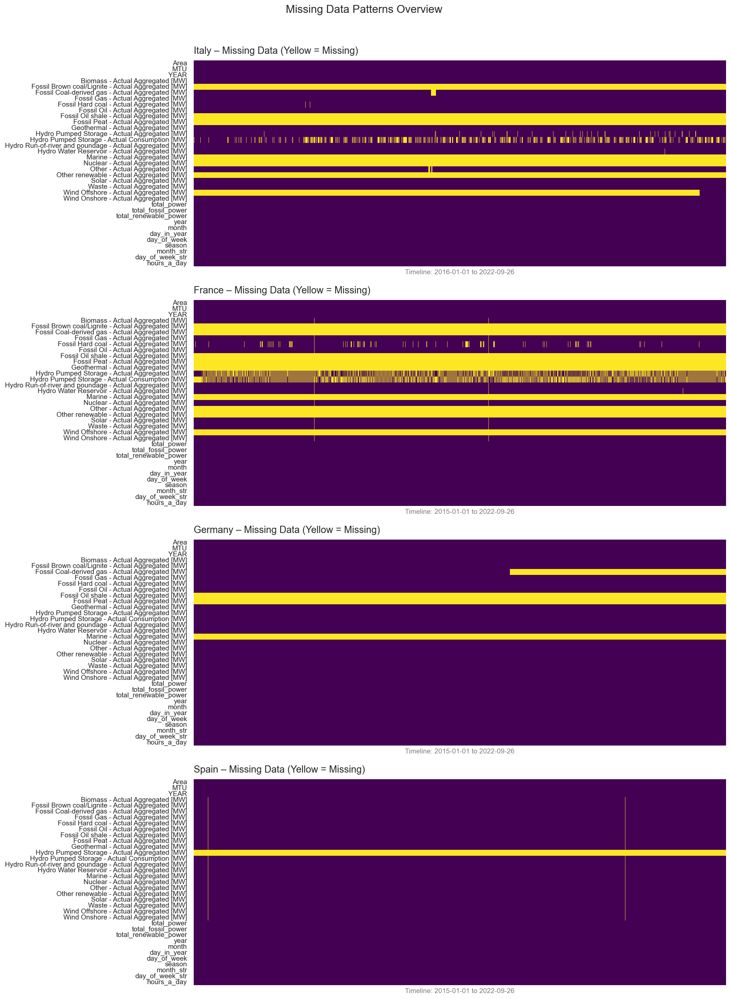
    


    
    combined timestamp gap analysis
    No timestamp gaps found! (not regarding the different start dates)
    
    combined outlier analysis (all power sources)


    
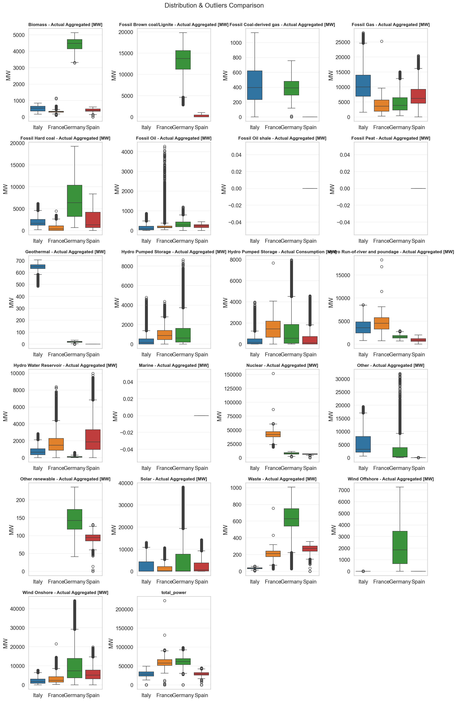
    


    
    [4] Generating Logical Consistency Check...


    
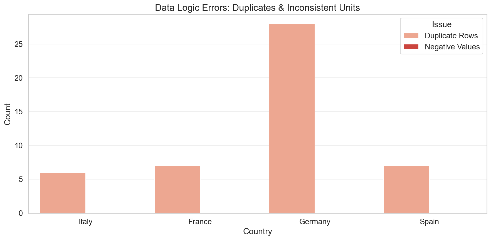
    


### 2.1.4 Data preprocessing pipeline (cleaning steps, handling missing data, outliers strategy, resampling or alignment if needed, feature engineering basics) (20 points)

#### 2.1.4.1 Hexbin Plots from Raw Data - Hours of the day


```python

def plot_hexbin_power_by_state_and_type(
    dataframes: list[tuple[str, pd.DataFrame]],
    power_columns: list[str],
    gridsize=40,
    mincnt=5,
    TimeAxis=Columns.AXIS.HOURS_OF_DAY,
    TimeAxisLabel="Hour of Day"
):
    """
    Hexbin grid:
    - Columns: states
    - Rows: power generation types
    - x-axis: hour of day
    - y-axis: power [MW]
    """

    n_states = len(dataframes)
    n_powers = len(power_columns)

    fig, axes = plt.subplots(
        nrows=n_powers,
        ncols=n_states,
        figsize=(5 * n_states, 3.5 * n_powers),
        sharex=True,
        sharey=False
    )

    # Ensure axes is 2D
    if n_powers == 1:
        axes = np.array([axes])

    for col_idx, (country, df) in enumerate(dataframes):
        for row_idx, power_col in enumerate(power_columns):

            ax = axes[row_idx, col_idx]

            if power_col not in df.columns:
                ax.axis("off")
                continue

            hb = ax.hexbin(
                df[TimeAxis],
                df[power_col],
                gridsize=gridsize,
                mincnt=mincnt,
                bins="log",
                cmap="viridis"
            )

            # Column titles (states)
            if row_idx == 0:
                ax.set_title(country, fontsize=12, pad=10)

            # Row labels (power types)
            if col_idx == 0:
                ax.set_ylabel(power_col.split(" - ")[0], fontsize=10)

            if row_idx == n_powers - 1:
                ax.set_xlabel(TimeAxisLabel)

    # Colorbar (single global)
    cbar = fig.colorbar(
        hb,
        ax=axes.ravel().tolist(),
        orientation="vertical",
        fraction=0.015,
        pad=0.01
    )
    cbar.set_label("log10(count)")

    plt.tight_layout()
    plt.show()


    #    Columns.Power.NUCLEAR,
    #     Columns.Power.FOSSIL_GAS,
    #     Columns.Power.SOLAR,
    #     Columns.Power.WIND_ONSHORE,

# plot_hexbin_power_by_state_and_type(
#     dataframes=dataframes,
#     power_columns=Columns.Power.ALL,
#     gridsize=50
# )

# Deactivated due to github html-oversize and not necessary.
```

#### 2.1.4.2 Hexbin Plots from Raw Data - column filtered - Hours of the day

Power sources not available for at least have of the countries are removed.


```python
plot_hexbin_power_by_state_and_type(
    dataframes=dataframes,
    power_columns=Columns.Power.ALL_FILT+ [Columns.CALC.TOTAL_POWER],
    gridsize=50
)
```

    C:\Users\reosa\AppData\Local\Temp\ipykernel_5340\2212957784.py:71: UserWarning: This figure includes Axes that are not compatible with tight_layout, so results might be incorrect.
      plt.tight_layout()


    

    


#### 2.1.4.3 Hexplots for raw data - days of the week

Hexplots are created for  which show the power production over the days of the week between start and end of the data.


```python
plot_hexbin_power_by_state_and_type(
    dataframes=dataframes,
    power_columns=Columns.Power.ALL_FILT + [Columns.CALC.TOTAL_POWER],
    gridsize=50,
    TimeAxis=Columns.AXIS.DAY_OF_WEEK,
    TimeAxisLabel="Day of Week"
)
```

    C:\Users\reosa\AppData\Local\Temp\ipykernel_5340\2212957784.py:71: UserWarning: This figure includes Axes that are not compatible with tight_layout, so results might be incorrect.
      plt.tight_layout()


    

    


```python

```

#### 2.1.4.3 Hexplots for raw data - days of the year

Hexplots are created for  which show the power production over the days of the year between start and end of the data.


```python
plot_hexbin_power_by_state_and_type(
    dataframes=dataframes,
    power_columns=Columns.Power.ALL_FILT+ [Columns.CALC.TOTAL_POWER],
    gridsize=50,
    TimeAxis=Columns.AXIS.DAY_OF_YEAR,
    TimeAxisLabel="Day of Year"
)
```

    C:\Users\reosa\AppData\Local\Temp\ipykernel_5340\2212957784.py:71: UserWarning: This figure includes Axes that are not compatible with tight_layout, so results might be incorrect.
      plt.tight_layout()


    

    


Outlier removal was done by fixed upper and lower threshold for two reasons.
1. The timely change of power generation to be seen in dayly, weekly patterns would lead to a removal of good data patterns by IQR.
2. What kind of unwanted data was removed:
    1. Zero power production within total power, not all countries have all types of power sources, but its very unlikely that power production was zero within this time frame.
    2. Exrteme spikes in power production e.g. France 2022, January. Several spikes beyond doubled typical power production. According to internet sources (e.g. [Energy Terminal: France's 2022 electricity generation at lowest in 30 years: Report (27.01.2026)](https://www.aa.com.tr/en/energy/electricity/frances-2022-electricity-generation-at-lowest-in-30-years-report/37529?utm_source=chatgpt.com) france hat some maintanence activities for nuclear power plants and saw low production. This might have led to frequency variation in power grid, resulting in high load changes for individual power sources being able to vary the output fast. Taking possible differences in data recording latency, this could lead to spikes due to time shift. This is an asumption, furthermore network frequency data for january 2022 in france was not easily available on most commomn platforms at time of investigation.
    3. For all other columns than the calculated total power sources a deep investigation would be necessary to validate the data quality.
3. Data removal was done by removing whole lines of total power to be out of limits, leading to a total loss of lines around ~200 which is minor compaired to overall lines per dataset.


```python
def remove_outliers_by_fixed_threshold(
    df: pd.DataFrame,
    *,
    state: str,
    thresholds: dict[str, tuple[float | None, float | None]],
    min_points: int = 10
):
    df = df.copy()
    mask_keep = pd.Series(True, index=df.index)

    report = {
        "state": state,
        "method": "fixed_threshold",
        "power_sources": {},
        "summary": {}
    }

    for power, (min_val, max_val) in thresholds.items():

        if power not in df.columns:
            report["power_sources"][power] = {
                "status": "skipped (column not found)"
            }
            continue

        series = df[power]

        valid = series.notna()
        n_valid = valid.sum()

        if n_valid < min_points:
            report["power_sources"][power] = {
                "status": "skipped (not enough data)",
                "points": int(n_valid)
            }
            continue

        keep = pd.Series(True, index=df.index)

        if min_val is not None:
            keep &= (series >= min_val) | ~valid
        if max_val is not None:
            keep &= (series <= max_val) | ~valid

        removed = (~keep & valid).sum()

        mask_keep &= keep

        report["power_sources"][power] = {
            "min_threshold": min_val,
            "max_threshold": max_val,
            "total_points": int(n_valid),
            "removed": int(removed),
            "removed_pct": float(100 * removed / n_valid),
        }

    filtered_df = df.loc[mask_keep].copy()

    report["summary"] = {
        "rows_before": len(df),
        "rows_after": len(filtered_df),
        "rows_removed": int((~mask_keep).sum()),
        "rows_removed_pct": float(100 * (~mask_keep).mean()),
    }

    return filtered_df, report


POWER_THRESHOLDS = {
    "Italy": {
        # Columns.Power.SOLAR: (0, 120000),
        # Columns.Power.WIND_ONSHORE: (0, 150000),
        # Columns.Power.WIND_OFFSHORE: (0, 90000),
        # Columns.Power.NUCLEAR: (0, 100000),
        # Columns.Power.FOSSIL_GAS: (0, 200000),
        Columns.CALC.TOTAL_POWER: (10000, 50000)
    },
    "France": {
        # Columns.Power.SOLAR: (0, 100000),
        # Columns.Power.WIND_ONSHORE: (0, 180000),
        # Columns.Power.WIND_OFFSHORE: (0, 70000),
        # Columns.Power.NUCLEAR: (0, 120000),
        # Columns.Power.FOSSIL_GAS: (0, 160000),  
        # Columns.Power.FOSSIL_OIL: (0, 50000),
        Columns.CALC.TOTAL_POWER: (20000, 100000)
    },
    "Germany": {
        # Columns.Power.SOLAR: (0, 80000),
        # Columns.Power.WIND_ONSHORE: (0, 200000),
        # Columns.Power.WIND_OFFSHORE: (0, 60000),
        # Columns.Power.NUCLEAR: (0, 90000),
        # Columns.Power.FOSSIL_GAS: (0, 150000),
        # Columns.Power.FOSSIL_COAL_DERIVED_GAS: (160, 650),
        # Columns.Power.OTHER: (0, 12500),
        Columns.CALC.TOTAL_POWER: (20000, 150000)
    },
    "Spain": {
        # Columns.Power.SOLAR: (0, 90000),
        # Columns.Power.WIND_ONSHORE: (0, 160000),
        # Columns.Power.WIND_OFFSHORE: (0, 50000),
        # Columns.Power.NUCLEAR: (0, 80000),
        # Columns.Power.FOSSIL_GAS: (0, 140000),
        # Columns.Power.FOSSIL_BROWN: (150, 100000),
        Columns.CALC.TOTAL_POWER: (15000, 110000)
    }
}


dataframes_filtered = []
reports = []

for country, df in dataframes:
    # if not ActvnMatrix.is_active(country, PlotOptions.OUTLIER_REMOVAL_FIXED_THRESHOLDS):
    #     continue

    filtered_df, report = remove_outliers_by_fixed_threshold(
        df,
        state=country,
        thresholds=POWER_THRESHOLDS[country]
    )
    dataframes_filtered.append((country, filtered_df))
    reports.append(report)

pprint.pp(reports)
```

    [{'state': 'Italy',
      'method': 'fixed_threshold',
      'power_sources': {'total_power': {'min_threshold': 10000,
                                        'max_threshold': 50000,
                                        'total_points': 59070,
                                        'removed': 23,
                                        'removed_pct': 0.03893685457931268}},
      'summary': {'rows_before': 59070,
                  'rows_after': 59047,
                  'rows_removed': 23,
                  'rows_removed_pct': 0.03893685457931268}},
     {'state': 'France',
      'method': 'fixed_threshold',
      'power_sources': {'total_power': {'min_threshold': 20000,
                                        'max_threshold': 100000,
                                        'total_points': 67831,
                                        'removed': 83,
                                        'removed_pct': 0.1223629314030458}},
      'summary': {'rows_before': 67831,
                  'rows_after': 67748,
                  'rows_removed': 83,
                  'rows_removed_pct': 0.1223629314030458}},
     {'state': 'Germany',
      'method': 'fixed_threshold',
      'power_sources': {'total_power': {'min_threshold': 20000,
                                        'max_threshold': 150000,
                                        'total_points': 271324,
                                        'removed': 32,
                                        'removed_pct': 0.01179401748463092}},
      'summary': {'rows_before': 271324,
                  'rows_after': 271292,
                  'rows_removed': 32,
                  'rows_removed_pct': 0.01179401748463092}},
     {'state': 'Spain',
      'method': 'fixed_threshold',
      'power_sources': {'total_power': {'min_threshold': 15000,
                                        'max_threshold': 110000,
                                        'total_points': 76969,
                                        'removed': 69,
                                        'removed_pct': 0.08964648105081266}},
      'summary': {'rows_before': 76969,
                  'rows_after': 76900,
                  'rows_removed': 69,
                  'rows_removed_pct': 0.08964648105081267}}]


### 2.1.5 Preprocessed vs original comparison (before/after visuals plus commentary on what changed and why) (10 points)


```python
def plot_filter_diagnostics_scatter(
    df_original: pd.DataFrame,
    df_filtered: pd.DataFrame,
    x_col: str,
    y_col: str,
    *,
    title: str | None = None,
    kept_label: str = "Kept",
    removed_label: str = "Filtered out",
    kept_color: str = "tab:blue",
    removed_color: str = "red",
    kept_alpha: float = 0.4,
    removed_alpha: float = 0.9,
    kept_size: int = 10,
    removed_size: int = 30
):
    """
    Scatter diagnostic plot showing which points were filtered out.

    Parameters
    ----------
    df_original : pd.DataFrame
        Data before filtering.
    df_filtered : pd.DataFrame
        Data after filtering.
    x_col, y_col : str
        Columns to plot.
    """

    # --- Align by index ---
    df_original = df_original[[x_col, y_col]].dropna()
    df_filtered = df_filtered[[x_col, y_col]].dropna()

    # Points kept
    df_kept = df_original.loc[df_original.index.intersection(df_filtered.index)]

    # Points removed
    df_removed = df_original.loc[
        df_original.index.difference(df_filtered.index)
    ]

    plt.figure(figsize=(14, 6))

    # Kept points
    sns.scatterplot(
        data=df_kept,
        x=x_col,
        y=y_col,
        color=kept_color,
        alpha=kept_alpha,
        s=kept_size,
        label=f"{kept_label} ({len(df_kept)})"
    )

    # Removed points
    sns.scatterplot(
        data=df_removed,
        x=x_col,
        y=y_col,
        color=removed_color,
        alpha=removed_alpha,
        s=removed_size,
        marker="x",
        label=f"{removed_label} ({len(df_removed)})"
    )

    plt.xlabel(x_col)
    #plt.ylabel(y_col)
    plt.title(title or f"Filter diagnostics: {y_col} vs {x_col}")
    plt.ylabel("Total Power [MW]")
    plt.legend()
    plt.grid(alpha=0.3)
    plt.tight_layout()
    plt.show()

```


```python
for country, df in dataframes_filtered:
    print("=" * 40)
    print(f"\nOutlier Removal Report for {country}:")
    print("-" * 40)
    plot_filter_diagnostics_scatter(
        df_original=dict(dataframes)[country], 
        df_filtered=df,
        x_col=Columns.AXIS.HOURS_OF_DAY,
        y_col=Columns.CALC.TOTAL_POWER,
        title=f"Hours of the day - Outlier Removal - {country}"
    )

for country, df in dataframes_filtered:
    print("=" * 40)
    print(f"\nOutlier Removal Report for {country}:")
    print("-" * 40)
    plot_filter_diagnostics_scatter(
        df_original=dict(dataframes)[country], 
        df_filtered=df,
        x_col=Columns.AXIS.DAY_OF_WEEK,
        y_col=Columns.CALC.TOTAL_POWER,
        title=f"Day of the week - Outlier Removal - {country}"
    )

for country, df in dataframes_filtered:
    print("=" * 40)
    print(f"\nOutlier Removal Report for {country}:")
    print("-" * 40)
    plot_filter_diagnostics_scatter(
        df_original=dict(dataframes)[country], 
        df_filtered=df,
        x_col=Columns.AXIS.DAY_OF_YEAR,
        y_col=Columns.CALC.TOTAL_POWER,
        title=f"Day of the year - Outlier Removal - {country}"
    )
```

    ========================================
    
    Outlier Removal Report for Italy:
    ----------------------------------------


    
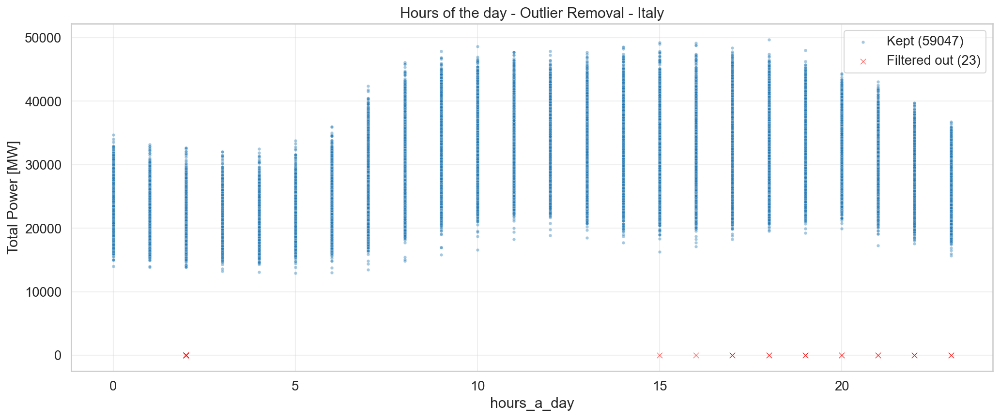
    


    ========================================
    
    Outlier Removal Report for France:
    ----------------------------------------


    
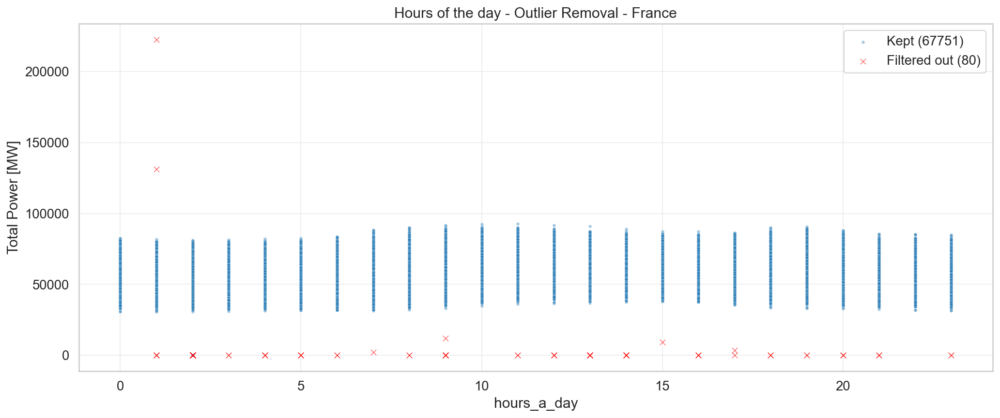
    


    ========================================
    
    Outlier Removal Report for Germany:
    ----------------------------------------


    
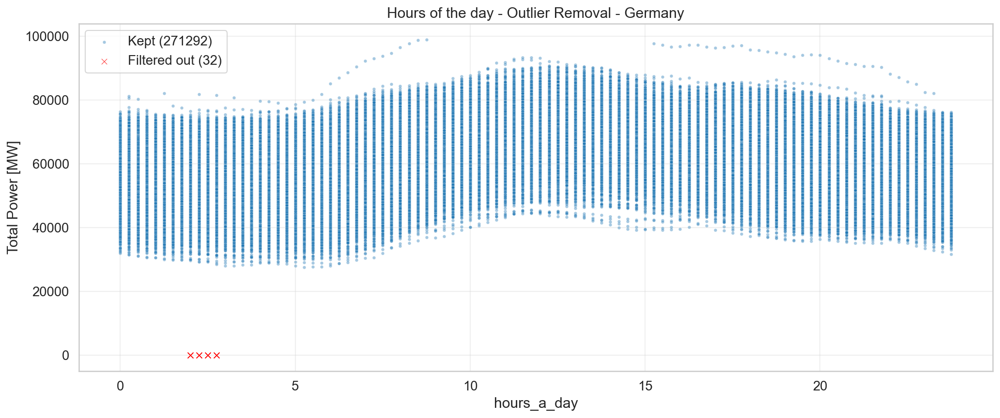
    


    ========================================
    
    Outlier Removal Report for Spain:
    ----------------------------------------


    
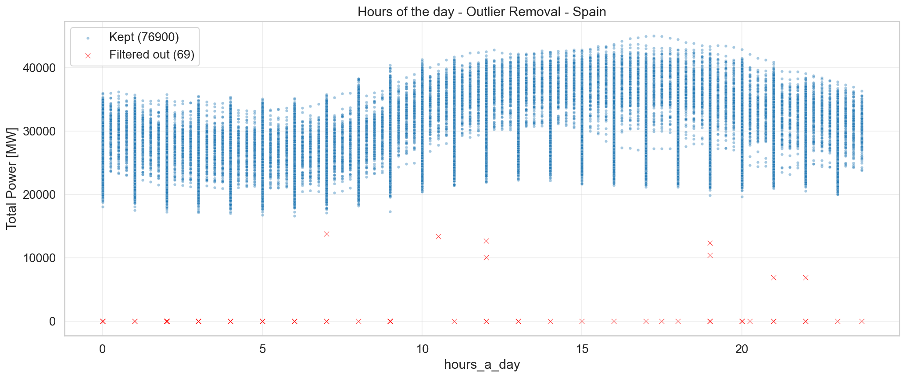
    


    ========================================
    
    Outlier Removal Report for Italy:
    ----------------------------------------


    
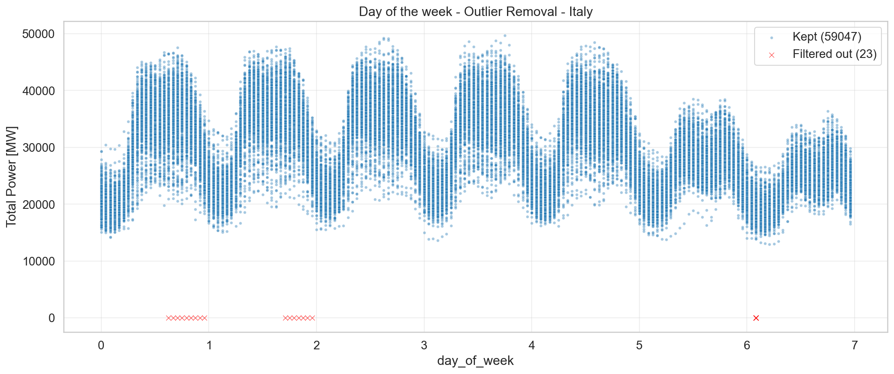
    


    ========================================
    
    Outlier Removal Report for France:
    ----------------------------------------


    
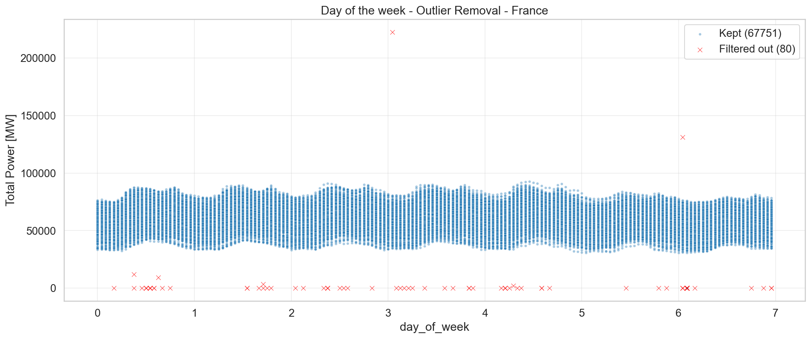
    


    ========================================
    
    Outlier Removal Report for Germany:
    ----------------------------------------


    
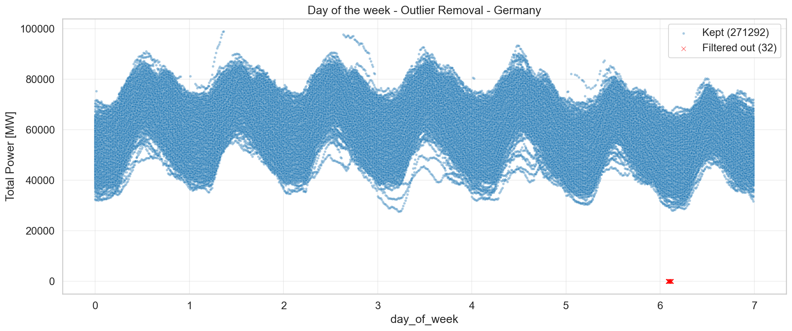
    


    ========================================
    
    Outlier Removal Report for Spain:
    ----------------------------------------


    

    


    ========================================
    
    Outlier Removal Report for Italy:
    ----------------------------------------


    
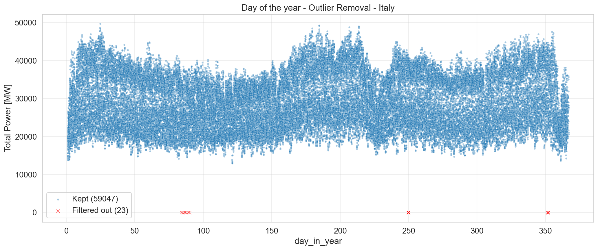
    


    ========================================
    
    Outlier Removal Report for France:
    ----------------------------------------


    
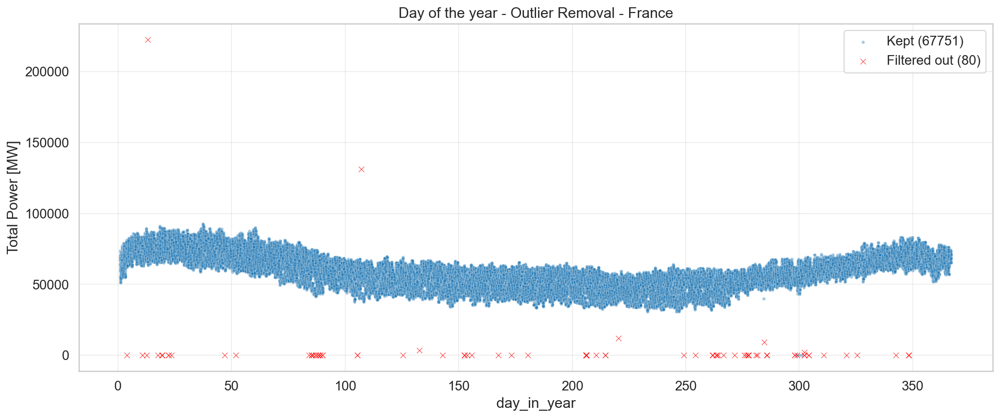
    


    ========================================
    
    Outlier Removal Report for Germany:
    ----------------------------------------


    
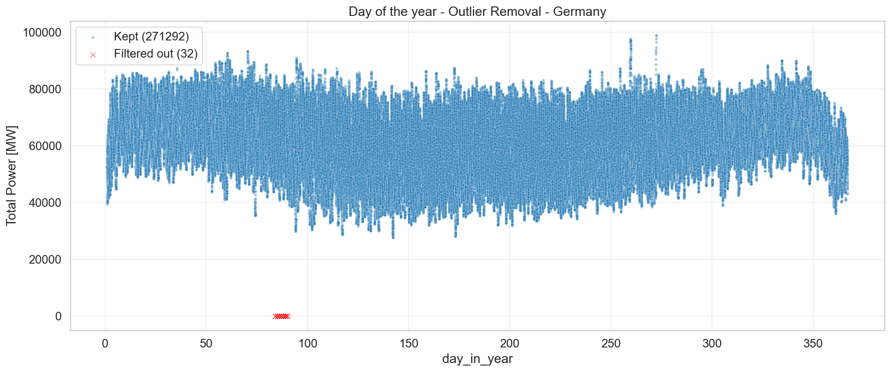
    


    ========================================
    
    Outlier Removal Report for Spain:
    ----------------------------------------


    
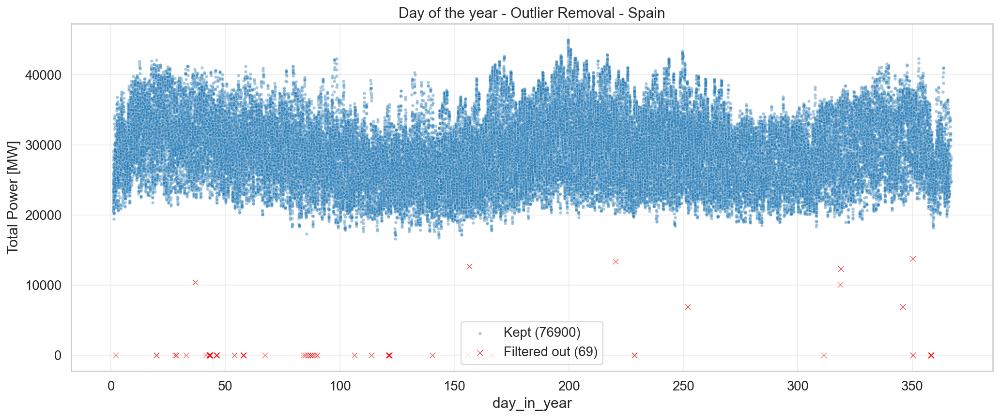
    


```python
def build_outlier_summary_table(reports: list[dict]) -> pd.DataFrame:
    rows = []

    for report in reports:
        row = {
            "Country": report["state"],
            **report["summary"]
        }
        rows.append(row)

    return pd.DataFrame(rows).set_index("Country")

outlier_summary_table = build_outlier_summary_table(reports)
print("\nOutlier Removal Summary Table:")
print(outlier_summary_table.to_markdown())
```

    
    Outlier Removal Summary Table:
    | Country   |   rows_before |   rows_after |   rows_removed |   rows_removed_pct |
    |:----------|--------------:|-------------:|---------------:|-------------------:|
    | Italy     |         59070 |        59047 |             23 |          0.0389369 |
    | France    |         67831 |        67748 |             83 |          0.122363  |
    | Germany   |        271324 |       271292 |             32 |          0.011794  |
    | Spain     |         76969 |        76900 |             69 |          0.0896465 |


#### 2.1.4.5 Plot of raw data of a country over whole time range

Hexplots are created for  which show the power production over the days of the year between start and end of the data.


```python
def plot_raw_power(df: pd.DataFrame, country: str):
    fig, axes = plt.subplots(
        nrows=len(Columns.Power.ALL),
        ncols=1,
        sharex=True,
        figsize=(14, 2.5 * len(Columns.Power.ALL))
    )

    for ax, col in zip(axes, Columns.Power.ALL):
        ax.plot(
            df.index,
            df[col],
            color=colors[country],
            linewidth=0.6
        )
        ax.set_title(col, fontsize=11)
        ax.set_ylabel("MW")

    fig.suptitle(f"{country} – Raw Power Generation (Hourly)", fontsize=16)
    plt.xlabel("Datetime")
    plt.show()
```


```python


for country, df in dataframes:
    if not ActvnMatrix.is_active(country, PlotOptions.TIME_PLOT_RAW_POWER):
        continue
    #df[Columns.Power.ALL] = df[Columns.Power.ALL].apply( pd.to_numeric, errors='coerce' )
    plot_raw_power(df, country)
    # plot_raw_overlay(df, country)
    print(type(df.index))

```


    

    


    <class 'pandas.core.indexes.datetimes.DatetimeIndex'>


    

    


    <class 'pandas.core.indexes.datetimes.DatetimeIndex'>


    

    


    <class 'pandas.core.indexes.datetimes.DatetimeIndex'>


    

    


    <class 'pandas.core.indexes.datetimes.DatetimeIndex'>


#### 2.1.4.6 Share of power source by country downsampled to month over all consequtive time

This function shall show the individual difference of used power sources and power amount between the countries.


```python
def plot_seahorse_share_all_data(df: pd.DataFrame, country_name: str):
    """
    Plot a stacked area chart of all power columns, ignoring order.
    """
    df_graph = df.copy()

    # Skip non-existing columns
    power_cols = [c for c in Columns.Power.ALL if c in df_graph.columns]
    df_graph = df_graph[power_cols]

    # Force numeric (extra safety)
    df_graph = df_graph.apply(pd.to_numeric, errors="coerce")

    # Monthly aggregation
    df_graph = df_graph.resample("M").mean()

    if df_graph.empty:
        print(f"No data after resampling for {country_name}")
        return

    sns.set_style("whitegrid")
    plt.figure(figsize=(18, 10))

    colors = sns.color_palette("tab20", n_colors=len(power_cols))
    short_labels = [col.split(" - ")[0] for col in power_cols]

    plt.stackplot(
        df_graph.index,
        *[df_graph[col].fillna(0) for col in power_cols],
        labels=short_labels,
        colors=colors,
        alpha=0.75
    )

    plt.legend(loc="upper left", bbox_to_anchor=(1, 1))
    plt.ylabel("Power [MW]")
    plt.xlabel("Time")
    plt.title(f"{country_name} – Monthly Average Power Generation")
    plt.tight_layout()
    plt.show()


```


```python
# dataframes = [
#     ("Italy", df_italy),
#     ("France", df_france),
#     ("Germany", df_germany),
#     ("Spain", df_spain)
# ]

for country, df in dataframes_filtered:
    if not ActvnMatrix.is_active(country, PlotOptions.POWER_SHARE_BY_SOURCE):
        continue
    plot_seahorse_share_all_data(df, country)

```

    C:\Users\reosa\AppData\Local\Temp\ipykernel_5340\3679005691.py:15: FutureWarning: 'M' is deprecated and will be removed in a future version, please use 'ME' instead.
      df_graph = df_graph.resample("M").mean()


    
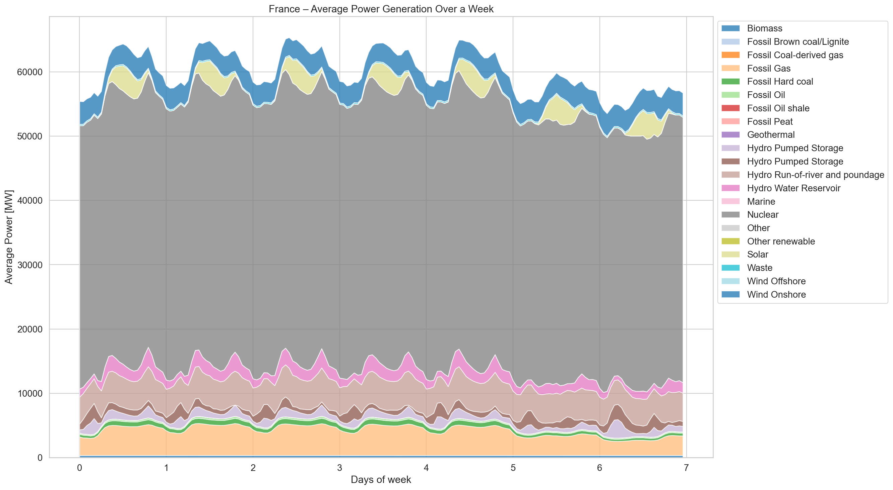
    


    C:\Users\reosa\AppData\Local\Temp\ipykernel_5340\3679005691.py:15: FutureWarning: 'M' is deprecated and will be removed in a future version, please use 'ME' instead.
      df_graph = df_graph.resample("M").mean()


    
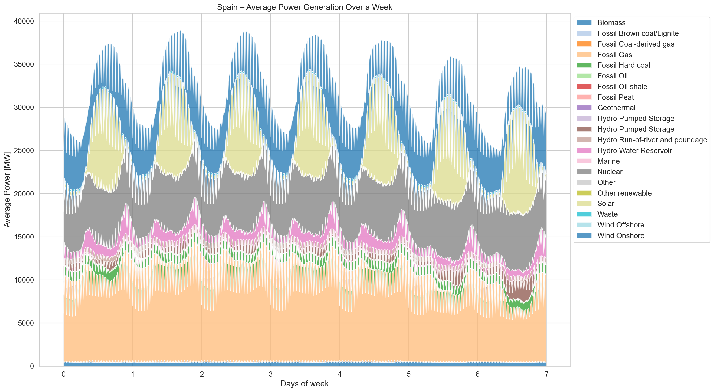
    


    C:\Users\reosa\AppData\Local\Temp\ipykernel_5340\3679005691.py:15: FutureWarning: 'M' is deprecated and will be removed in a future version, please use 'ME' instead.
      df_graph = df_graph.resample("M").mean()


    
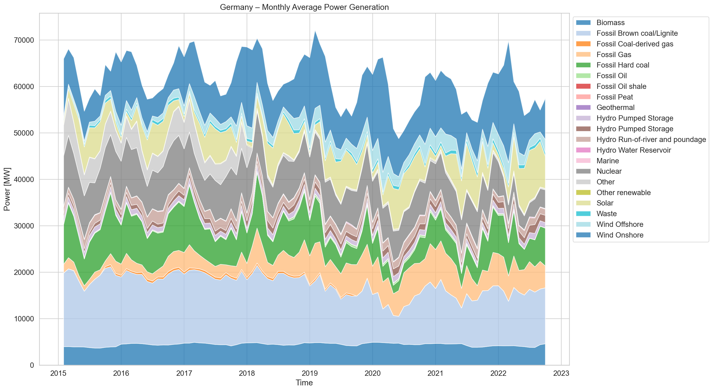
    


    C:\Users\reosa\AppData\Local\Temp\ipykernel_5340\3679005691.py:15: FutureWarning: 'M' is deprecated and will be removed in a future version, please use 'ME' instead.
      df_graph = df_graph.resample("M").mean()


    

    


#### 2.1.4.7 Power share of countries over the year


```python
def plot_seahorse_share_yearly_data(df: pd.DataFrame, country_name: str):
    """
    Plot a stacked area chart showing average daily power profile
    over a year (day-of-year).
    """

    df_graph = df.copy()

    # Keep only power columns
    power_cols = [c for c in Columns.Power.ALL if c in df_graph.columns]
    df_graph = df_graph[power_cols].apply(pd.to_numeric, errors="coerce")

    # Daily aggregation - "D" daily, "M" monthly, "W-MON" weekly starting Monday
    #df_graph = df_graph.resample("W-MON").mean()

    # Add day-of-year
    df_graph["day_of_year"] = df_graph.index.dayofyear

    # Average over all years → yearly profile
    df_graph = df_graph.groupby("day_of_year").mean()

    if df_graph.empty:
        print(f"No data after aggregation for {country_name}")
        return

    sns.set_style("whitegrid")
    plt.figure(figsize=(18, 10))

    colors = sns.color_palette("tab20", n_colors=len(power_cols))
    short_labels = [col.split(" - ")[0] for col in power_cols]

    plt.stackplot(
        df_graph.index,
        *[df_graph[col].fillna(0) for col in power_cols],
        labels=short_labels,
        colors=colors,
        alpha=0.75
    )

    # plt.stackplot(
    #     date=df_graph,
    #     x=Columns.AXIS.MONTH_STR,
    #     y=power_cols,
    #     labels=short_labels,
    #     colors=colors,
    #     alpha=0.75
    # )

    plt.ylabel("Average Power [MW]")
    plt.xlabel("Day of Year")
    plt.title(f"{country_name} – Average Power Generation Over a Year")
    plt.legend(loc="upper left", bbox_to_anchor=(1, 1))
    plt.tight_layout()
    plt.show()


```


```python
for country, df in dataframes_filtered:
    if not ActvnMatrix.is_active(country, PlotOptions.POWER_SHARE_BY_SOURCE):
        continue
    plot_seahorse_share_yearly_data(df, country)
```


    
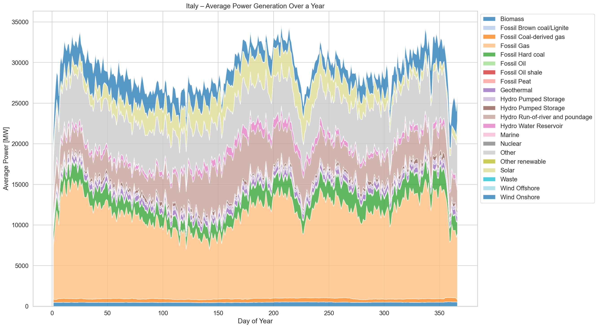
    


    
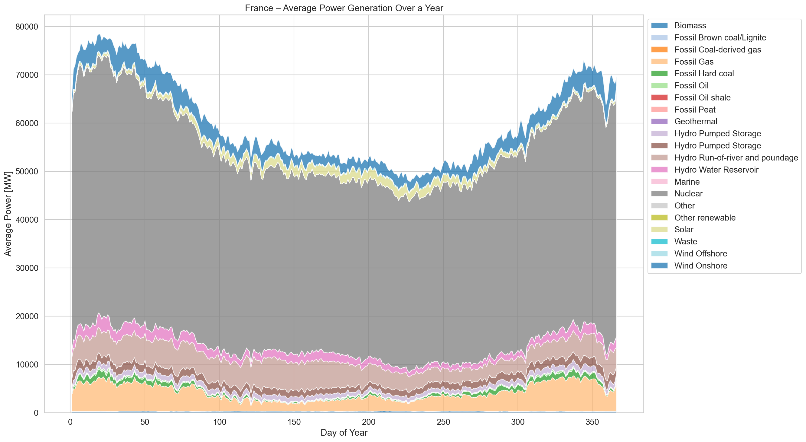
    


    
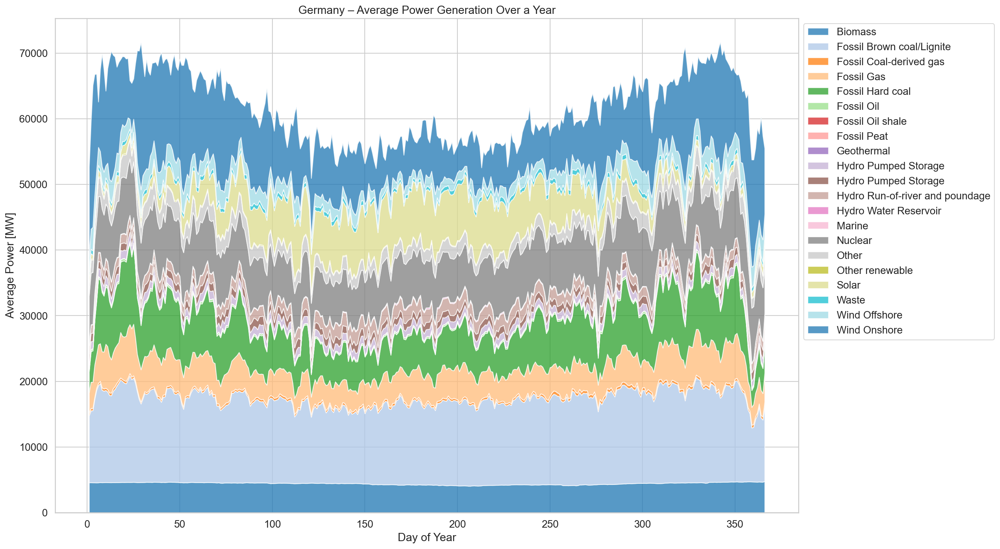
    


    
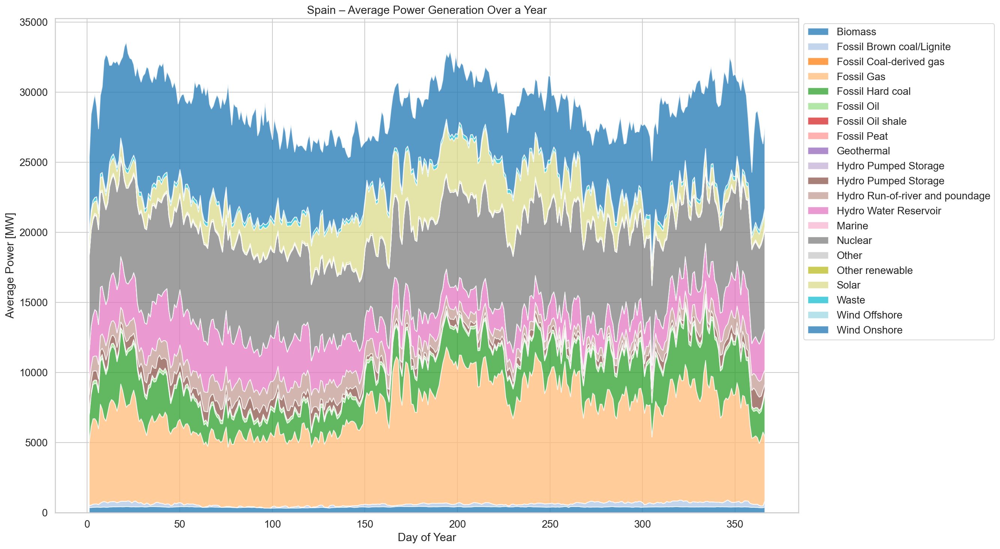
    


```python
def plot_seahorse_share_weekly_data(df: pd.DataFrame, country_name: str):
    """
    Plot a stacked area chart showing average daily power profile
    over a year (day-of-year).
    """

    df_graph = df.copy()

    # Keep only power columns
    power_cols = [c for c in Columns.Power.ALL if c in df_graph.columns]
    df_graph = df_graph[power_cols].apply(pd.to_numeric, errors="coerce")

    # Daily aggregation - "D" daily, "M" monthly, "W-MON" weekly starting Monday
    #df_graph = df_graph.resample("W-MON").mean()

    # Add day-of-week
    df_graph[Columns.AXIS.DAY_OF_WEEK] = df_graph.index.dayofweek + (df_graph.index.hour + df_graph.index.minute / 60) / 24

    # Average over all years → yearly profile
    df_graph = df_graph.groupby(Columns.AXIS.DAY_OF_WEEK).mean()

    if df_graph.empty:
        print(f"No data after aggregation for {country_name}")
        return

    sns.set_style("whitegrid")
    plt.figure(figsize=(18, 10))

    colors = sns.color_palette("tab20", n_colors=len(power_cols))
    short_labels = [col.split(" - ")[0] for col in power_cols]

    plt.stackplot(
        df_graph.index,
        *[df_graph[col].fillna(0) for col in power_cols],
        labels=short_labels,
        colors=colors,
        alpha=0.75
    )

    # plt.stackplot(
    #     date=df_graph,
    #     x=Columns.AXIS.MONTH_STR,
    #     y=power_cols,
    #     labels=short_labels,
    #     colors=colors,
    #     alpha=0.75
    # )

    plt.ylabel("Average Power [MW]")
    plt.xlabel("Days of week")
    plt.title(f"{country_name} – Average Power Generation Over a Week")
    plt.legend(loc="upper left", bbox_to_anchor=(1, 1))
    plt.tight_layout()
    plt.show()

for country, df in dataframes_filtered:
    # if not ActvnMatrix.is_active(country, PlotOptions.POWER_SHARE_BY_SOURCE):
    #     continue
    plot_seahorse_share_weekly_data(df, country)
```


    
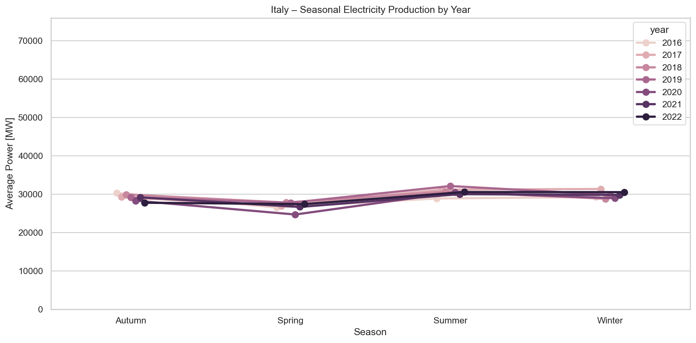
    


    

    


    

    


    

    


```python
def plot_seahorse_share_daily_data(df: pd.DataFrame, country_name: str):
    """
    Plot a stacked area chart showing average daily power profile
    over a year (day-of-year).
    """

    df_graph = df.copy()

    # Keep only power columns
    power_cols = [c for c in Columns.Power.ALL if c in df_graph.columns]
    df_graph = df_graph[power_cols].apply(pd.to_numeric, errors="coerce")

    # Daily aggregation - "D" daily, "M" monthly, "W-MON" weekly starting Monday
    #df_graph = df_graph.resample("W-MON").mean()

    # Add hours of day
    df_graph[Columns.AXIS.HOURS_OF_DAY] = df_graph.index.hour + df_graph.index.minute / 60

    # Average over all years → yearly profile
    df_graph = df_graph.groupby(Columns.AXIS.HOURS_OF_DAY).mean()

    if df_graph.empty:
        print(f"No data after aggregation for {country_name}")
        return

    sns.set_style("whitegrid")
    plt.figure(figsize=(18, 10))

    colors = sns.color_palette("tab20", n_colors=len(power_cols))
    short_labels = [col.split(" - ")[0] for col in power_cols]

    plt.stackplot(
        df_graph.index,
        *[df_graph[col].fillna(0) for col in power_cols],
        labels=short_labels,
        colors=colors,
        alpha=0.75
    )

    # plt.stackplot(
    #     date=df_graph,
    #     x=Columns.AXIS.MONTH_STR,
    #     y=power_cols,
    #     labels=short_labels,
    #     colors=colors,
    #     alpha=0.75
    # )

    plt.ylabel("Average Power [MW]")
    plt.xlabel("Hour of Day")
    plt.title(f"{country_name} – Average Power Generation Over a Day")
    plt.legend(loc="upper left", bbox_to_anchor=(1, 1))
    plt.tight_layout()
    plt.show()

for country, df in dataframes_filtered:
    # if not ActvnMatrix.is_active(country, PlotOptions.POWER_SHARE_BY_SOURCE):
    #     continue
    plot_seahorse_share_daily_data(df, country)
```


    

    


    
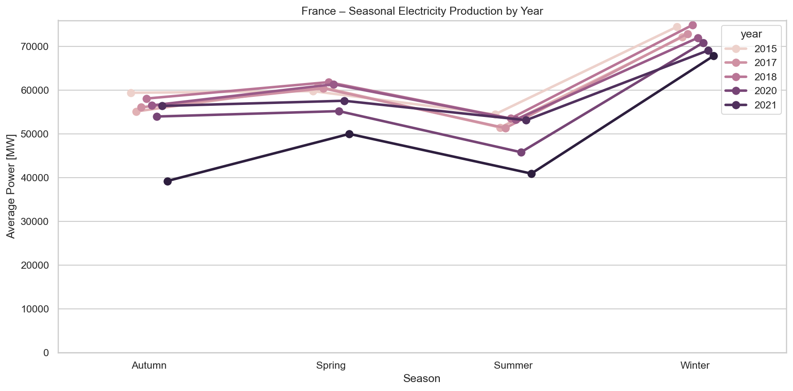
    


    

    


    

    


```python
def plot_total_power_scatter(dataframes: list[tuple[str, pd.DataFrame]]):
    fig, axes = plt.subplots(
        nrows=len(dataframes),
        ncols=1,
        figsize=(20, 12),
        sharex=True
    )

    enum_limit = {}

    state_cut_line_values = {
        "Italy": [15000, 50000],
        "France": [30000, 90000],
        "Germany": [30000, 90000],
        "Spain": [18000, 42000]
    }

    for ax, (country, df) in zip(axes, dataframes):

        sns.scatterplot( 
            data=df,
            x=Columns.AXIS.DAY_OF_YEAR,
            y=Columns.CALC.TOTAL_POWER,
            ax=ax,
            color=colors[country],
            alpha=0.4,
            s=5
        )

        # Horizontal upper cutoff line
        ax.axhline(
            y=state_cut_line_values[country][1],
            color="red",
            linestyle="--",
            linewidth=1.5,
            alpha=0.8
        )

        # Horizontal lower cutoff line
        ax.axhline(
            y=state_cut_line_values[country][0],
            color="red",
            linestyle="--",
            linewidth=1.5,
            alpha=0.8
        )

        upper_y_offset = 2500
        lower_y_offset = -6000

        ax.text(
            x=10,  # day 10
            y=state_cut_line_values[country][1] + upper_y_offset,
            s=f"{state_cut_line_values[country][1]:,.0f} MW",
            color="red",
            fontsize=10
        )

        ax.text(
            x=10,  # day 10
            y=state_cut_line_values[country][0] + lower_y_offset,
            s=f"{state_cut_line_values[country][0]:,.0f} MW",
            color="red",
            fontsize=10
        )

        # Set consistent y-axis
        ax.set_ylim(0, 100000)  # add a small buffer

        ax.set_title(f"Total power generation in {country}")
        ax.set_ylabel("Total Power [MW]")

        
        # ---- Key: format x-axis to show months ----
        # ax.xaxis.set_major_locator(mdates.MonthLocator())  # every month
        # ax.xaxis.set_major_formatter(mdates.DateFormatter('%b'))  # 'Jan', 'Feb', ...

    axes[-1].set_xlabel("Day of Year")
    plt.tight_layout()
    plt.show()


plot_total_power_scatter(dataframes_filtered)

    # for feature in Columns.Power.ALL:
    #     plt.figure(figsize=[len(dataframes_only), len(Columns.Power.ALL)])
    #     sns.scatterplot(
    #         data=df,
    #         x=Columns.AXIS.DAY_OF_YEAR,
    #         y=feature,
    #         hue='day_of_week',
    #         palette='tab10',
    #         alpha=0.6
    #     )


#df_all = pd.concat([df_italy, df_france, df_germany, df_spain], ignore_index=True)

```


    
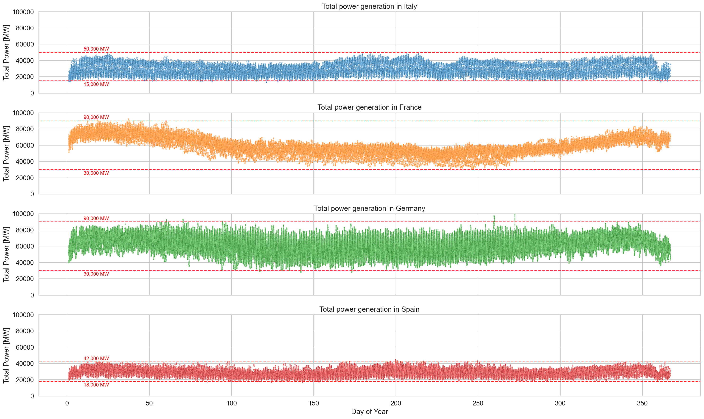
    


```python
def plot_yearly_profiles_seasonal(df, country_name):
    df_season = df.copy()

    df_season = (
        df_season
        .groupby([Columns.AXIS.YEAR, Columns.AXIS.SEASON], as_index=False)
        .mean(numeric_only=True)
    )

    sns.set_theme(style="whitegrid")
    plt.figure(figsize=(12, 6))

    sns.pointplot(
        data=df_season,
        x=Columns.AXIS.SEASON,
        y=Columns.CALC.TOTAL_POWER,
        hue=Columns.AXIS.YEAR,
        dodge=True
    )
    # Set consistent y-axis
    plt.ylim(0, 76000)  # add a small buffer

    plt.xlabel("Season")
    plt.ylabel("Average Power [MW]")
    plt.title(f"{country_name} – Seasonal Electricity Production by Year")
    plt.tight_layout()
    plt.show()

```


```python
for country, df in dataframes_filtered:
    if not ActvnMatrix.is_active(country, PlotOptions.YEARLY_SEASONAL_OVER_YEARS):
        continue
    plot_yearly_profiles_seasonal(df, country)

```


    
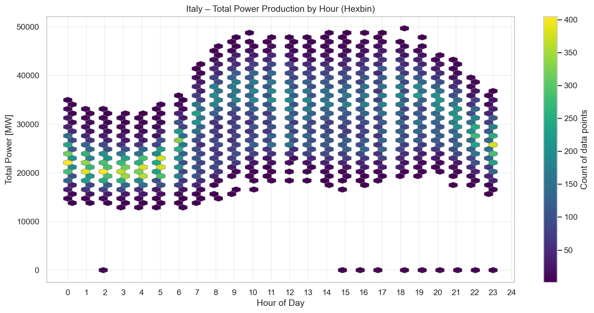
    


    
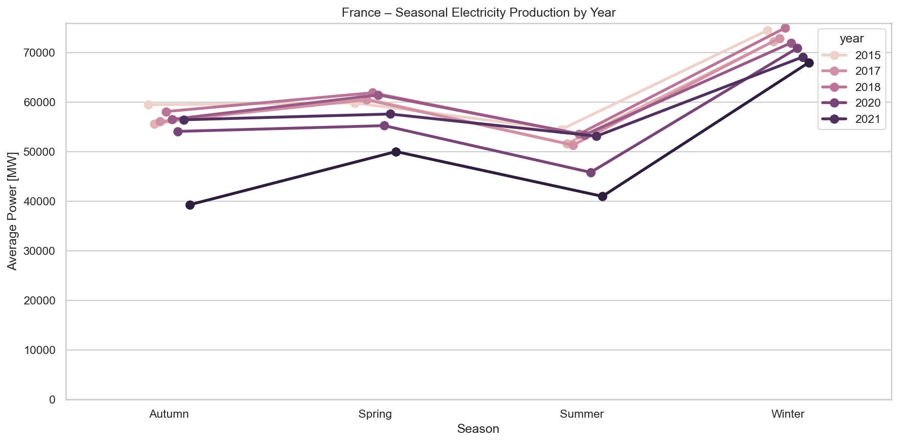
    


    
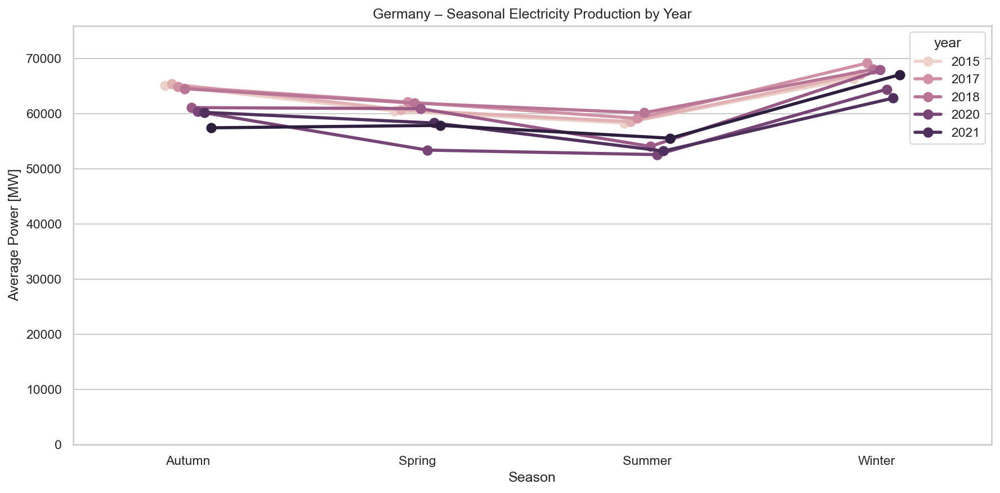
    


    
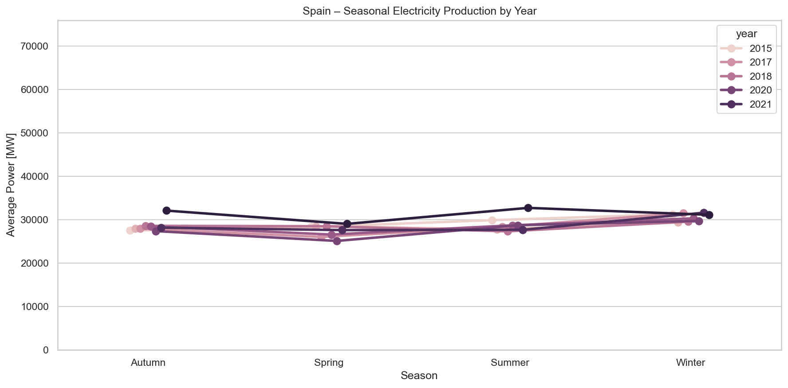
    


```python
def plot_hourly_profile_by_season(df: pd.DataFrame, country: str):
    """
    Plot the total power consumption over the hours of a day, colored by season.
    """

    df_graph = df.copy()


    plt.figure(figsize=(14,6))

    # sns.scatterplot(
    #     data=df,
    #     x='hour',
    #     y=Columns.CALC.TOTAL_POWER,
    #     hue=Columns.AXIS.SEASON,
    #     palette=["#1f77b4", "#2ca02c", "#ff7f0e", "#d62728"],
    #     alpha=0.5,
    #     s=10
    # )

    # Optional: smooth line per season
    sns.lineplot(
        data=df_graph,
        x=Columns.AXIS.HOURS_OF_DAY,
        y=Columns.CALC.TOTAL_POWER,
        hue=Columns.AXIS.SEASON,
        palette=["#1f77b4", "#2ca02c", "#ff7f0e", "#d62728"],
        estimator='mean'
    )

    plt.title(f"{country} – Average Hourly Power Consumption by Season")
    plt.xlabel("Hour of Day")
    plt.ylabel("Total Power [MW]")
    plt.xticks(range(0,25))
    plt.legend(title="Season")
    plt.grid(alpha=0.3)
    plt.tight_layout()
    plt.show()


```


```python
for country, df in dataframes_filtered:
    if not ActvnMatrix.is_active(country, PlotOptions.HOURLY_PLOT_OVER_SEASONS):
        continue
    plot_hourly_profile_by_season(df, country)
```

    
    ----- NOTE -----
    Plot 'HOURLY_PLOT_OVER_SEASONS' is deactivated in PLOT_OPTIONS_DICT. Skipping execution for Italy.
    
    ----- NOTE -----
    Plot 'HOURLY_PLOT_OVER_SEASONS' is deactivated in PLOT_OPTIONS_DICT. Skipping execution for France.
    
    ----- NOTE -----
    Plot 'HOURLY_PLOT_OVER_SEASONS' is deactivated in PLOT_OPTIONS_DICT. Skipping execution for Germany.
    
    ----- NOTE -----
    Plot 'HOURLY_PLOT_OVER_SEASONS' is deactivated in PLOT_OPTIONS_DICT. Skipping execution for Spain.


```python
def plot_hexbin_hourly_power(df: pd.DataFrame, country: str):
    """
    Create a hexbin plot per state showing precomputed total power vs hour of the day.
    Assumes 'total_power' and 'hour' columns already exist in each dataframe.
    """
    
    plt.figure(figsize=(12,6))
    hb = plt.hexbin(
        x=df[Columns.AXIS.HOURS_OF_DAY],
        y=df[Columns.CALC.TOTAL_POWER],
        gridsize=48,
        cmap='viridis',
        mincnt=1,
        linewidths=0.5,
        edgecolors='grey'
    )
    plt.colorbar(hb, label='Count of data points')
    plt.title(f"{country} – Total Power Production by Hour (Hexbin)")
    plt.xlabel("Hour of Day")
    plt.ylabel("Total Power [MW]")
    plt.xticks(range(0,25,1))
    plt.grid(alpha=0.3)
    plt.tight_layout()
    plt.show()

```


```python
for country, df in dataframes_filtered:
    if not ActvnMatrix.is_active(country, PlotOptions.HEXBIN_TOTAL_POWER_HOURLY_DAYTIME_PLOT):
        continue
    plot_hexbin_hourly_power(df, country)
```


    

    


    

    


    
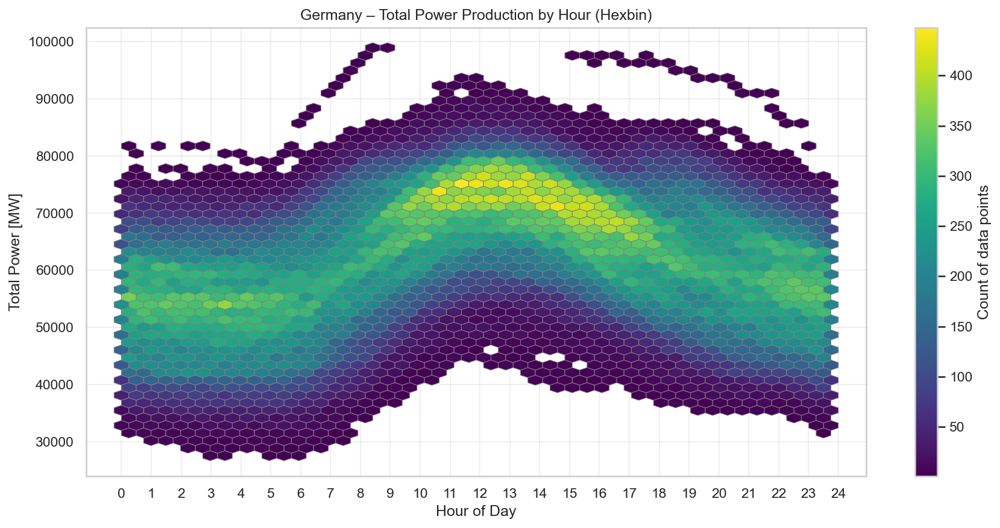
    


    
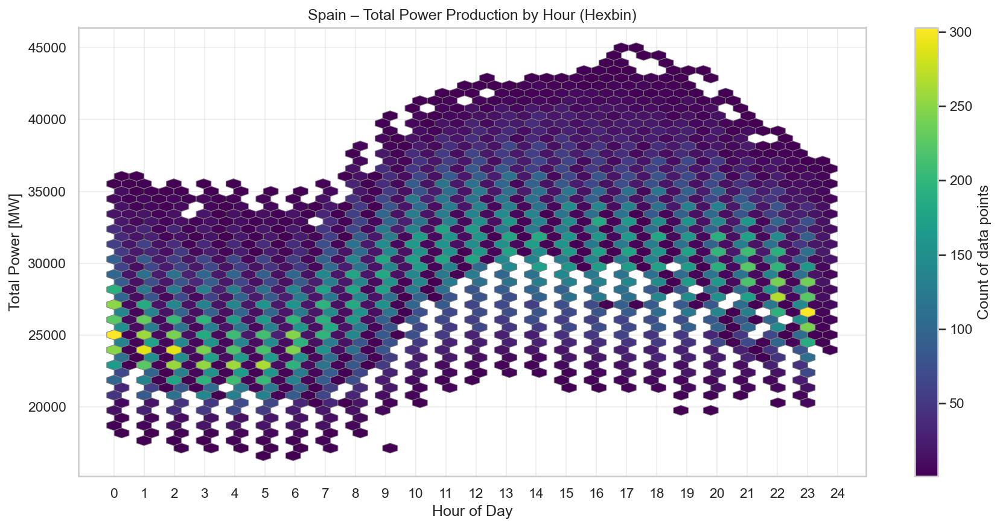
    


```python
def plot_power_hexbins(df: pd.DataFrame, country: str):
    df_graph = df.copy()

    power_cols = [c for c in Columns.Power.ALL if c in df.columns]

    for power in power_cols:
        plt.figure(figsize=(14, 6))
        hb = plt.hexbin(
            x=df_graph[Columns.AXIS.DAY_OF_YEAR],    # x = day of year
            y=df_graph[Columns.AXIS.HOURS_OF_DAY],    # y = hour with fraction
            C=df_graph[Columns.CALC.TOTAL_POWER],    # color = power
            gridsize=100,                            # increase for higher resolution
            cmap='viridis',
            reduce_C_function=np.mean,     # average in bin
            mincnt=1                       # skip empty bins
        )
        plt.colorbar(hb, label=f"{power} [MW]")
        plt.xlabel("Day of Year")
        plt.ylabel("Hour of Day")
        plt.title(f"{country} – {power} Power Consumption")
        plt.tight_layout()
        plt.show()

```


```python
for country, df in dataframes:
    if not ActvnMatrix.is_active(country, PlotOptions.HEXBIN_TOTAL_POWER_DAILY_YEAR_PLOT):
        continue
    plot_power_hexbins(df, country)

```

    
    ----- NOTE -----
    Plot 'HEXBIN_TOTAL_POWER_DAILY_YEAR_PLOT' is deactivated in PLOT_OPTIONS_DICT. Skipping execution for Italy.
    
    ----- NOTE -----
    Plot 'HEXBIN_TOTAL_POWER_DAILY_YEAR_PLOT' is deactivated in PLOT_OPTIONS_DICT. Skipping execution for France.
    
    ----- NOTE -----
    Plot 'HEXBIN_TOTAL_POWER_DAILY_YEAR_PLOT' is deactivated in PLOT_OPTIONS_DICT. Skipping execution for Germany.
    
    ----- NOTE -----
    Plot 'HEXBIN_TOTAL_POWER_DAILY_YEAR_PLOT' is deactivated in PLOT_OPTIONS_DICT. Skipping execution for Spain.


```python
# plot_filter_diagnostics_scatter(
#     df_original,
#     df_filtered,
#     x_col=Columns.AXIS.HOURS_OF_DAY,
#     y_col=Columns.CALC.TOTAL_POWER,
#     title="Total Power vs Hour – Filtered points"
# )

```


```python
# plot_filter_diagnostics_scatter(
#     df_original,
#     df_filtered,
#     x_col=Columns.AXIS.DAY_OF_YEAR,
#     y_col=Columns.CALC.TOTAL_POWER
# )

```


```python
# plot_filter_diagnostics_scatter(
#     df_original,
#     df_filtered,
#     x_col=Columns.AXIS.HOURS_OF_DAY,
#     y_col=Columns.Power.SOLAR,
#     title="Solar production – filtered diagnostics"
# )

```

## 2.2  B. Visualization and Exploratory Analysis (55 points)

1. Time-series visualizations (raw, smoothed, rolling mean or windowed views) (10 points)
2. Distribution analysis with histograms and density style plots where applicable (10 points)
3. Correlation analysis and heatmaps (Pearson and at least one alternative such as Spearman, with short interpretation) (10 points)
4.  Daily or periodic pattern analysis (day-of-week, hour-of-day, seasonality indicators, or test-cycle patterns) (15 points)
5.  Summary of observed patterns as short check statements (similar to True/False style) with evidence (10 points)

### 2.2.2 Distribution analysis with histograms and density style plots where applicable (10 points)


```python
def plot_distribution_all_sources(dataframes_list):
    print(f"\n{'='*80}")
    print("2.2.2 Distribution analysis")
    print(f"{'='*80}")

    # identify collumms
    check_list = [Columns.CALC.TOTAL_POWER] + Columns.Power.ALL_FILT 
    cols_to_plot = []
    
    # loops through data to get a unique list of colums 
    present_cols = set()
    for _, df in dataframes_list: 
        present_cols.update(df.columns)
        
    # deletes the column no data is found
    for col in check_list:
        if col in present_cols:
            cols_to_plot.append(col)

    # set up grid with 5 colums and calculate the rows
    n_cols = 5
    n_rows = (len(cols_to_plot) + n_cols - 1) // n_cols
    
    # width fixed at 20 
    # height calculated according to n_rows
    fig, axes = plt.subplots(n_rows, n_cols, figsize=(20, 3 * n_rows))
    axes = axes.flatten()
    

    # loop through the colums and generate plots
    for i, col_name in enumerate(cols_to_plot):
        ax = axes[i]
        has_data = False
        
        # added to adjust the displayed frame
        view_min = float('inf')
        view_max = float('-inf')
        
        # loop through the
        for country, df in dataframes_list:
            if col_name in df.columns:
                data = df[col_name].dropna()
                
                if not data.empty and data.std() > 0:
                    # plot the full curve (with cut=0 to stop exactly at min/max data)
                    sns.kdeplot(
                        data,
                        ax=ax,
                        label=country,
                        color=colors[country], 
                        fill=True,                      # color the area under the curve
                        alpha=0.1,                      # transparent fill
                        linewidth=1.5, 
                        warn_singular=False,            
                        cut=0)                          # border 0 (no negative line smoothing)            
                    has_data = True
                    
                    # added to delete the outliers (for better visibility)
                    q01 = data.quantile(0.01)
                    q99 = data.quantile(0.99)
                    
                    # added (also for view)
                    view_min = min(view_min, q01)
                    view_max = max(view_max, q99)

        # formatting
        # remove repetetive text
        clean_title = col_name.replace(" - Actual Aggregated [MW]", "")
        ax.set_title(clean_title, fontsize=10, fontweight='bold')
        ax.set_ylabel("")
        ax.set_xlabel("")
        ax.tick_params(axis='both', which='major', labelsize=8)
        ax.grid(True, linestyle=':', alpha=0.4)
        
        # added here are the limits set / cut off
        if has_data and view_max > view_min:
            ax.set_xlim(view_min, view_max)
        
        # the legend is only displayed on the first plot
        if i == 0:
            ax.legend(loc='upper right', fontsize=8, title="Country")
        else:
            if ax.get_legend(): ax.get_legend().remove()

        if not has_data:
            ax.text(0.5, 0.5, "No Data / Constant", ha='center', fontsize=8, color='gray')

    # set the empty plots to no data / constant
    for j in range(len(cols_to_plot), len(axes)):
        axes[j].set_visible(False)

    plt.suptitle("Comparative Distribution Analysis (Zoomed into 1st-99th Percentile)", fontsize=16, y=1.005)
    plt.tight_layout()
    plt.show()

# execute
plot_distribution_all_sources(dataframes_filtered)
```

    
    ================================================================================
    2.2.2 Distribution analysis
    ================================================================================


    
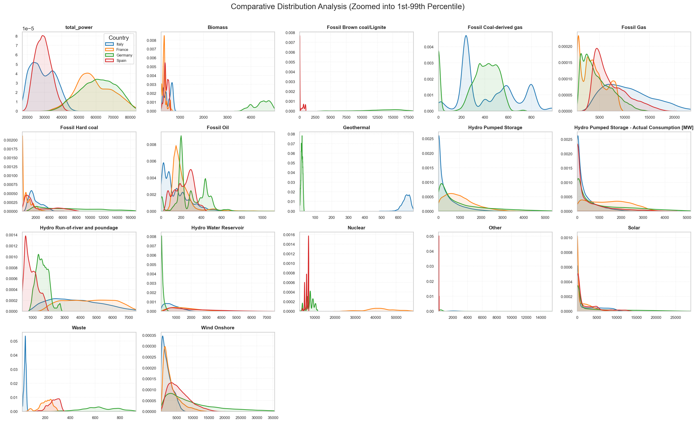
    


```python
def plot_power_comparison(
    df_raw: pd.DataFrame,
    df_filtered: pd.DataFrame,
    country: str,
    colors: dict[str, str],
    title_suffix: str = "Power Generation (Hourly)"
):
    """
    Plot a comparison of raw vs filtered power data for each power source.
    """

    n_sources = len(Columns.Power.ALL)
    fig, axes = plt.subplots(
        nrows=n_sources,
        ncols=1,
        sharex=True,
        figsize=(14, 2.5 * n_sources)
    )

    for ax, col in zip(axes, Columns.Power.ALL):
        # Plot raw data
        ax.plot(
            df_raw.index,
            df_raw[col],
            color="lightgray",
            linewidth=0.6,
            label="Raw"
        )

        # Plot filtered data
        ax.plot(
            df_filtered.index,
            df_filtered[col],
            color=colors.get(country, "tab:blue"),
            linewidth=0.8,
            label="Filtered"
        )

        # Highlight removed points
        removed_idx = df_raw.index.difference(df_filtered.index)
        # Keep only valid indices for this column
        valid_idx = removed_idx.intersection(df_raw[col].dropna().index)

        # Extract x and y as numpy arrays to avoid alignment issues
        x_vals = valid_idx.to_numpy()
        y_vals = df_raw.loc[valid_idx, col].to_numpy()

        if len(x_vals) > 0:
            ax.scatter(
                x_vals,
                y_vals,
                color="red",
                s=20,
                marker="x",
                label="Removed"
            )

        ax.set_title(col, fontsize=11)
        ax.set_ylabel("MW")
        ax.grid(alpha=0.3)

        # Avoid duplicate legend entries
        handles, labels = ax.get_legend_handles_labels()
        by_label = dict(zip(labels, handles))
        ax.legend(by_label.values(), by_label.keys(), fontsize=9)

    fig.suptitle(f"{country} – {title_suffix}", fontsize=16)
    plt.xlabel("Datetime")
    plt.tight_layout(rect=[0, 0, 1, 0.96])
    plt.show()


# for country, df in dataframes_filtered_regression:
#     print("=" * 40)
#     print(f"\nPower Comparison for {country}:")
#     print("-" * 40)
#     plot_power_comparison(
#         df_raw=dict(dataframes)[country],
#         df_filtered=df,
#         country=country,
#         colors=colors,
#         title_suffix="Power Generation – Filtered Diagnostics"
#     )
```

### 2.2.3 Correlation analysis and heatmaps (Pearson and at least one alternative such as Spearman, with short interpretation) (10 points)


```python
def analyze_correlations_standard(dataframes_list):

    print(f"\n{'='*80}")
    print("2.2.3 CORRELATION ANALYSIS")
    print(f"{'='*80}")

    for country, df in dataframes_list:
        
        # select colums
        target_cols = Columns.Power.ALL + [Columns.CALC.TOTAL_POWER]
        available_cols = [c for c in target_cols if c in df.columns]
        
        # validate colums (take ony valid ones)
        valid_cols = []
        for col in available_cols:
            if df[col].notna().sum() > 10 and df[col].std() > 0:
                valid_cols.append(col)
        
        # if there are less than 2 colums - correlation not possible
        if len(valid_cols) < 2:
            print(f"Skipping {country}: Not enough valid columns.")
            continue

        # only validated collums
        corr_data = df[valid_cols].copy()
        
        # split the string at " - " and keep only the first part.
        #(because otherwise the plots would be to small)
        new_names = {}
        for col in valid_cols:
            if " - " in col:
                clean_name = col.split(" - ")[0] 
            else:
                clean_name = col # keep original if no separator found
            new_names[col] = clean_name
            
        corr_data.rename(columns=new_names, inplace=True)

        # calculate Matrices
        pearson_corr = corr_data.corr(method='pearson')
        spearman_corr = corr_data.corr(method='spearman')
        
        # plot conficturation
        fig, axes = plt.subplots(1, 2, figsize=(22, 9))
        
        # Left: Pearson
        sns.heatmap(
            pearson_corr, 
            annot=True, 
            fmt=".2f", 
            cmap='coolwarm', 
            vmin=-1, 
            vmax=1, 
            center=0, 
            square=True, 
            linewidths=0.5, 
            ax=axes[0],
            annot_kws={"size": 9})
        axes[0].set_title(f"{country} - Pearson (Linear)", fontsize=16, fontweight='bold', pad=15)
        axes[0].tick_params(axis='both', which='major', labelsize=11)
        
        # Right: Spearman
        sns.heatmap(
            spearman_corr, 
            annot=True, 
            fmt=".2f", 
            cmap='coolwarm', 
            vmin=-1,
            vmax=1,
            center=0,
            square=True,
            linewidths=0.5, 
            ax=axes[1],
            annot_kws={"size": 9})
        axes[1].set_title(f"{country} - Spearman (Rank Order)", fontsize=16, fontweight='bold', pad=15)
        axes[1].tick_params(axis='both', which='major', labelsize=11)
        
        plt.tight_layout()
        plt.show()

# execute
analyze_correlations_standard(dataframes_filtered)
```

    
    ================================================================================
    2.2.3 CORRELATION ANALYSIS
    ================================================================================


    
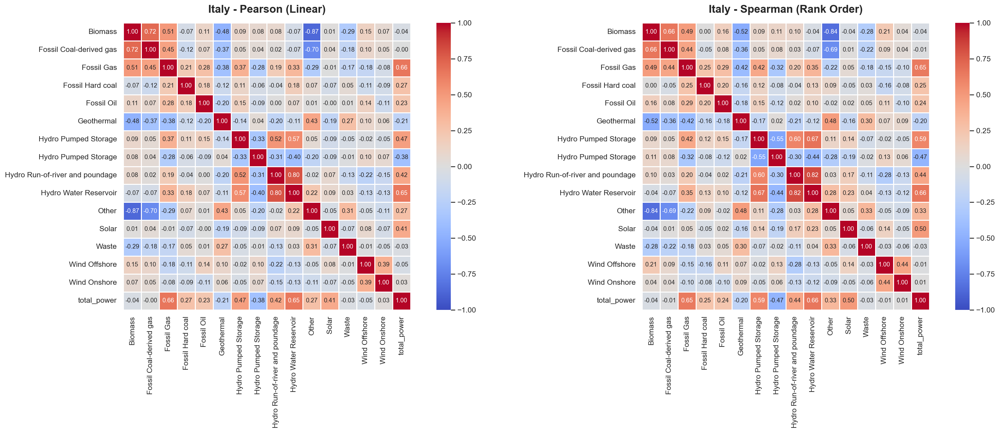
    


    
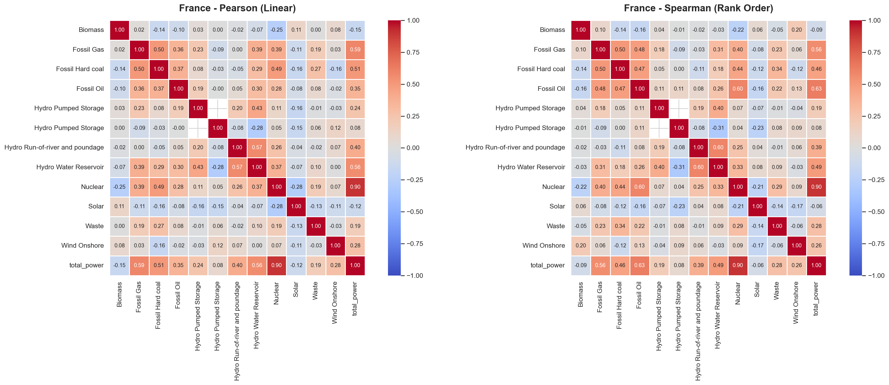
    


    
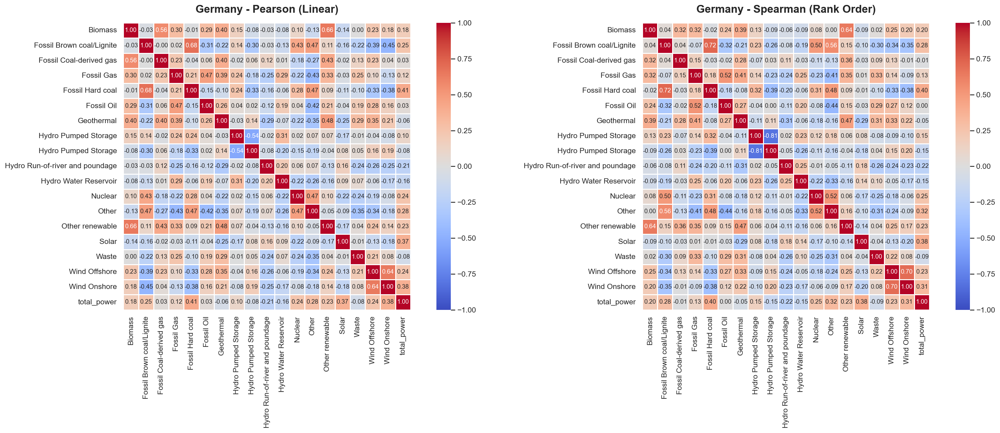
    


    
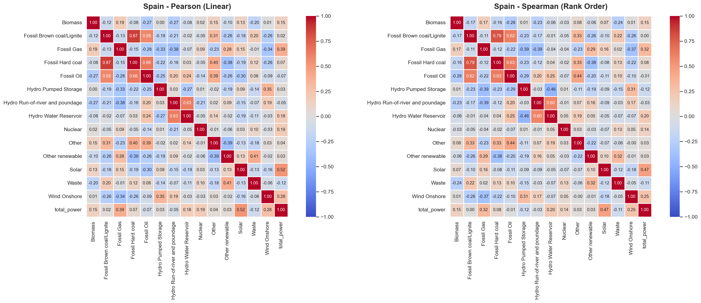
    


### 2.2.4 Daily or periodic pattern analysis 

day-of-week
hour-of-day
seasonality indicators


```python
def analyze_periodic_patterns(dataframes_list):

    print(f"\n{'='*80}\n2.2.4 PERIODIC PATTERN ANALYSIS\n{'='*80}")
    
    # only visalize the total pwoer collumn
    TARGET = Columns.CALC.TOTAL_POWER

    # iteration through all countries
    for country, df in dataframes_list:
        if TARGET not in df.columns: continue

        # copy the data and prepareing it for plotting
        pdf = df[[TARGET]].copy()
        pdf[Columns.AXIS.HOURS_OF_DAY] = pdf.index.hour
        pdf[Columns.AXIS.DAY_OF_WEEK_STR] = pdf.index.day_name()
        pdf[Columns.AXIS.MONTH_STR] = pdf.index.month_name()

        # layout for the plots
        fig, (ax1, ax2, ax3) = plt.subplots(1, 3, figsize=(18, 4.5))
        
        # DAILY profile
        day_stats = pdf.groupby(Columns.AXIS.HOURS_OF_DAY)[TARGET].agg(['mean', 'std'])
        # averaging line
        ax1.plot(day_stats.index, 
                 day_stats['mean'], 
                 color=colors[country], 
                 lw=2.5, label='Mean')
        # shading between -std / mean / +std
        ax1.fill_between(day_stats.index, 
                         day_stats['mean'] - day_stats['std'], 
                         day_stats['mean'] + day_stats['std'], 
                         color=colors[country], 
                         alpha=0.2)
        
        # set title and gid
        ax1.set(title=f"{country}: Daily Profile", 
                xlabel="Hour (0-23)", 
                ylabel="MW", 
                xticks=range(0, 25, 4))
        ax1.grid(True, 
                 ls='--', 
                 alpha=0.5)

        # WEEKLY profile 
        week_stats = pdf.groupby(Columns.AXIS.DAY_OF_WEEK_STR)[TARGET].agg(['mean', 'std']).reindex(WEEK_ORDER)
        # averaging line
        ax2.plot(week_stats.index, 
                 week_stats['mean'], 
                 color=colors[country], 
                 lw=2.5, 
                 label='Mean')
        ax2.fill_between(week_stats.index, 
                         week_stats['mean'] - week_stats['std'], 
                         week_stats['mean'] + week_stats['std'], 
                         color=colors[country], 
                         alpha=0.2)
        # shading between -std / mean / +std
        ax2.set(title=f"{country}: Weekly Cycle", 
                xlabel="", 
                ylabel="")
        ax2.tick_params(axis='x', rotation=45)
        ax2.grid(True, ls='--', alpha=0.5)

        # SEASONAL tred with bar charts
        season_stats = pdf.groupby(Columns.AXIS.MONTH_STR)[TARGET].mean().reindex(MONTH_ORDER)
        bars = ax3.bar(season_stats.index, 
                       season_stats.values, 
                       color=colors[country], 
                       alpha=0.7, 
                       edgecolor='k')
        
        # mark the month with the maximum production in darkred
        if not season_stats.empty:
            peak_idx = MONTH_ORDER.index(season_stats.idxmax())
            bars[peak_idx].set(color='darkred', alpha=1.0)
        
        # set up plot
        ax3.set(title=f"{country}: Seasonal Trend", ylabel="")
        ax3.tick_params(axis='x', rotation=45)
        ax3.grid(axis='y', ls='--', alpha=0.5)

        plt.tight_layout()
        plt.show()

# execute
analyze_periodic_patterns(dataframes_filtered)
```

    
    ================================================================================
    2.2.4 PERIODIC PATTERN ANALYSIS
    ================================================================================


    
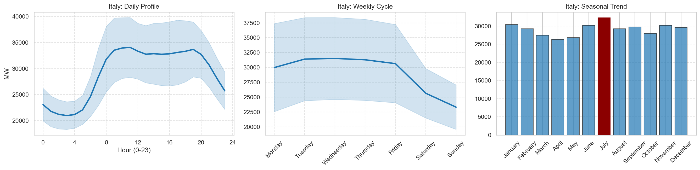
    


    
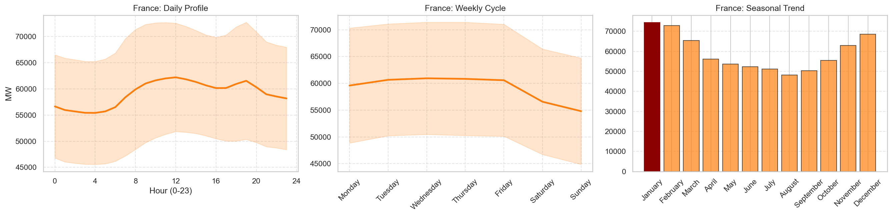
    


    
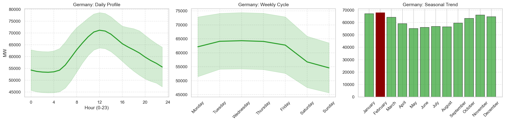
    


    
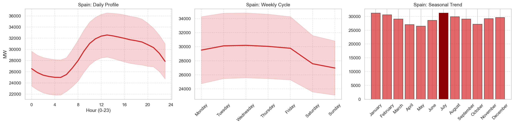
    


### 2.2.5 Summary of observed patterns

#### ITALY

1. Significant consumption drop on Weekends (>5%).
   -> [TRUE]
   -> Weekends are 20.9% lower than Weekdays (Avg: 24.5GW vs 31.0GW).

2. Grid load is dominated by Winter heating demand.
   -> [FALSE]
   -> Summer load is 2.7% higher on average.
      Temperature (average): summer max 32, winter min 5

3. Strong correlation between Solar Generation and Total Load.
   -> [FALSE]
   -> Pearson Correlation coefficient is 0.41.
      Best correlation is between fossil coal delivered gas and Biomass (0.72).
      Also high correlation for Hydro Pumped storage and Reservoirs (0.75).

------------------------------------------------------------

#### FRANCE

1. Significant consumption drop on Weekends (>5%).
   -> [TRUE]
   -> Weekends are 8.0% lower than Weekdays (Avg: 55.6GW vs 60.5GW).

2. Grid load is dominated by Winter heating demand.
   -> [TRUE]
   -> Winter load is 42.5% higher on average.
      Temperature (average): summer max 25, winter min 0

3. Strong correlation between Solar Generation and Total Load.
   -> [FALSE]
   -> Pearson Correlation coefficient is -0.12.
      Distinct correlation between total power and nuclear (0.9).

------------------------------------------------------------

#### GERMANY

1. Significant consumption drop on Weekends (>5%)
   -> [TRUE]
   -> Weekends are 12.3% lower than Weekdays (Avg: 55.7GW vs 63.5GW)

2. Grid load is dominated by Winter heating demand
   -> [TRUE]
   -> Winter load is 18.0% higher on average
      Temperature (average): summer max 20, winter min 1.7

3. Strong correlation between Solar Generation and Total Load
   -> [FALSE]
   -> Pearson Correlation coefficient is 0.37
      Good correlation between Wind offshore and onshore (0.64)

------------------------------------------------------------

#### SPAIN

1. Significant consumption drop on Weekends (>5%).
   -> [TRUE] 
   -> Weekends are 9.1% lower than Weekdays (Avg: 28.4GW vs 31.2GW)

2. Grid load is dominated by Winter heating demand.
   -> [FALSE] (Summer/Winter balanced) 
   -> Summer load is 1.2% higher on average
      Temperature (average): summer max 28.6, winter min 10.5

3. Strong correlation between Solar Generation and Total Load
   -> [TRUE] 
   -> Pearson Correlation: 0.72.
      High correlation due to sunny weather driving both solar output and air conditioning.

## 2.3 C. Probability and Event Analysis (45 points)

1. Threshold-based probability estimation for events (define event, justify threshold, compute empirical probability) (15 points)
2. Cross tabulation analysis for two variables (10 points)
3. Conditional probability analysis (at least two meaningful conditional relationships) (15 points)
4. Summary of observations and limitations (what could bias these estimates, what assumptions were made) (5 points)

### 2.3.2 Cross tabulation analysis for two variables (10 points)

One central message of renewable energy is that windy energy is available in the winter when solar energy is low and otherwise around. This analyse shall show the available of wind and solar against each other.


```python
# -----------------------------
# 2. Cross-tabulation analysis
# -----------------------------
def cross_tab_analysis(df, col1, col2, bins1=None, bins2=None, normalize=True):
    """
    Cross-tabulation between two variables (can discretize with bins).

    Parameters
    ----------
    df : pd.DataFrame
    col1, col2 : str
        Columns to cross-tabulate
    bins1, bins2 : list or None
        Optional bin edges to discretize continuous variables
    normalize : bool
        Return percentages if True
    
    Returns
    -------
    ctab : pd.DataFrame
    """
    data1 = pd.cut(df[col1], bins=bins1) if bins1 else df[col1]
    data2 = pd.cut(df[col2], bins=bins2) if bins2 else df[col2]
    
    ctab = pd.crosstab(data1, data2, normalize="all" if normalize else False)
    return ctab


# -----------------------------
# 2x2 Cross-tab Heatmap Plot
# -----------------------------
def plot_cross_tab_heatmaps_2x2(dataframes, solar_col, wind_col, bins=5, cmap="viridis", show_percent=True):
    """
    Plot cross-tab heatmaps for multiple countries in a 2x2 layout.
    """
    n_countries = len(dataframes)
    n_cols = 2
    n_rows = (n_countries + 1) // 2

    fig, axes = plt.subplots(n_rows, n_cols, figsize=(12*n_cols, 10*n_rows))
    axes = axes.flatten() if n_countries > 1 else [axes]

    for ax, (country, df) in zip(axes, dataframes):
        # Compute cross-tab
        ctab = cross_tab_analysis(
            df,
            solar_col,
            wind_col,
            bins1=bins,
            bins2=bins,
            normalize=True
        )

        # Convert to percent if requested
        data = ctab * 100 if show_percent else ctab
        fmt = ".2f" if show_percent else ".3f"
        cbar_label = "Joint probability (%)" if show_percent else "Frequency"

        # Plot heatmap on the specific axes
        sns.heatmap(
            data,
            annot=True,
            fmt=fmt,
            cmap=cmap,
            cbar=True,
            ax=ax,
            linewidths=0.5,
            linecolor="white",
            cbar_kws={"label": cbar_label}
        )

        ax.set_title(f"{country} – Solar & Wind", fontsize=16, pad=12)
        ax.set_xlabel(ctab.columns.name or "Wind output (binned)", fontsize=14)
        ax.set_ylabel(ctab.index.name or "Solar output (binned)", fontsize=14)
        ax.tick_params(axis='x', labelsize=12)
        ax.tick_params(axis='y', labelsize=12)

    # Hide any unused axes
    for ax in axes[n_countries:]:
        ax.set_visible(False)

    plt.tight_layout()
    plt.show()


# -----------------------------
# Usage Example
# -----------------------------
plot_cross_tab_heatmaps_2x2(
    dataframes_filtered,
    solar_col="Solar - Actual Aggregated [MW]",
    wind_col="Wind Onshore - Actual Aggregated [MW]",
    bins=5,
    cmap="viridis",
    show_percent=True
)

```


    

    


### 2.3.1. Threshold-based probability estimation for events (define event, justify threshold, compute empirical probability) (15 points)


```python
*-/def threshold_event_probability(df, state, thresholds, plot=False):
    report = {
        "state": state,
        "probabilities": {},
        "thresholds": {}
    }

    for power, (min_val, thresh_type) in thresholds.items():
        if power not in df.columns:
            report["thresholds"][power] = {"type": thresh_type, "value": None}
            report["probabilities"][power] = None
            continue

        series = df[power].dropna()

        if series.empty:  # <- critical check
            report["thresholds"][power] = {"type": thresh_type, "value": None}
            report["probabilities"][power] = None
            continue

        if thresh_type == "percentile":
            threshold_val = np.percentile(series, min_val)
        else:  # absolute
            threshold_val = min_val

        event = series >= threshold_val
        probability = event.sum() / len(series)

        report["thresholds"][power] = {
            "type": thresh_type,
            "value": threshold_val
        }
        report["probabilities"][power] = probability

    return report


# Define thresholds per power source
POWER_THRESHOLDS = {
    # Columns.Power.SOLAR: (90, "percentile"),          # Top 5% of solar output
    Columns.Power.SOLAR: (10000, "absolute"),      # Absolute threshold in MW
    # Columns.Power.SOLAR: (12000, "absolute"),      # Absolute threshold in MW
    # Columns.Power.SOLAR: (35000, "absolute"),      # Absolute threshold in MW
    # Columns.Power.WIND_ONSHORE: (150000, "absolute"), # Absolute threshold in MW
    # Columns.Power.WIND_OFFSHORE: (10000, "absolute"),
    Columns.Power.WIND_ONSHORE: (30, "percentile"),
    Columns.Power.WIND_OFFSHORE: (30, "percentile"),
    Columns.Power.NUCLEAR: (80, "percentile"),
    Columns.Power.FOSSIL_GAS: (10_000, "absolute")
}

for country, df in dataframes_filtered:
    
    report = threshold_event_probability(
        df=dict(dataframes)[country],
        state=country,
        thresholds=POWER_THRESHOLDS,
        plot=True
    )

    # Print probabilities
    print(f"\nThreshold Event Probabilities for {country}:")
    print("-" * 40)
    for source, prob in report["probabilities"].items():
        if prob is None:
            print(f"{source}: column not found in data")
        else:
            print(f"{source}: {prob:.2%}")


```

    
    Threshold Event Probabilities for Italy:
    ----------------------------------------
    Solar - Actual Aggregated [MW]: 1.37%
    Wind Onshore - Actual Aggregated [MW]: 70.02%
    Wind Offshore - Actual Aggregated [MW]: 100.00%
    Nuclear - Actual Aggregated [MW]: column not found in data
    Fossil Gas - Actual Aggregated [MW]: 50.16%
    
    Threshold Event Probabilities for France:
    ----------------------------------------
    Solar - Actual Aggregated [MW]: 0.06%
    Wind Onshore - Actual Aggregated [MW]: 70.03%
    Wind Offshore - Actual Aggregated [MW]: column not found in data
    Nuclear - Actual Aggregated [MW]: 20.00%
    Fossil Gas - Actual Aggregated [MW]: 0.00%
    
    Threshold Event Probabilities for Germany:
    ----------------------------------------
    Solar - Actual Aggregated [MW]: 20.89%
    Wind Onshore - Actual Aggregated [MW]: 70.00%
    Wind Offshore - Actual Aggregated [MW]: 70.01%
    Nuclear - Actual Aggregated [MW]: 20.02%
    Fossil Gas - Actual Aggregated [MW]: 5.29%
    
    Threshold Event Probabilities for Spain:
    ----------------------------------------
    Solar - Actual Aggregated [MW]: 5.44%
    Wind Onshore - Actual Aggregated [MW]: 70.00%
    Wind Offshore - Actual Aggregated [MW]: 100.00%
    Nuclear - Actual Aggregated [MW]: 20.03%
    Fossil Gas - Actual Aggregated [MW]: 20.07%


```python

# -----------------------------
# 1. Threshold-based probability estimation
# -----------------------------
def compute_event_probabilities(df, thresholds: dict[str, tuple[float | str]], verbose=True):
    """
    Compute empirical probability of threshold-defined events for each power source.
    Handles missing or insufficient data safely.
    """

    report = {
        "probabilities": {},
        "thresholds": {},
        "notes": {}
    }

    for power, (val, typ) in thresholds.items():

        if power not in df.columns:
            report["probabilities"][power] = None
            report["notes"][power] = "column not found"
            continue

        series = df[power].dropna()

        # Handle empty or insufficient data
        if len(series) == 0:
            report["probabilities"][power] = None
            report["notes"][power] = "no valid data"
            continue

        if typ == "percentile":
            threshold_val = np.percentile(series, val)
        else:  # absolute
            threshold_val = val

        # Define event
        event = series >= threshold_val
        probability = event.mean()

        report["thresholds"][power] = {
            "value": float(threshold_val),
            "type": typ
        }
        report["probabilities"][power] = float(probability)
        report["notes"][power] = "ok"

        if verbose:
            print(
                f"{power}: threshold={threshold_val:.2f} ({typ}), "
                f"P(event)={probability:.2%}"
            )

    return report


# -----------------------------
# 3. Conditional probability
# -----------------------------
def conditional_probability(df, event_col, condition_col, threshold_event, threshold_condition):
    """
    Compute P(event | condition) for two columns.

    Parameters
    ----------
    df : pd.DataFrame
    event_col, condition_col : str
    threshold_event, threshold_condition : numeric
    
    Returns
    -------
    float
        Conditional probability
    """
    event = df[event_col] >= threshold_event
    condition = df[condition_col] >= threshold_condition

    if condition.sum() == 0:
        return None

    return (event & condition).sum() / condition.sum()


# -----------------------------
# 4. Summary
# -----------------------------
def summarize_prob_analysis(prob_report, ctab_report=None, conditional_probs=None):
    """
    Print concise summary of probability analysis.
    """
    print("\n=== Summary of Probability & Event Analysis ===\n")
    print("Event Probabilities:")
    for source, prob in prob_report["probabilities"].items():
        if prob is not None:
            print(f"- {source}: {prob:.2%}")
        else:
            print(f"- {source}: No data")
    
    if ctab_report is not None:
        print("\nCross-tabulation (sample):")
        print(ctab_report.head())
    
    if conditional_probs is not None:
        print("\nConditional Probabilities:")
        for desc, val in conditional_probs.items():
            if val is not None:
                print(f"- {desc}: {val:.2%}")
            else:
                print(f"- {desc}: No data / zero condition count")
    
    print("\nLimitations: thresholds are user-defined, independent assumption, missing data not considered.")


for country, df in dataframes_filtered:
    # 1. Compute event probabilities
    prob_report = compute_event_probabilities(df, POWER_THRESHOLDS)

    # 2. Cross-tabulation example
    ctab = cross_tab_analysis(df, Columns.Power.SOLAR, Columns.Power.WIND_ONSHORE, bins1=5, bins2=5)

    # 3. Conditional probabilities
    cond_probs = {
        "P(SOLAR high | WIND_ONSHORE high)": conditional_probability(
            df, Columns.Power.SOLAR, Columns.Power.WIND_ONSHORE, threshold_event=np.percentile(df[Columns.Power.SOLAR], 95),
            threshold_condition=100_000
        ),
        "P(FOSSIL_GAS high | SOLAR low)": conditional_probability(
            df, Columns.Power.FOSSIL_GAS, Columns.Power.SOLAR, threshold_event=200_000, threshold_condition=np.percentile(df[Columns.Power.SOLAR], 5)
        )
    }

    # 4. Summary
    summarize_prob_analysis(prob_report, ctab_report=ctab, conditional_probs=cond_probs)


```

    Solar - Actual Aggregated [MW]: threshold=10000.00 (absolute), P(event)=1.37%
    Wind Onshore - Actual Aggregated [MW]: threshold=1027.00 (percentile), P(event)=70.02%
    Wind Offshore - Actual Aggregated [MW]: threshold=0.00 (percentile), P(event)=100.00%
    Fossil Gas - Actual Aggregated [MW]: threshold=10000.00 (absolute), P(event)=50.16%
    
    === Summary of Probability & Event Analysis ===
    
    Event Probabilities:
    - Solar - Actual Aggregated [MW]: 1.37%
    - Wind Onshore - Actual Aggregated [MW]: 70.02%
    - Wind Offshore - Actual Aggregated [MW]: 100.00%
    - Nuclear - Actual Aggregated [MW]: No data
    - Fossil Gas - Actual Aggregated [MW]: 50.16%
    
    Cross-tabulation (sample):
    Wind Onshore - Actual Aggregated [MW]  (12.328, 1554.4]  (1554.4, 3088.8]  (3088.8, 4623.2]  (4623.2, 6157.6]  (6157.6, 7692.0]
    Solar - Actual Aggregated [MW]                                                                                                 
    (-13.155, 2631.0]                              0.289837          0.201145          0.112351          0.057869          0.006944
    (2631.0, 5262.0]                               0.052162          0.037970          0.021339          0.009738          0.001880
    (5262.0, 7893.0]                               0.056176          0.034346          0.017901          0.007384          0.001931
    (7893.0, 10524.0]                              0.046709          0.024489          0.009636          0.003455          0.000711
    (10524.0, 13155.0]                             0.003658          0.001253          0.000728          0.000373          0.000017
    
    Conditional Probabilities:
    - P(SOLAR high | WIND_ONSHORE high): No data / zero condition count
    - P(FOSSIL_GAS high | SOLAR low): 0.00%
    
    Limitations: thresholds are user-defined, independent assumption, missing data not considered.
    Solar - Actual Aggregated [MW]: threshold=10000.00 (absolute), P(event)=0.06%
    Wind Onshore - Actual Aggregated [MW]: threshold=1587.00 (percentile), P(event)=70.03%
    Nuclear - Actual Aggregated [MW]: threshold=48534.60 (percentile), P(event)=20.00%
    Fossil Gas - Actual Aggregated [MW]: threshold=10000.00 (absolute), P(event)=0.00%
    
    === Summary of Probability & Event Analysis ===
    
    Event Probabilities:
    - Solar - Actual Aggregated [MW]: 0.06%
    - Wind Onshore - Actual Aggregated [MW]: 70.03%
    - Wind Offshore - Actual Aggregated [MW]: No data
    - Nuclear - Actual Aggregated [MW]: 20.00%
    - Fossil Gas - Actual Aggregated [MW]: 0.00%
    
    Cross-tabulation (sample):
    Wind Onshore - Actual Aggregated [MW]  (247.783, 3105.4]  (3105.4, 5948.8]  (5948.8, 8792.2]  (8792.2, 11635.6]  (11635.6, 14479.0]
    Solar - Actual Aggregated [MW]                                                                                                     
    (-10.701, 2140.2]                               0.443693          0.192708          0.073216           0.031279            0.006495
    (2140.2, 4280.4]                                0.113292          0.030851          0.013123           0.005713            0.001830
    (4280.4, 6420.6]                                0.046262          0.012222          0.004650           0.001727            0.000133
    (6420.6, 8560.8]                                0.012828          0.003735          0.000841           0.000118            0.000000
    (8560.8, 10701.0]                               0.004118          0.001107          0.000059           0.000000            0.000000
    
    Conditional Probabilities:
    - P(SOLAR high | WIND_ONSHORE high): No data / zero condition count
    - P(FOSSIL_GAS high | SOLAR low): No data / zero condition count
    
    Limitations: thresholds are user-defined, independent assumption, missing data not considered.
    Solar - Actual Aggregated [MW]: threshold=10000.00 (absolute), P(event)=20.89%
    Wind Onshore - Actual Aggregated [MW]: threshold=4276.00 (percentile), P(event)=70.00%
    Wind Offshore - Actual Aggregated [MW]: threshold=839.00 (percentile), P(event)=70.01%
    Nuclear - Actual Aggregated [MW]: threshold=9405.00 (percentile), P(event)=20.02%
    Fossil Gas - Actual Aggregated [MW]: threshold=10000.00 (absolute), P(event)=5.29%
    
    === Summary of Probability & Event Analysis ===
    
    Event Probabilities:
    - Solar - Actual Aggregated [MW]: 20.89%
    - Wind Onshore - Actual Aggregated [MW]: 70.00%
    - Wind Offshore - Actual Aggregated [MW]: 70.01%
    - Nuclear - Actual Aggregated [MW]: 20.02%
    - Fossil Gas - Actual Aggregated [MW]: 5.29%
    
    Cross-tabulation (sample):
    Wind Onshore - Actual Aggregated [MW]  (28.893, 8894.4]  (8894.4, 17715.8]  (17715.8, 26537.2]  (26537.2, 35358.6]  (35358.6, 44180.0]
    Solar - Actual Aggregated [MW]                                                                                                        
    (-38.153, 7630.6]                              0.403226           0.202258            0.090073            0.043647            0.008718
    (7630.6, 15261.2]                              0.079704           0.028932            0.011139            0.004335            0.001478
    (15261.2, 22891.8]                             0.061380           0.017667            0.005090            0.001124            0.000332
    (22891.8, 30522.4]                             0.027336           0.006370            0.001349            0.000022            0.000000
    (30522.4, 38153.0]                             0.005031           0.000593            0.000195            0.000000            0.000000
    
    Conditional Probabilities:
    - P(SOLAR high | WIND_ONSHORE high): No data / zero condition count
    - P(FOSSIL_GAS high | SOLAR low): 0.00%
    
    Limitations: thresholds are user-defined, independent assumption, missing data not considered.
    Solar - Actual Aggregated [MW]: threshold=10000.00 (absolute), P(event)=5.44%
    Wind Onshore - Actual Aggregated [MW]: threshold=3560.00 (percentile), P(event)=70.01%
    Wind Offshore - Actual Aggregated [MW]: threshold=0.00 (percentile), P(event)=100.00%
    Nuclear - Actual Aggregated [MW]: threshold=7058.00 (percentile), P(event)=20.03%
    Fossil Gas - Actual Aggregated [MW]: threshold=10000.00 (absolute), P(event)=20.07%
    
    === Summary of Probability & Event Analysis ===
    
    Event Probabilities:
    - Solar - Actual Aggregated [MW]: 5.44%
    - Wind Onshore - Actual Aggregated [MW]: 70.01%
    - Wind Offshore - Actual Aggregated [MW]: 100.00%
    - Nuclear - Actual Aggregated [MW]: 20.03%
    - Fossil Gas - Actual Aggregated [MW]: 20.07%
    
    Cross-tabulation (sample):
    Wind Onshore - Actual Aggregated [MW]  (124.245, 4095.0]  (4095.0, 8046.0]  (8046.0, 11997.0]  (11997.0, 15948.0]  (15948.0, 19899.0]
    Solar - Actual Aggregated [MW]                                                                                                       
    (-14.314, 2862.8]                               0.225074          0.286571           0.134839            0.043356            0.003277
    (2862.8, 5725.6]                                0.082485          0.062550           0.023537            0.007100            0.001079
    (5725.6, 8588.4]                                0.022510          0.018674           0.008167            0.002042            0.000325
    (8588.4, 11451.2]                               0.025007          0.018063           0.005137            0.000936            0.000013
    (11451.2, 14314.0]                              0.014916          0.012094           0.002172            0.000078            0.000000
    
    Conditional Probabilities:
    - P(SOLAR high | WIND_ONSHORE high): No data / zero condition count
    - P(FOSSIL_GAS high | SOLAR low): No data / zero condition count
    
    Limitations: thresholds are user-defined, independent assumption, missing data not considered.


## 2.4 D. Statistical Theory Applications (45 points)

1. Law of Large Numbers demonstration (15 points)
2. Central Limit Theorem application (sampling distributions, effect of sample size, interpretation) (25 points)
3. Result interpretation and sanity checks (what would invalidate your conclusion, what you verified) (5 points)


```python
def demonstrate_lln(dataframes_list):
    print(f"\n{'='*80}")
    print("2.4.1 STATISTICAL THEORY: LAW OF LARGE NUMBERS ")
    print(f"{'='*80}")
    
    TARGET = Columns.CALC.TOTAL_POWER

    # grid setup
    n_cols = 2
    n_rows = (len(dataframes_list) + n_cols - 1) // n_cols
    fig, axes = plt.subplots(n_rows, n_cols, figsize=(20, 6 * n_rows))
    axes = axes.flatten()

    for i, (country, df) in enumerate(dataframes_list):
        ax = axes[i]
        
        if TARGET not in df.columns:
            ax.text(0.5, 0.5, "Data Missing", ha='center')
            continue

        # calculate mean
        # (line to converge to)
        population_data = df[TARGET].dropna()
        true_mean = population_data.mean()
        
        # simulate the random sampling
        #   the data neets to be shuffeled!
        #   if it starts in the morning the first values are to low and then the data isnt convergeing right.
        shuffled_samples = population_data.sample(frac=1, random_state=42).values
        
        # 3. calculating the cumulative mean
        #    mean of the first value, the first two, three and so on
        #    1/1 (1+2)/2 (1+2+3)/3 (1+2+3+4)/4
        cumulative_sum = np.cumsum(shuffled_samples)
        #    divide by 1,2,3,4,5.....
        sample_sizes = np.arange(1, len(shuffled_samples) + 1)
        running_means = cumulative_sum / sample_sizes
        
        # fix:  plot only the start to see the results
        #       else there are too many values to see it converge!
        limit_n = 5000 
        
        # plot the calculated mean ( 1/1 (1+2)/2 (1+2+3)/3 ....)
        ax.plot(sample_sizes[:limit_n],     # added limit
                running_means[:limit_n],    # added limit
                color=colors[country], 
                linewidth=1.5, 
                alpha=0.8, 
                label='Sample Mean')
        
        # plot the mean line in red, where the data should be convergeint
        ax.axhline(true_mean, 
                   color='black', 
                   linestyle='--', 
                   linewidth=2, 
                   label=f'True Mean ({true_mean:.0f} MW)')
        
        # format the graph for better visibility
        ax.set_title(f"{country}: Convergence to True Mean", fontsize=12, fontweight='bold')
        ax.set_xlabel("Sample Size (n)")
        ax.set_ylabel("Calculated Mean [MW]")
        ax.legend(loc='upper right')
        ax.grid(True, linestyle=':', alpha=0.6)
        
        # Add text verification
        # compare mean at n=10 vs n=5000
        mean_10 = running_means[9]
        mean_5000 = running_means[limit_n-1]

        # for visibility measure the error at 10 samples and 5000 samples to see the converge
        error_10 = abs(mean_10 - true_mean)
        error_5000 = abs(mean_5000 - true_mean)
        stats_text = (f"Error at n=10:   {error_10:.1f} MW\n"
                      f"Error at n=5000: {error_5000:.1f} MW")
        
        ax.text(0.5, 0.1, stats_text, transform=ax.transAxes, 
                fontsize=10, bbox=dict(facecolor='white', alpha=0.8, edgecolor='gray'))

    # hide empty subplots if neccesary
    for j in range(i + 1, len(axes)):
        axes[j].set_visible(False)
        
    plt.tight_layout()
    plt.show()

    print("\n INTERPRETATION:")
    print(" - The jagged line starts wildly volatile because 'n' is small (small sample size).")
    print(" - As 'n' increases (moving right), the colored line flattens and is getting closer to the true mean.")
    print(" - This proves larger datasets yield more reliable statistics.")

# execute
demonstrate_lln(dataframes_filtered)
```

    
    ================================================================================
    2.4.1 STATISTICAL THEORY: LAW OF LARGE NUMBERS 
    ================================================================================


    
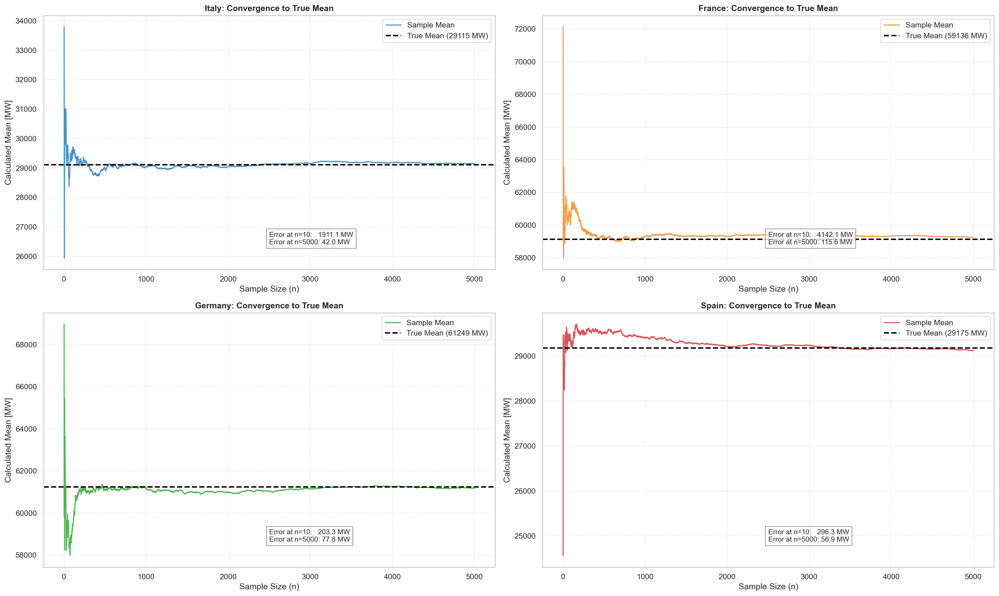
    


    
     INTERPRETATION:
     - The jagged line starts wildly volatile because 'n' is small (small sample size).
     - As 'n' increases (moving right), the colored line flattens and is getting closer to the true mean.
     - This proves larger datasets yield more reliable statistics.


```python
def demonstrate_clt(dataframes_list):
    print(f"\n{'='*80}")
    print("2.4.2  CENTRAL LIMIT THEOREM (CLT)")
    print(f"{'='*80}")

    TARGET_COL = Columns.CALC.TOTAL_POWER  # Column to analyze
    NUM_TRIALS = 2000       # repetition times
    SMALL_N    = 1          # small sample size for comparison(must be smaller than 5)
    LARGE_N    = 2000       # lagre sample size (smooth)
    BINS       = 100        # histogramm resolution (bars)
    # ==========================================

    for country, df in dataframes_list:
        if TARGET_COL not in df.columns: continue
        
        # prepare the data
        population = df[TARGET_COL].dropna().values
        true_mean = np.mean(population)
        
        # SMALL sample size
        samples_small = np.random.choice(population, size=(NUM_TRIALS, SMALL_N))
        means_small = np.mean(samples_small, axis=1)
        
        # LARGE sample size
        samples_large = np.random.choice(population, size=(NUM_TRIALS, LARGE_N))
        means_large = np.mean(samples_large, axis=1)

        # plot presettings
        fig, axes = plt.subplots(1, 3, figsize=(20, 5))
        
        # LEFT plot the original 
        sns.histplot(
            population, 
            kde=True,               # display the smooth line voer the bars
            ax=axes[0], 
            color='gray', 
            stat='density', 
            bins=BINS)
        
        # settings
        axes[0].set_title(f"{country}: Original Population", fontweight='bold')
        axes[0].set_xlabel("Power [MW]")
        axes[0].text(0.95, 0.95, "Often Irregular\n(Not Normal)", transform=axes[0].transAxes, 
                     ha='right', va='top', bbox=dict(boxstyle="round", fc="white", alpha=0.8))

        # MIDDLE SMALL sample size
        sns.histplot(
            means_small,
            kde=True,               # display the smooth line voer the bars
            ax=axes[1], 
            color=colors[country], 
            stat='density',         # normlaizes height 
            bins=BINS)
        # settings
      
        axes[1].set_title(f"Sampling Dist. (N={SMALL_N})", fontweight='bold')
        axes[1].set_xlabel("Mean Power [MW]")
        axes[1].axvline(true_mean, color='black', linestyle='--', label='True Mean')
        axes[1].legend()

        # RIGHT LARGE sample size
        sns.histplot(
            means_large, 
            kde=True,               # display the smooth line voer the bars 
            ax=axes[2], 
            color=colors[country], 
            stat='density',         # normlaizes height  
            bins=BINS)

        axes[2].set_title(f"Sampling Dist. (N={LARGE_N})", fontweight='bold')
        axes[1].set_xlabel("Mean Power [MW]")
        axes[2].axvline(true_mean, color='black', linestyle='--', label='True Mean')
        axes[2].legend()

        plt.tight_layout()
        plt.show()

# execute
demonstrate_clt(dataframes_filtered)
```

    
    ================================================================================
    2.4.2  CENTRAL LIMIT THEOREM (CLT)
    ================================================================================


    
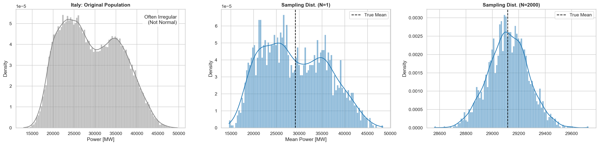
    


    
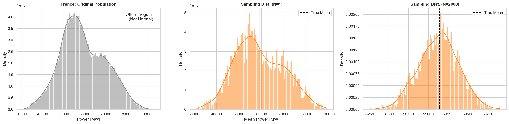
    


    
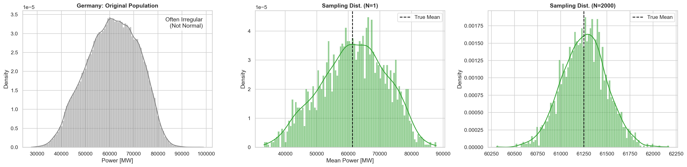
    


    

    


### 2.4.3 Result interpretation and sanity checks (what would invalidate your conclusion, what you
verified) (5 points)

#### LLN Interpretation

The experiment confirmed that the power generation is highly unstable on an hourly basis. But the long-term average is a stable and deterministic value.
It demonstrates that a sample size of about 2000 values is required to cancel out the random noise of the chaotic world (like weather, day night cycles) and get a precise estimate of the average

#### CLT Interpretation

Generally the CTL shows, that we can use the normal distribution even on a dataset, which is non-normal (with two peaks)
At N=2000 no significand deviations of the theorem was observed. The convergence to a bell curve was confirmed despite the underlying data doesn’t have a normal distribution.


## 2.5  E. Regression and Predictive Modeling (45 points)

1. Define a prediction target and features (justify why they make sense) (10 points)
2. Linear or polynomial model selection (include rationale and show at least two candidates) (10 points)
3. Model fitting and validation (train-test split appropriate for time-series. e.g., time-based split) (15 points)
4. Residual analysis and interpretation (errors, bias, failure cases, what to improve next) (10 points)


```python
def r2_score_manual(y_true, y_pred):
    ss_res = np.sum((y_true - y_pred) ** 2)
    ss_tot = np.sum((y_true - np.mean(y_true)) ** 2)
    return 1 - ss_res / ss_tot

```


```python
def plot_yearly_total_power_trend(
    df: pd.DataFrame,
    country: str,
    degrees=(1, 2, 3, 4, 5, 6, 7, 8, 9, 10)
):
    df = df.copy()

    # --- yearly aggregation ---
    yearly = (
        df
        .groupby(Columns.AXIS.MONTH, as_index=False)[Columns.CALC.TOTAL_POWER]
        .mean()
    )

    x = yearly.index.values
    y = yearly[Columns.CALC.TOTAL_POWER].values

    # numeric axis for stable polynomial fitting
    t = np.arange(len(x))
    t_fit = np.linspace(t.min(), t.max(), 300)

    plt.figure(figsize=(14, 6))

    sns.scatterplot(
        x=x,
        y=y,
        s=70,
        color=colors[country],
        label="Yearly average"
    )

    max_degree = len(x) - 1

    for deg in degrees:
        if deg > max_degree:
            print(
                f"⚠️  Skipping degree {deg} for {country} "
                f"(only {len(x)} data points)"
            )
            continue

        coeffs = np.polyfit(t, y, deg)
        poly = np.poly1d(coeffs)

        y_pred = poly(t)
        r2 = r2_score_manual(y, y_pred)

        plt.plot(
            np.interp(t_fit, t, x),
            poly(t_fit),
            linewidth=2,
            label=f"deg={deg}, R²={r2:.3f}"
        )

    plt.xlabel("Year")
    plt.ylabel("Average Total Power [MW]")
    plt.title(f"{country} – Yearly Power Production Trend")
    plt.legend()
    plt.grid(alpha=0.3)
    plt.tight_layout()
    plt.show()

```


```python
for country, df in dataframes_filtered:
    if not ActvnMatrix.is_active(country, PlotOptions.TREND_TOTAL_POWER_OVER_YEARS):
        continue
    plot_yearly_total_power_trend(df, country)
```


    
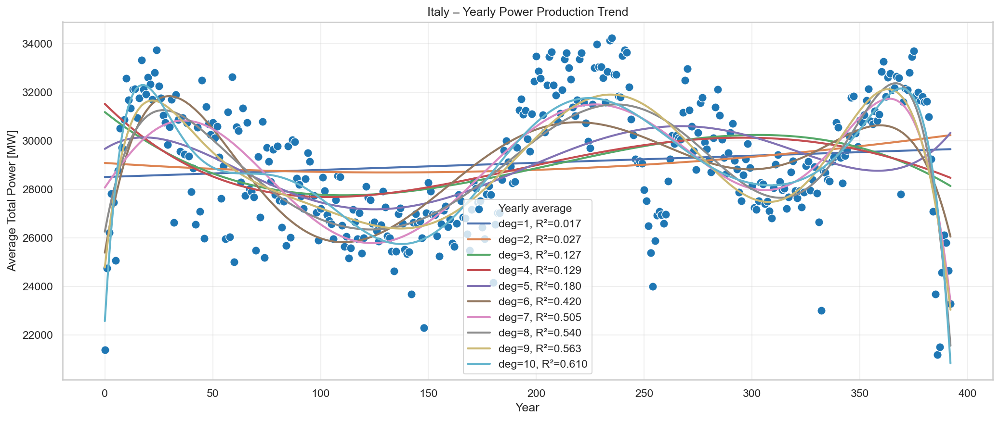
    


    

    


    

    


    
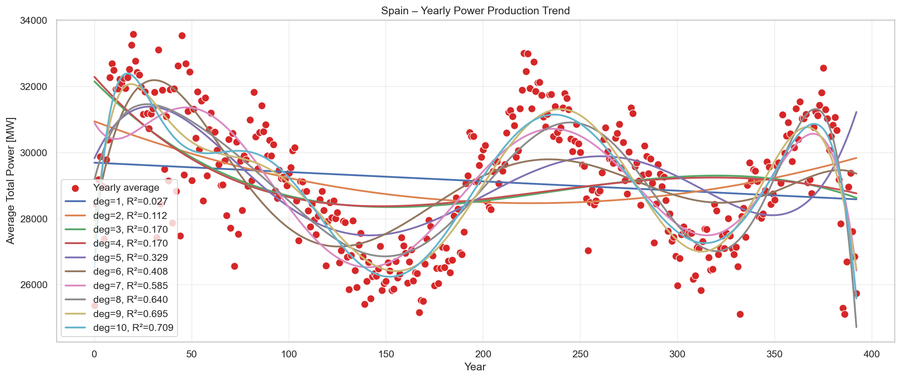
    


```python


def plot_hourly_polynomial_comparison(
    df: pd.DataFrame,
    country: str,
    degrees=(1, 2, 3, 4, 5, 6, 7, 8, 9, 10, 11, 12, 13, 14, 15)
):
    df = df.copy()

    x = df[Columns.AXIS.HOURS_OF_DAY].values
    y = df[Columns.CALC.TOTAL_POWER].values

    # Clean NaNs
    mask = ~np.isnan(x) & ~np.isnan(y)
    x, y = x[mask], y[mask]

    x_fit = np.linspace(0, 23, 300)

    plt.figure(figsize=(13, 7))

    # Raw data
    sns.scatterplot(
        x=x,
        y=y,
        alpha=0.25,
        s=10,
        color=colors[country],
        label="Hourly observations"
    )

    results = []

    for deg in degrees:
        coeffs = np.polyfit(x, y, deg)
        poly = np.poly1d(coeffs)

        y_pred = poly(x)
        r2 = r2_score_manual(y, y_pred)

        results.append((deg, r2))

        plt.plot(
            x_fit,
            poly(x_fit),
            linewidth=2,
            label=f"deg={deg}, R²={r2:.3f}"
        )

    plt.xlabel("Hour of Day")
    plt.ylabel("Total Power [MW]")
    plt.title(f"{country} – Polynomial Regression Comparison")
    plt.legend()
    plt.grid(alpha=0.3)
    plt.tight_layout()
    plt.show()

    # Console report
    print(f"\nPolynomial model comparison for {country}")
    print("-" * 40)
    for deg, r2 in results:
        print(f"Degree {deg}: R² = {r2:.4f}")


def plot_hourly_total_power_regression(df: pd.DataFrame, country: str, degree: int = 6):
    df = df.copy()

    x = df[Columns.AXIS.HOURS_OF_DAY].values
    y = df[Columns.CALC.TOTAL_POWER].values

    # Remove NaNs
    mask = ~np.isnan(x) & ~np.isnan(y)
    x, y = x[mask], y[mask]

    # Polynomial fit
    coeffs = np.polyfit(x, y, degree)
    poly = np.poly1d(coeffs)

    x_fit = np.linspace(0, 23, 200)
    y_fit = poly(x_fit)

    plt.figure(figsize=(12, 6))

    sns.scatterplot(
        x=x,
        y=y,
        alpha=0.25,
        s=10,
        color=colors[country],
        label="Hourly observations"
    )

    plt.plot(
        x_fit,
        y_fit,
        color="black",
        linewidth=2.5,
        label=f"Polynomial regression (deg={degree})"
    )

    plt.xlabel("Hour of Day")
    plt.ylabel("Total Power [MW]")
    plt.title(f"{country} – Daily Power Profile (Polynomial Regression)")
    plt.legend()
    plt.grid(alpha=0.3)
    plt.tight_layout()
    plt.show()

```


```python
for country, df in dataframes_filtered:
    if not ActvnMatrix.is_active(country, PlotOptions.HOURLY_TOTAL_POWER_REGRESSION):
        continue
    plot_hourly_total_power_regression(df, country)
    plot_hourly_polynomial_comparison(df, country)
```


    
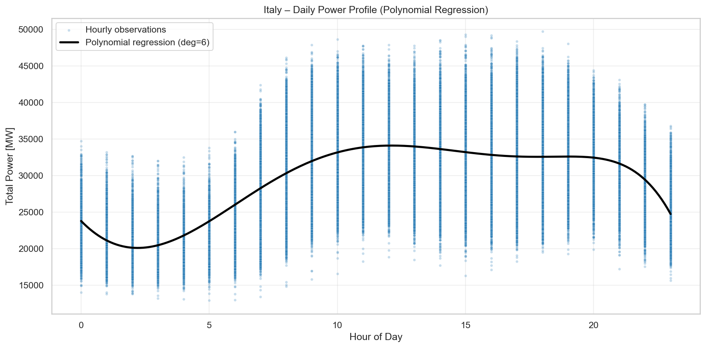
    


    C:\Users\reosa\AppData\Local\Temp\ipykernel_5340\105496585.py:32: RankWarning: Polyfit may be poorly conditioned
      coeffs = np.polyfit(x, y, deg)


    
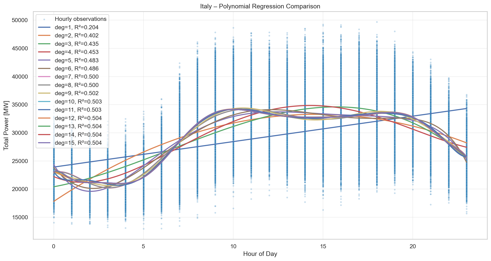
    


    
    Polynomial model comparison for Italy
    ----------------------------------------
    Degree 1: R² = 0.2037
    Degree 2: R² = 0.4022
    Degree 3: R² = 0.4352
    Degree 4: R² = 0.4527
    Degree 5: R² = 0.4828
    Degree 6: R² = 0.4855
    Degree 7: R² = 0.5003
    Degree 8: R² = 0.5003
    Degree 9: R² = 0.5016
    Degree 10: R² = 0.5031
    Degree 11: R² = 0.5031
    Degree 12: R² = 0.5037
    Degree 13: R² = 0.5037
    Degree 14: R² = 0.5037
    Degree 15: R² = 0.5037


    
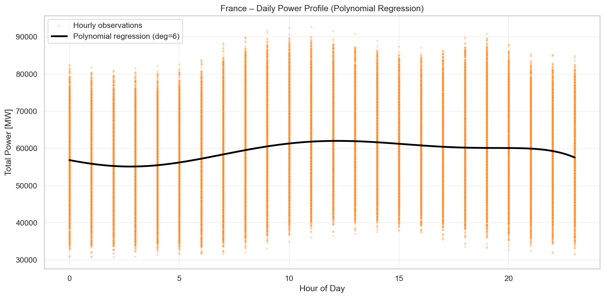
    


    C:\Users\reosa\AppData\Local\Temp\ipykernel_5340\105496585.py:32: RankWarning: Polyfit may be poorly conditioned
      coeffs = np.polyfit(x, y, deg)


    
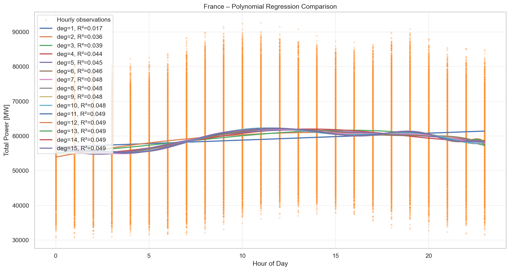
    


    
    Polynomial model comparison for France
    ----------------------------------------
    Degree 1: R² = 0.0170
    Degree 2: R² = 0.0360
    Degree 3: R² = 0.0393
    Degree 4: R² = 0.0440
    Degree 5: R² = 0.0453
    Degree 6: R² = 0.0463
    Degree 7: R² = 0.0477
    Degree 8: R² = 0.0483
    Degree 9: R² = 0.0483
    Degree 10: R² = 0.0483
    Degree 11: R² = 0.0486
    Degree 12: R² = 0.0488
    Degree 13: R² = 0.0488
    Degree 14: R² = 0.0488
    Degree 15: R² = 0.0488


    
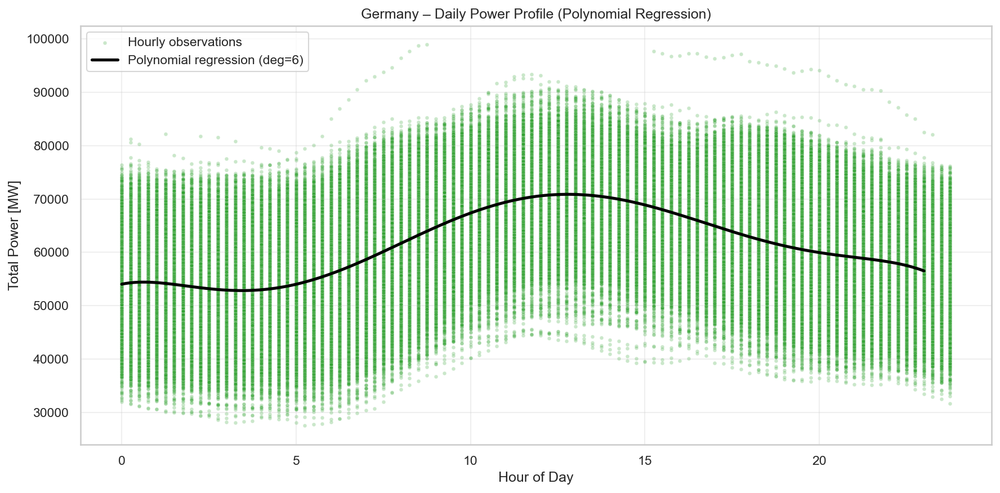
    


    C:\Users\reosa\AppData\Local\Temp\ipykernel_5340\105496585.py:32: RankWarning: Polyfit may be poorly conditioned
      coeffs = np.polyfit(x, y, deg)


    
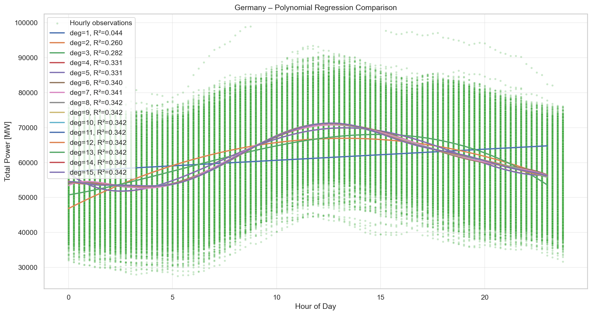
    


    
    Polynomial model comparison for Germany
    ----------------------------------------
    Degree 1: R² = 0.0437
    Degree 2: R² = 0.2600
    Degree 3: R² = 0.2821
    Degree 4: R² = 0.3310
    Degree 5: R² = 0.3310
    Degree 6: R² = 0.3402
    Degree 7: R² = 0.3406
    Degree 8: R² = 0.3417
    Degree 9: R² = 0.3418
    Degree 10: R² = 0.3418
    Degree 11: R² = 0.3419
    Degree 12: R² = 0.3419
    Degree 13: R² = 0.3421
    Degree 14: R² = 0.3421
    Degree 15: R² = 0.3421


    
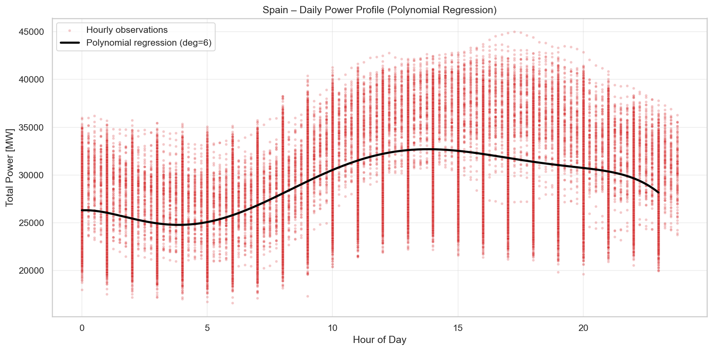
    


    C:\Users\reosa\AppData\Local\Temp\ipykernel_5340\105496585.py:32: RankWarning: Polyfit may be poorly conditioned
      coeffs = np.polyfit(x, y, deg)


    
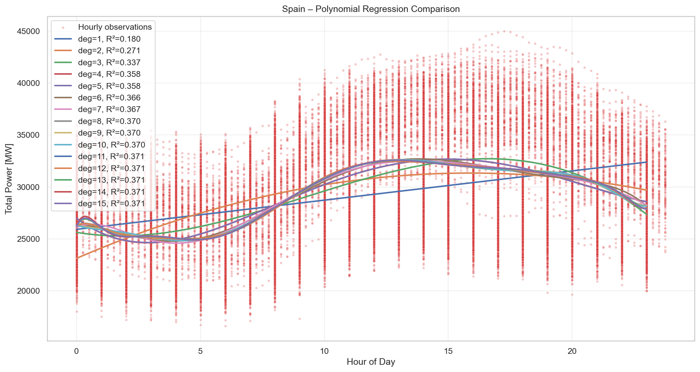
    


    
    Polynomial model comparison for Spain
    ----------------------------------------
    Degree 1: R² = 0.1796
    Degree 2: R² = 0.2711
    Degree 3: R² = 0.3370
    Degree 4: R² = 0.3579
    Degree 5: R² = 0.3579
    Degree 6: R² = 0.3659
    Degree 7: R² = 0.3672
    Degree 8: R² = 0.3697
    Degree 9: R² = 0.3698
    Degree 10: R² = 0.3699
    Degree 11: R² = 0.3709
    Degree 12: R² = 0.3709
    Degree 13: R² = 0.3713
    Degree 14: R² = 0.3713
    Degree 15: R² = 0.3713


```python
def plot_monthly_trend_regression(
    monthly: pd.DataFrame,
    country: str,
    degrees=(1, 2, 3, 4, 5, 6, 7, 8, 9, 10)
):
    x = monthly[Columns.AXIS.MONTH].values
    y = monthly[Columns.CALC.TOTAL_POWER].values

    x_fit = np.linspace(x.min(), x.max(), 300)

    plt.figure(figsize=(14, 6))

    # Raw monthly trend
    sns.scatterplot(
        x=x,
        y=y,
        s=60,
        alpha=0.8,
        color=colors[country],
        label="Monthly mean"
    )

    for deg in degrees:
        coeffs = np.polyfit(x, y, deg)
        poly = np.poly1d(coeffs)

        y_pred = poly(x)
        r2 = r2_score_manual(y, y_pred)

        plt.plot(
            x_fit,
            poly(x_fit),
            linewidth=2,
            label=f"deg={deg}, R²={r2:.3f}"
        )

    plt.xlabel("Time (months since start)")
    plt.ylabel("Total Power [MW]")
    plt.title(f"{country} – Monthly Power Trend Regression")
    plt.legend()
    plt.grid(alpha=0.3)
    plt.tight_layout()
    plt.show()


```


```python
for country, df in dataframes_filtered:
    if not ActvnMatrix.is_active(country, PlotOptions.TREND_TOTAL_POWER_OVER_MONTHS):
        continue
    plot_monthly_trend_regression(df, country)
```


    
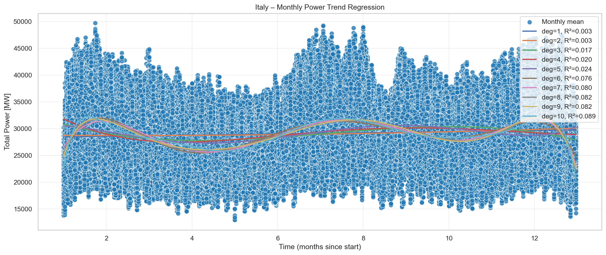
    


    
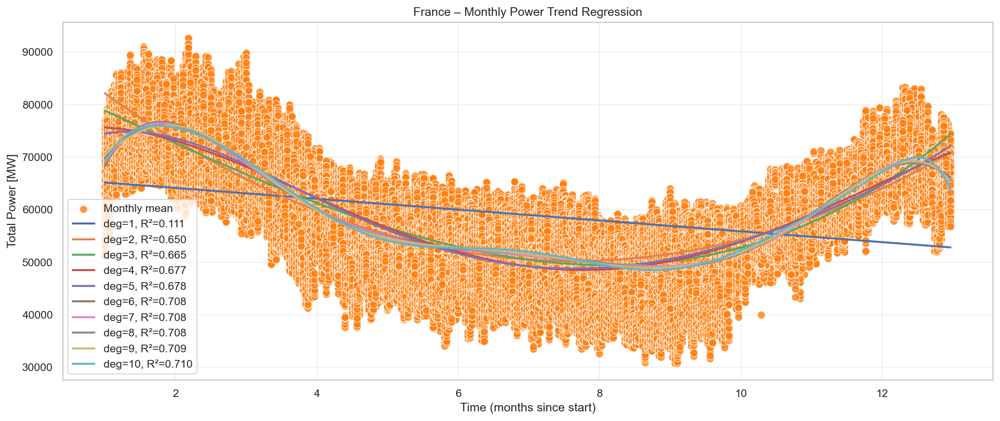
    


    
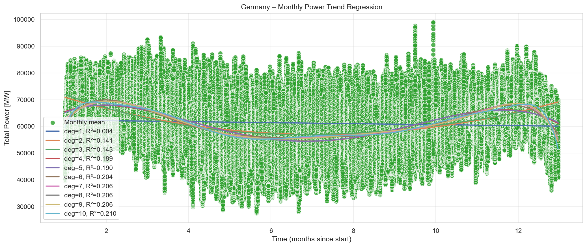
    


    
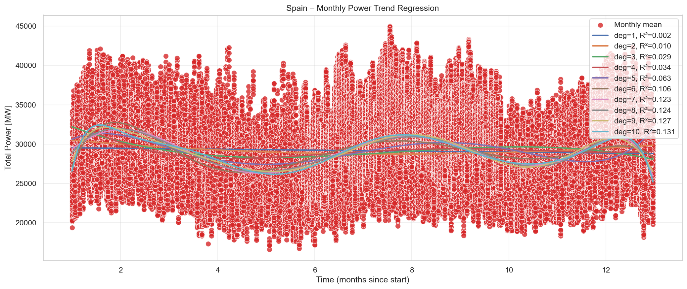
    

