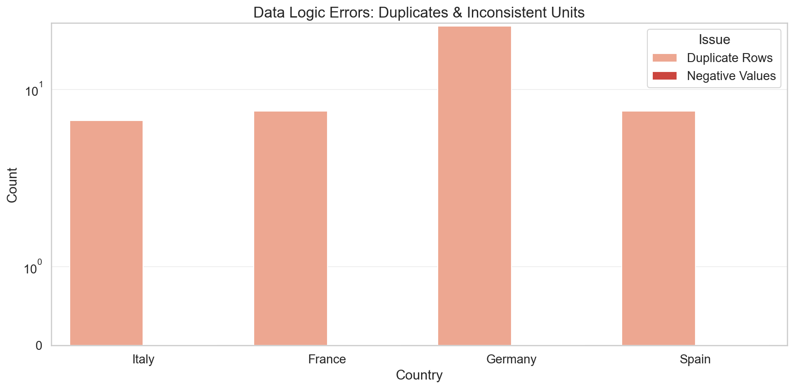

# Team Format and Dataset

## 1. Team formation and dataset

### 1.1 Contributions

- Oswald Lackner
    - Initial python script setup
    - Plot activation
    - Column data managment
    - Import of raw data from CSV-files
    - Dataset overview
    - Data processing pipline (cleaning, outlier)
        - Hexbin raw data visualisation
            - Hours of day
            - Days a week
            - days a year
        - Outlier removal
	- Raw data hexbin plots
		- Hours of the day
		- Days of the week
		- Days of the year
- Stocker Christoph
    - Basic statistical analysis
    - Original data quality analysis with visualization
        - Checking Dataset Time Ranges
        - Generating Combined Missingness diagramm
        - Generating Combined Timestamp Gap Analysis
        - Generating Combined Outlier Analysis
        - Generating Logical Consistency Check

Source of Data: [Kaggle: Hourly Power Generation of Europe](https://www.kaggle.com/datasets/mehmetnuryildirim/hourly-power-generation-of-europe) (date: 2026-01-16)

# Dataset Description

-   Dataset name and source (Kaggle, Hugging Face, Westermo tests,
    etc.):

-   Why it is suitable for time-series analysis:

-   Time period covered and sampling frequency:

-   Key variables analyzed (signals, sensors, physical quantities):

-   Size and structure:

    -   Number of observations (rows):

    -   Number of features (columns):

    -   Target variable(s) if any:

-   Missing data summary:

-   Any known limitations or caveats:

# Task 1. Data Preprocessing and Basic Analysis

## Basic statistical analysis using pandas

-   Descriptive stats (mean, std, min, max, quantiles) for key
    variables:

-   Grouped summaries where relevant (by day, device, category, test
    run):

## Original data quality analysis including visualization

-   Missingness patterns (counts, heatmap, timeline gaps):

-   Outliers and suspicious values (plots and rule used):

-   Consistency checks (timestamps order, duplicates, impossible
    values):

## Data preprocessing

-   Cleaning steps performed:

-   Missing-value treatment (drop, impute, interpolate, forward fill,
    etc.):

-   Outlier handling (range, threshold, IQR, percentile, justify
    choice):

-   Feature engineering (e.g., scaling/normalization, log):

-   Final dataset shape after preprocessing:

## Preprocessed vs original data visual analysis

-   Before vs after comparison plots (at least 2 to 3 key variables):

-   What improved and what trade-offs exist:

# Task 2. Visualization and Exploratory Analysis

## Time series visualizations

-   Plot of main variable(s) over time:

-   Annotations for notable events or pattern shifts (if applicable):

## Distribution analysis with histograms

-   Histograms for key numeric variables:

-   Notes on skewness, heavy tails, multi-modality:

## Correlation analysis and heatmaps

-   Correlation type used (Pearson or Spearman) and why:

-   Heatmap and top correlated pairs with short interpretation:

## Daily pattern analysis

-   Aggregation method (hourly means, day-of-week, rolling averages):

-   Plots showing daily cycles or weekday-weekend differences:

-   What patterns are stable vs noisy:

## Summary of observed patterns, similar to True/False questions

*Write short, testable statements and answer them based on evidence.
Example format below.*

-   Statement 1 (True or False): **\...**. Evidence: \...

-   Statement 2 (True or False): **\...**. Evidence: \...

-   Statement 3 (True or False): **\...**. Evidence: \...

# Task 3. Probability Analysis

## Threshold-based probability estimation

-   Define threshold(s) and justify choice:

-   Estimate probabilities of exceeding thresholds:

-   Visual support (e.g., empirical CDF, bar plot, timeline highlights):

## Cross tabulation analysis

-   Define two categorical variables (or binned numeric variables):

-   Present contingency table and interpret key cells:

## Conditional probability analysis

-   Define events $A$ and $B$:

-   Compute and interpret $P(A)$, $P(B)$, $P(A \mid B)$, $P(B \mid A)$:

-   Include at least one meaningful comparison and conclusion:

## Summary of observations from each probability task

-   Key takeaway from threshold probability:

-   Key takeaway from crosstab:

-   Key takeaway from conditional probability:

# Task 4. Statistical Theory Applications

## Law of Large Numbers (LLN) demonstration

-   Variable chosen and why it makes sense:

-   Experiment: show sample mean as $n$ increases:

-   Plot and short interpretation:

## Central Limit Theorem (CLT) application

-   Sampling procedure (sample size, number of trials, with or without
    replacement):

-   Show distribution of sample means for increasing $n$:

-   Plot(s): histogram(s) of sample means and comparison to normal
    shape:

## Result interpretation

-   What LLN showed in your data context:

-   What CLT showed, and any deviations and why:

# Task 5. Regression Analysis

## Linear or Polynomial model selection

-   Define target $y$ and predictors $X$:

-   Motivation for linear vs polynomial:

-   Any train-test split rationale (time-aware split if relevant):

## Model fitting and validation

-   Fit procedure and preprocessing (scaling, feature selection):

-   Validation method (holdout, time-series split, etc.):

-   Metrics reported (RMSE, MAE, $R^2$) and why:

-   Residual analysis (at least one plot recommended):

## Result interpretation and analysis

-   Main effects and practical meaning:

-   Failure cases or where model performs poorly:

# Bonus Tasks

-   New dataset bonus (10): state why dataset is new and provide link:

-   Q-Q plot with explanation (5):

    -   Either for CLT sample means, or regression residuals:

    -   Interpretation of deviations from normality:

-   Interactive visualizations (up to 10): describe tool used and what
    interactivity adds:

-   Cross-validation in regression (5): method used and how results
    compare to holdout:

-   Additional exploration (up to 20): clearly state extra tasks and
    value gained:

# Key Findings and Conclusions

-   Main findings from preprocessing and EDA:

-   Main findings from probability tasks:

-   Main findings from LLN and CLT:

-   Main findings from regression:

-   Limitations:

-   What you would do next if you had more time:

# Reproducibility Notes

-   Exact dataset source link and version or download date:

-   Key libraries used and versions (optional but recommended):

-   How to run the notebook end-to-end:
